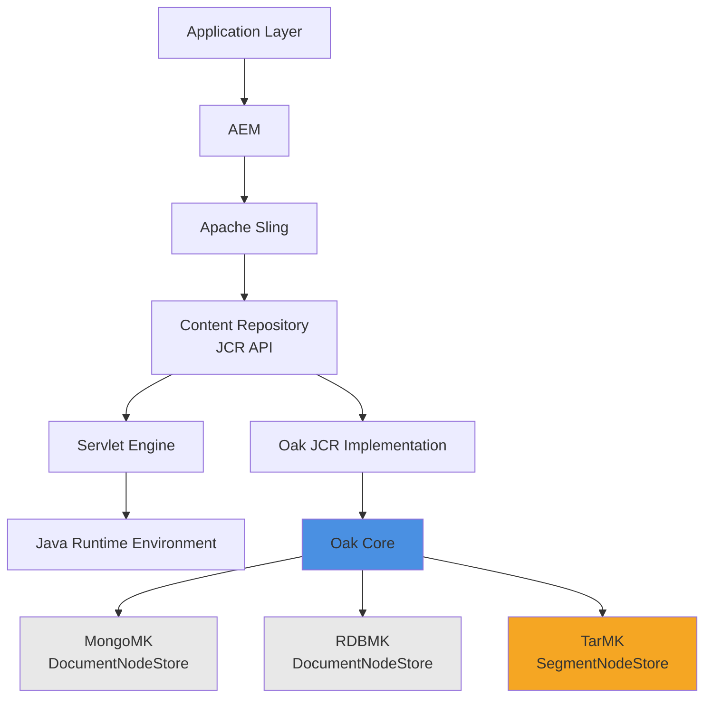
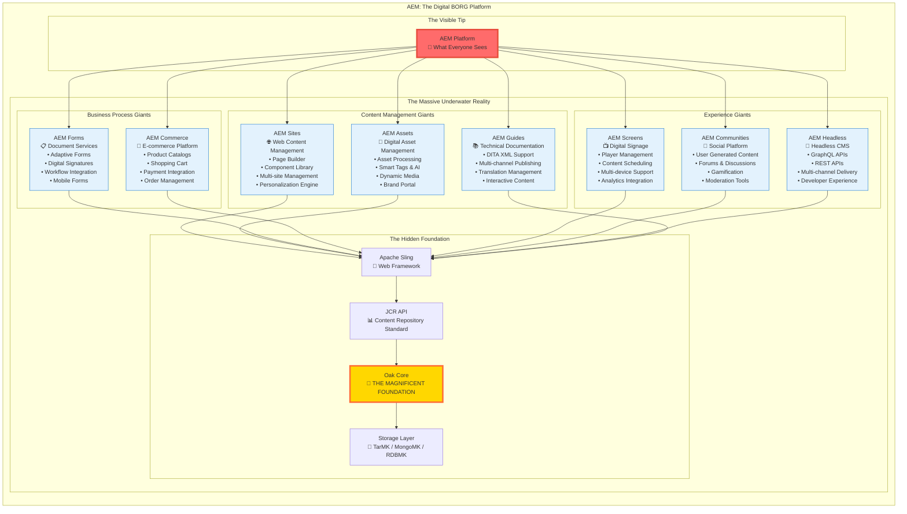
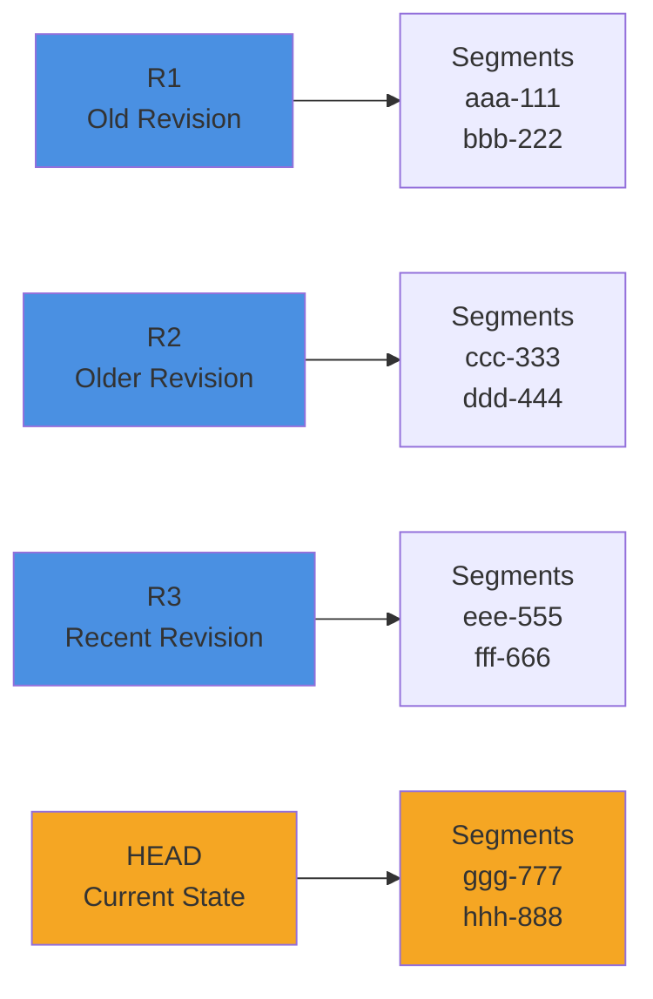
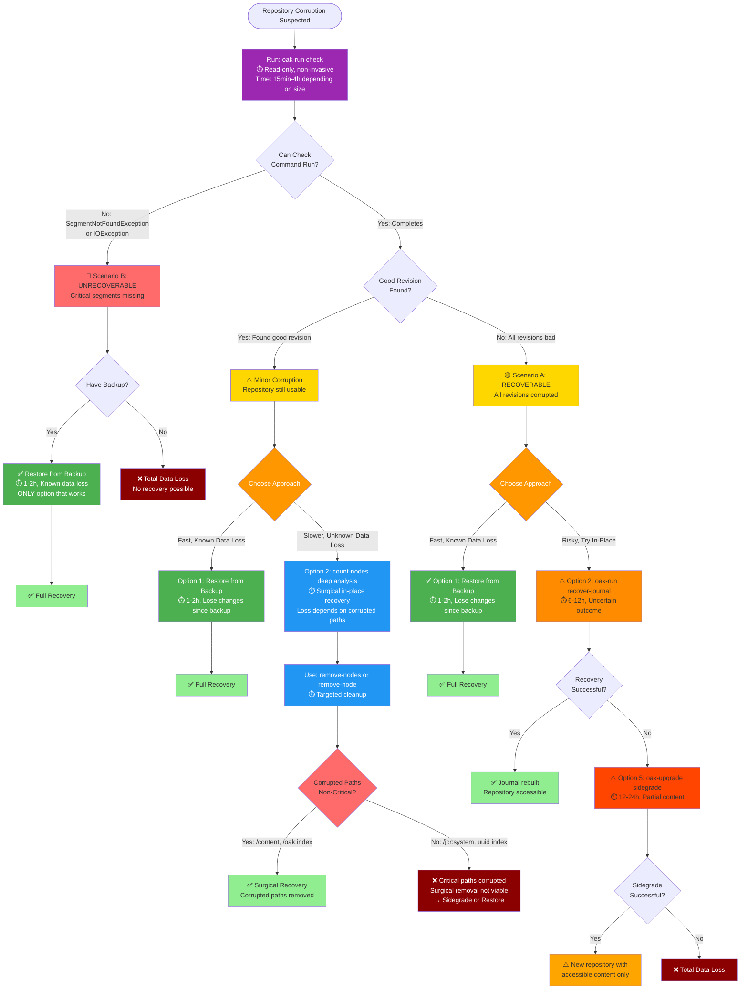

Oak Runnable Jar: The Magnum OAKus
===================================

**A comprehensive guide to Apache Oak repository maintenance, corruption recovery, and operational excellence**

*Primarily focused on SegmentStore (TarMK) with DocumentNodeStore (MongoMK/RDB) references where applicable*

---

## 🚀 Quick Start Navigation

### 🆘 **IN CRISIS? START HERE:**
1. **[📋 Crisis Checklist](#-crisis-checklist-for-people-who-dont-read-good)** - Follow the boxes, zero fluff
2. **[🔍 Identify Repository Type](#identifying-your-repository-type)** - Different repos = different commands
3. **[🔧 Run Check Command](#check)** - Diagnose the problem
4. **[📊 Recovery Decision Tree](#corruption-recovery-decision-tree)** - Choose your recovery path

### 📚 **LEARNING THE SYSTEM:**
- **[🏗️ Architecture Primer](#oak-segment-store-architecture-primer)** - Understand why recovery works
- **[⚙️ Understanding Checkpoints](#️-important-understanding-checkpoints-in-oak)** - Fix disk bloat issues
- **[🔧 DataStore Tools](#understanding-datastore-tools-index-based-vs-traversal-based-approaches)** - When to use what

---

## 🚨 **REPOSITORY CORRUPTED? READ THIS FIRST** 🚨

### **Managing Business Expectations & Stress**

**⚠️ CRITICAL REALITY CHECK**: Repository corruption scenarios fall into three categories:

1. **Recoverable** (good revision found by `oak-run check`)
   - ✅ Urgency is appropriate - minimize downtime
   - ✅ Recovery procedures can help
   - ✅ Time pressure is productive
   
2. **Partially Recoverable** (check completes but finds "no good revision")
   - ⚠️ **Sidegrade may work** - `oak-upgrade` can extract accessible content
   - ⚠️ **Unknown data loss** - won't know what's missing until sidegrade completes
   - ⚠️ **Time-consuming** - 6-24 hours for sidegrade (assumes expertise), 2-5 days realistically (troubleshooting, retries, validation)
   - 💡 Urgency is moderate - faster than rebuild, but expect significant loss
   
3. **Unrecoverable** (check fails completely with SegmentNotFoundException/IOException)
   - ⛔ **Urgency is counterproductive** - the "patient" is already dead
   - ⛔ No amount of rushing will recover data that doesn't exist
   - ⛔ Stress and panic lead to worse decisions
   - 💡 **"They don't run the ambulance lights when they fish the body out of the water"**

**If you're in Scenario 2 (Partially Recoverable)**: 
- **Moderate urgency** - Sidegrade is worth attempting before accepting total loss
- **Communicate upward**: "Repository severely corrupted. Attempting sidegrade recovery. Expect significant but unknown data loss. Timeline: 2-5 days (includes troubleshooting, retries, validation)."
- **Set expectations**: Whatever is recovered is a bonus - prepare for substantial loss
- **Reality check**: First-time operators without deep Oak knowledge should expect the upper end of timeline estimates

**If you're in Scenario 3 (Unrecoverable)**: 
- **Stop rushing**. The damage is done. Additional pressure won't create data that's been destroyed.
- **Communicate upward immediately**: "Repository is unrecoverable. We need to restore from backup or accept total data loss. Timeline is days/weeks, not hours."
- **Business impact is already realized** - scrambling won't change it. Focus on controlled, correct recovery.
- **Your job now**: Prevent making it worse, document what happened, implement backups so it never happens again.

---

### **The Single Most Important Thing: BACKUP**

**If you have a recent, tested backup**: **RESTORE IT NOW**. Stop reading. Don't run diagnostics. Don't try recovery procedures. Every minute spent "investigating" is wasted time when you have a guaranteed good state.

**Why backup-first is not negotiable** *(assumes backup strategy is tested and functionally understood)*:
- ✅ **Fastest** recovery (hours vs unknown timelines for procedures)
- ✅ **Most reliable** (100% success rate vs uncertain outcomes)
- ✅ **Least risk** (no chance of making corruption worse)
- ✅ **Predictable data loss** (content authored since backup will be lost)
- ✅ **Proven** in production (iron-clad recovery method)

**If you don't have a backup**: This is a business process failure, not a technical one. After you recover (if possible), implement a backup strategy immediately. Most P1 incidents resolve with backup restore, not heroic recovery.

**If backup is old** (weeks/months): Restore it anyway, then use `oak-upgrade --merge-paths` to sync accessible recent content. Better to lose corrupted paths than everything.

---

## 📖 Table of Contents

### 🚨 Emergency Response
- [**🚨 Repository Corrupted? Read This First**](#-repository-corrupted-read-this-first-) - **START HERE** - Critical reality check and business expectations
- [**📋 Crisis Checklist**](#-crisis-checklist-for-people-who-dont-read-good) - **Checkbox-driven, zero-fluff, follow the boxes**
- [**Emergency Quick Reference**](#emergency-quick-reference) - 1-page cheat sheet (print this!)
- [**Recovery Decision Tree**](#corruption-recovery-decision-tree) - Visual flowchart for choosing recovery strategy

### 🔍 Diagnosis & Identification
- [**Identify Your Repository Type**](#identifying-your-repository-type) - **CRITICAL** - Different repos need different commands!
- [**Oak-Run Check**](#check) - Diagnose repository corruption and find last good revision
- [**Count-Nodes**](#count-nodes) - Surgical recovery (remove specific corrupted nodes)
- [**Understanding Checkpoints**](#️-important-understanding-checkpoints-in-oak) - Fix "async checkpoint" errors, disk bloat

### 🛠️ Recovery Operations
- [**Recovery Options**](#repository-corruption-recovery-options) - Full comparison of all recovery strategies
- [**Option A1: Rollback Approach**](#option-a1-rollback-approach-fastest-safest-loses-recent-changes) - Fastest, safest, loses recent changes
- [**Option A2: Surgical Approach**](#option-a2-surgical-approach-slower-preserves-more-keeps-recent-changes) - Slower, preserves more, keeps recent changes
- [**Compact**](#compact) - **WARNING: Read "Check Before Compaction" first!**
- [**Checkpoints**](#checkpoints) - Manage checkpoints and fix async errors

### 📚 Architecture & Understanding
- [**Oak Segment Store Architecture Primer**](#oak-segment-store-architecture-primer) - Why recovery works the way it does
- [**Understanding DataStore Tools**](#understanding-datastore-tools-index-based-vs-traversal-based-approaches) - When to use different tools
- [**Generational Garbage Collection**](#generational-garbage-collection) - How Oak manages storage lifecycle

### 🔧 Advanced Operations
- [**Re-indexing After Recovery**](#re-indexing-after-corruption-recovery-with-pre-text-extraction) - Restore search functionality
- [**DataStore Maintenance**](#datastore) - Blob storage operations and cleanup
- [**Console Commands**](#console) - Interactive repository exploration and manipulation

### 📋 Reference Materials
- [**Command Reference**](#command-reference) - Complete list of all oak-run commands
- [**Troubleshooting Guide**](#troubleshooting-common-issues) - Solutions to common problems
- [**Best Practices**](#best-practices-and-recommendations) - Operational excellence guidelines

---

## 🆘 In a Crisis? Jump To:
- [**📋 Crisis Checklist (For People Who Don't Read Good)**](#-crisis-checklist-for-people-who-dont-read-good) - **Checkbox-driven, zero-fluff, follow the boxes**
- [**Emergency Quick Reference**](#emergency-quick-reference) - 1-page cheat sheet (print this!)
- [**📊 Recovery Decision Tree**](#corruption-recovery-decision-tree) - Visual decision guide
- [**CRITICAL: Identify Your Repository Type**](#identifying-your-repository-type) - **START HERE** - Different repos need different commands!
- [Oak-Run Check](#check) - Diagnose repository corruption
- [Count-Nodes](#count-nodes) - Surgical recovery (remove specific corrupted nodes)
- [Compact](#compact) - **WARNING: Read "Check Before Compaction" first!**
- [Checkpoints](#checkpoints) - Fix "async checkpoint" errors, disk bloat
- [**Fixing a Failing Async Lane on AEM 6.5.x**](#fixing-a-failing-async-lane-on-aem-65x) - **E-001852983** - Thomas Mueller procedure for looping and corrupted index lanes
- [Recovery Options](#repository-corruption-recovery-options) - Full comparison of all recovery strategies

## 📚 Understanding the Architecture:
- [Oak Segment Store Architecture Primer](#oak-segment-store-architecture-primer) - Why recovery works the way it does for SegmentStore (immutability, compaction, generations)
- [Understanding DataStore Tools](#understanding-datastore-tools-index-based-vs-traversal-based-approaches) - When to use `datastore` vs `datastorecheck` vs `count-nodes`
- [Checkpoints Explained](#️-important-understanding-checkpoints-in-oak) - How checkpoints work and cause disk bloat

---

This jar contains maintenance and diagnostic tools for Oak repositories. 

The following runmodes are currently available:

    * backup          : Backup an existing Oak repository
    * check           : Check the FileStore for inconsistencies
    * checkpoints     : Manage checkpoints
    * clusternodes    : Display DocumentMK cluster node information
    * compact         : Segment compaction on a TarMK repository
    * console         : Start an interactive console
    * count-nodes     : Count nodes and analyze corruption in a repository (console command)
    * remove-node     : Remove a single node from a repository (console command)
    * remove-nodes    : Safely remove corrupted nodes from a repository (console command)
    * datastorecacheupgrade : Upgrades the JR2 DataStore cache
    * datastorecheck  : Consistency checker for data store 
    * datastore       : Maintenance operations for the for data store 
    * debug           : Print status information about an Oak repository
    * explore         : Starts a GUI browser based on java swing
    * export          : Export repository content as json
    * garbage         : Identifies blob garbage on a DocumentMK repository
    * help            : Print a list of available runmodes
    * history         : Trace the history of a node
    * iotrace         : Collect a trace of segment store read accesses 
    * recovery        : Run a _lastRev recovery on a DocumentMK repository
    * resetclusterid  : Resets the cluster id
    * restore         : Restore a backup of an Oak repository
    * revisions       : Revision GC on a DocumentMK
    * server          : Run the Oak Server
    * tarmkdiff       : Show changes between revisions on TarMk
    * tika            : Performs text extraction
    * unlockUpgrade   : Unlock a DocumentMK upgrade to a newer version
    * upgrade         : Migrate existing Jackrabbit 2.x repository to Oak
    

Some of the features related to Jackrabbit 2.x are provided by oak-run-jr2 jar. See
the [Oak Runnable JR2](#jr2) section for more details.

Logging
-------

Oak run uses [Logback](https://logback.qos.ch/) for logging. To customize the logging
you can specify a custom logback config file via `logback.configurationFile` system property
 
    java -Dlogback.configurationFile=./logback.xml -jar oak-run-*.jar console /path/to/oak/repository
    
See [here](https://github.com/apache/jackrabbit-oak/blob/trunk/oak-run/src/main/resources/logback.xml) for the default 
logback config file used

Command Line Format
-------------------

Oak run uses [joptsimple](http://jopt-simple.github.io/jopt-simple/) library for parsing the command line 
options. 

* A option's argument can occur:
    * `--foo=bar` - right up against the option separated by an equals sign (=)
    * `--foo bar` - in the position on the command line after the option
* `--foo=bar,baz` - Sets multiple values for option `foo` separated by `,`
* `--foo` - Enables `foo` option where foo is a boolean option. 
* Most commands provide help via `-h` option
* An argument consisting only of two hyphens (--) signals that the remaining arguments are to be treated as non-options.

Refer to [examples](http://jopt-simple.github.io/jopt-simple/examples.html) for more details

----

## Identifying Your Repository Type

**⚠️ CRITICAL: Different repository types require different `oak-run` commands for recovery!**

Oak supports two fundamentally different repository architectures. You **MUST** know which one you're using before attempting recovery:

### SegmentStore (TarMK)

**What it is**: File-based repository stored as TAR files on disk.

**How to identify**:
```bash
# Look for these in your repository directory:
crx-quickstart/repository/segmentstore/
  ├── journal.log              # Sequential commit history
  ├── data00000a.tar           # Segment data files
  ├── data00001a.tar
  └── ...
```

**Recovery commands for SegmentStore**:
- `oak-run check` - Diagnose corruption
- `oak-run recover-journal` - Rebuild journal.log to last good revision
- `oak-run compact` - Garbage collection
- `oak-run checkpoints` - Manage checkpoints
- Console commands: `:count-nodes`, `:remove-nodes`, `:remove-node`

**Most AEM instances use SegmentStore (TarMK)**

---

### DocumentNodeStore (MongoMK / RDB)

**What it is**: Repository stored in MongoDB or relational database (PostgreSQL, MySQL, Oracle, SQL Server).

**How to identify**:
```bash
# Look for MongoDB or JDBC connection in:
crx-quickstart/install/
  ├── org.apache.jackrabbit.oak.plugins.document.DocumentNodeStoreService.config
  └── (contains mongouri or JDBC URL)

# OR check system logs for:
"DocumentNodeStore initialized"
"Connected to MongoDB"
```

**Recovery commands for DocumentNodeStore**:
- `oak-run recovery` - Recover `_lastRev` for cluster recovery (MongoDB/RDB only)
- `oak-run garbage` - Blob garbage collection
- `oak-run revisions` - Revision GC
- `oak-run clusternodes` - Cluster node management

**⚠️ DocumentNodeStore does NOT support**: `recover-journal`, `compact`, `check`, console commands for surgical removal.

---

### Quick Identification Command

```bash
# If this directory exists → SegmentStore (TarMK)
ls crx-quickstart/repository/segmentstore/

# If this file exists → DocumentNodeStore (MongoMK/RDB)
ls crx-quickstart/install/*DocumentNodeStoreService*.config
```

---

## 📋 Crisis Checklist (For People Who Don't Read Good)

**🚨 PRINT THIS - LAMINATE IT - TAPE IT TO YOUR MONITOR 🚨**

**Follow the boxes in order. Check them off as you go. DO NOT SKIP BOXES.**

**⏱️ TIME WARNING**: All time estimates in this document assume you know what you're doing. If you're uncertain, stressed, or reading this for the first time during an incident: **multiply all times by 3-5x** for troubleshooting overhead. An operation that "should take 30 minutes" can easily consume 2-4 hours when you're figuring it out under pressure. **When in doubt, restore from backup** - it's the only time-bounded option.

### ✅ Step 1: Do You Have a Backup? How Old Is It?

```
[ ] YES, and it's RECENT (< 24 hours old)
    → RESTORE IT NOW. Stop reading. You're done.
    
[ ] YES, but it's OLD (days/weeks/months old)
    → Business won't accept the data loss?
       → Continue to Step 2 (Advanced Recovery)
       → WARNING: You're trading CERTAIN recovery (backup) for UNCERTAIN recovery (procedures)
       → If advanced recovery fails, you WILL restore this old backup anyway
       → Consider: Restore old backup NOW, then use oak-upgrade sidegrade to merge recent accessible content
    
[ ] NO backup exists
    → Continue to Step 2 (you have no choice)
    → Prepare for potential total data loss
    
[ ] DON'T KNOW if backup exists
    → Find out. Call your manager. This is their problem now.
```

**💡 REALITY CHECK**: If your backup is 2 weeks old and business says "we can't lose 2 weeks of work," understand that:
- Advanced recovery might lose MORE than 2 weeks (corrupted paths = unknown data loss)
- Advanced recovery might FAIL completely (then you restore the old backup anyway, but now you've wasted 12-24 hours)
- The "we can't lose data" pressure is what leads to making corruption WORSE

**Best compromise for old backups**: Restore it, start AEM, verify it works, THEN use `oak-upgrade --merge-paths` to selectively pull recent content from the corrupted repo (if accessible).

---

### ✅ Step 2: Identify Your Repository Type

**Look in your filesystem:**

```
[ ] I see: crx-quickstart/repository/segmentstore/
    → You have SegmentStore (TarMK)
    → Use commands: check, recover-journal, console
    → NEVER use: compact (unless explicitly instructed after verification)
    
[ ] I see: MongoDB or database connection in repository.xml
    → You have DocumentNodeStore (MongoMK/RDB)
    → Use commands: check, recovery (NOT recover-journal)
    → NEVER use: compact (SegmentStore only)
    
[ ] I DON'T KNOW WHAT I'M LOOKING AT
    → Stop. Get someone who knows Oak. Seriously.
```

---

### ✅ Step 3: Run This Command (Diagnose the Problem)

**FOR SEGMENTSTORE (most common):**

```bash
$ java -jar oak-run-*.jar check /path/to/segmentstore
```

**Check the output:**

```
[ ] Output says: "Latest good revision for paths and checkpoints checked is..."
    → GOOD! Repository is recoverable.
    → Continue to Step 4

[ ] Output says: "No good revision found"
    → BAD! Repository is severely corrupted (but check ran successfully).
    → Jump to Step 5 (Last Resort)

[ ] Command FAILS with "SegmentNotFoundException" or "IOException"
    → VERY BAD! Repository is bricked (check can't even initialize).
    → Restore from backup. No other option.
```

---

### ✅ Step 4: Choose Your Recovery Path (If Step 3 Found Good Revision)

**Option A: Fast Rollback (loses recent changes, SAFE)**

```bash
$ java -jar oak-run-*.jar recover-journal /path/to/segmentstore
```

```
[ ] Command completed successfully
    → Start AEM
    → You're done!
    
[ ] Command failed
    → Try Option B
```

**Option B: Surgical Removal (preserves more data, SLOWER, MORE DANGEROUS)**

```bash
$ java -jar oak-run-*.jar console --read-write /path/to/segmentstore
> :count-nodes deep analysis
# WAIT FOR IT TO FINISH (may take hours)
# It creates a log file: /tmp/count-nodes-snfe-*.log

# ⚠️ HOW TO KNOW IF IT'S STUCK vs RUNNING:
# - RUNNING: Log file grows every 30-60 seconds, shows new paths being scanned
# - STUCK: No log growth for 10+ minutes, no new paths, same line repeating
# - If stuck: Ctrl+C, check error.log, repository may be too corrupted for surgical approach
```

**NOW READ THE LOG FILE:**

```
[ ] Log shows ONLY paths like: /content/dam/xyz, /var/audit/abc
    → These are SAFE to remove
    → Continue below
    
[ ] Log shows ANY of these paths:
    - /oak:index/uuid
    - /oak:index/nodetype
    - /jcr:system
    - /rep:security
    - /home/users/system
    - /libs
    → STOP! These are CRITICAL. You CANNOT remove them.
    → Options: Restore from backup OR attempt oak-upgrade sidegrade (if content paths are mostly intact)
```

**If safe to remove:**

```bash
> :remove-nodes /tmp/count-nodes-snfe-*.log dry-run
# READ THE OUTPUT - make sure it's not deleting critical stuff
> :remove-nodes /tmp/count-nodes-snfe-*.log
# Wait for it to finish
> :exit
```

**MANDATORY: Verify you didn't break anything:**

```bash
$ java -jar oak-run-*.jar check /path/to/segmentstore
```

```
[ ] Check says: "Latest good revision..." (NO ERRORS)
    → Good! Continue below
    
[ ] Check shows errors
    → YOU BROKE IT WORSE. Restore from backup.
```

**Clean up and start AEM:**

```bash
$ java -jar oak-run-*.jar checkpoints /path/to/segmentstore rm-unreferenced
$ java -jar oak-run-*.jar check /path/to/segmentstore  # Verify AGAIN
$ java -jar oak-run-*.jar compact /path/to/segmentstore
# Start AEM
```

---

### ✅ Step 5: Last Resort (If Step 3 Found No Good Revision)

**This will lose data. Accept that now.**

```bash
$ java -jar oak-upgrade-*.jar upgrade --copy-binaries \
    /path/to/corrupted /path/to/new-repo
```

```
[ ] Command extracted SOME content
    → Replace old repo with new repo
    → Start AEM
    → Assess what was lost
    
[ ] Command failed completely
    → Restore from backup (yes, even if it's old)
    → There is no other option
```

---

## 🚫 NEVER DO THESE (You Will Brick Your Repository)

```
[ ] Run compact BEFORE running check
[ ] Run compact if check shows ANY errors
[ ] Remove paths that include: /oak:index/uuid, /jcr:system, /rep:security, /libs
[ ] Skip the "dry-run" before remove-nodes
[ ] Use recover-journal on DocumentNodeStore (MongoDB/RDB)
[ ] Panic and run random commands you found on Stack Overflow
```

---

## Emergency Quick Reference

| Symptom | First Command | If Success ✅ | If Failure ❌ |
|---------|--------------|---------------|---------------|
| **AEM won't start** | `oak-run check` | Good revision found → Run `recover-journal` | Check fails → [Bricked](#bricked-repository-recovery-realistic-options) → Restore backup |
| **SegmentNotFoundException** | `oak-run check` | Good revision → `:count-nodes` + `:remove-nodes` | No good revision → [Sidegrade](#option-5-oak-upgrade-sidegrade-extract-what-you-can) |
| **Disk full during compaction** | **STOP COMPACTION** | If cleanup NOT started → Run `recover-journal`<br>If cleanup finished → Restore backup | N/A |
| **"Async checkpoint" error** | `checkpoints list` | Find referenced checkpoint at `/:async@async`<br>If missing → [Force reindex](#common-confusion-async-checkpoint-error) | No checkpoints → Force reindex or restore |
| **Compaction broke repo** | `oak-run check` | Good revision → `recover-journal`<br>No good revision → Sidegrade | Check fails → [Bricked](#bricked-repository-recovery-realistic-options) → Restore |
| **Repo slow, corruption?** | `oak-run check` | Check passes → Not corrupted<br>Run `:count-nodes` for full scan | Corruption found → See paths above |
| **Find ALL corrupted paths** | `:count-nodes deep` (in console) | Lists ALL corruption (segments, blobs, etc.) → Review → Remove | Critical paths → [Can't remove](#-critical-surgical-removal-limitations) |
| **Disk bloat from checkpoints** | `checkpoints list` | Many old checkpoints → Run `rm-unreferenced` | Few checkpoints → [Check for indexing loop](#disk-bloat-from-missing-blobs-and-consecutive-indexing-cycles) |
| **Disk bloat + indexing errors** | Check error.log | Repeated indexer failures → [Emergency: Disable index](#emergency-option-a-disable-the-corrupt-index-fastest) → Fix corruption → `rm-unreferenced` → [Re-index with pre-text extraction](#re-indexing-after-corruption-recovery-with-pre-text-extraction) | See [Missing Blob Bloat](#disk-bloat-from-missing-blobs-and-consecutive-indexing-cycles) |
| **Indexing lane stuck/frozen** | Check JMX lanes | **DocumentMK only**: "Lease" not expired → [Release lease](#emergency-option-c-release-stuck-lease-indexing-completely-stopped)<br>**SegmentStore**: Check for missing blobs or corrupted index | No leader (DocumentMK) → Check `/system/console/topology` |
| **Remove corrupted paths** | `:count-nodes` then `:remove-nodes` | Log file lists corrupted paths → Review → Remove | Critical paths → [Can't remove](#-critical-surgical-removal-limitations) |

### Critical Commands Summary

```bash
# 1. ALWAYS start with check (diagnoses corruption, finds last good revision)
$ java -jar oak-run-*.jar check /path/to/segmentstore

# 2. If check finds good revision, rebuild journal to that point (FAST rollback, SegmentStore only)
$ java -jar oak-run-*.jar recover-journal /path/to/segmentstore

# 3. For surgical removal (preserves more data, slower)
$ java -jar oak-run-*.jar console --read-write /path/to/segmentstore
> :count-nodes deep analysis
> :remove-nodes /tmp/count-nodes-snfe-*.log

# 4. If check fails or no good revision, extract what you can (LAST RESORT)
$ oak-upgrade --src=/path/to/corrupted --dest=/path/to/new --copy-binaries

# 5. Clean up orphaned checkpoints (disk space recovery)
$ java -jar oak-run-*.jar checkpoints /path/to/segmentstore rm-unreferenced
```

### ⚠️ NEVER DO THESE (Common Mistakes)

| Dangerous Action | Why It's Dangerous | What Happens |
|-----------------|-------------------|--------------|
| **Run compaction on corrupted repo** | Cleanup phase permanently deletes tar files containing segments you might need | Corruption becomes unrecoverable ("bricked" repository) → Backup restore is ONLY option |
| **Delete all checkpoints (`rm-all`)** | Deletes the checkpoint referenced by async indexer (`/:async@async`) | AEM won't start ("Cannot read index checkpoint") → Must force full reindex or restore |
| **Surgically remove critical paths** | Paths like `/oak:index/uuid`, `/jcr:system/jcr:nodeTypes`, `/rep:security` are required for AEM to function | AEM won't start even after removal → Sidegrade or restore required |
| **Run `oak-run recover-journal` without checking** | Rebuilds journal but doesn't validate segments exist | May create journal pointing to missing segments → Worsens corruption |
| **Trust standby for recovery** | Standby mirrors corruption from primary (sync every few seconds) | Standby likely has same corruption → Not a viable recovery option |
| **Assume old backup is safe** | Backups taken after corruption began will restore corrupted state | Restoring corrupted backup wastes time → Must validate backup timestamp vs corruption onset |

### Decision Tree Quick Version

```
1. Run `oak-run check`
   ├─ Check FAILS (can't open FileStore)
   │  └─ → Restore from backup (bricked, no other option)
   │
   ├─ Check RUNS, finds good revision
   │  ├─ Option A: Fast rollback (lose recent data)
   │  │  └─ → `oak-run recover-journal`
   │  └─ Option B: Surgical (keep more data, slower)
   │     └─ → `count-nodes` + `remove-nodes`
   │
   └─ Check RUNS, NO good revision found
      ├─ Option C: Extract accessible content (data loss)
      │  └─ → `oak-upgrade` sidegrade
      └─ Option D: Restore from backup
         └─ → DevOps backup restore
```

### Time Estimates (100GB Repository on SSD)

| Operation | Time Estimate | Notes |
|-----------|--------------|-------|
| `oak-run check` | 15 minutes | Faster if corruption found early in journal |
| `oak-run recover-journal` | 30 minutes | Rebuilds journal, doesn't copy data |
| `count-nodes` (full scan) | 2 hours | Tests every node + blob accessibility |
| `remove-nodes` | 10-30 minutes | Depends on number of paths to remove |
| `oak-upgrade` sidegrade | 4-6 hours | Copies all accessible content to new repo |
| Backup restore | 1-2 hours | Depends on network/storage speed |

**⚠️ CRITICAL ASSUMPTIONS ABOUT TIME ESTIMATES**:

1. **These times assume you know what you're doing**. An uncertain operator can spend:
   - **Hours** troubleshooting wrong commands, incorrect paths, or misinterpreted output
   - **Days** waiting for operations that are actually hung/failed but appear to be "running"
   - **Infinite time** making wrong decisions, running operations in wrong order, or corrupting further

2. **These times scale with repository size**. A 1TB repository can take 10-20x longer. **There is no way to speed up these operations** - they are I/O bound.

3. **If you're reading this doc under pressure with uncertainty**: Add 2-5x to all time estimates for troubleshooting, validation, and decision-making overhead. **When in doubt, restore from backup** - it's the only time-bounded operation with guaranteed outcome.

### When in Doubt

1. **If corruption is suspected**: Run `oak-run check` BEFORE any other operation
2. **If backup is recent and tested**: Restore from backup (fastest, safest)
3. **If check finds good revision**: Use `oak-run recover-journal` (fast, minimal data loss)
4. **If critical paths corrupted**: Sidegrade or restore (surgical removal won't work)
5. **If completely stuck**: Restore from backup (even old backup + oak-upgrade merge is better than nothing)

**For detailed explanations, see the full sections linked in the table above.**

----

## Oak Segment Store Architecture Primer

> **📍 Navigation:** [Quick Start](#-quick-start-navigation) → [Architecture & Understanding](#-architecture--understanding) → **Oak Segment Store Architecture Primer**

Before diving into recovery procedures, understanding Oak's segment store architecture helps explain **why** certain recovery options work and others don't.

Reference: [Oak Segment Tar Overview](https://jackrabbit.apache.org/oak/docs/nodestore/segment/overview.html)

### TarMK in the AEM Stack

Understanding where TarMK fits in the overall architecture:



**Key Takeaway**: TarMK (SegmentNodeStore) is one of three storage backends for Oak. This guide focuses on TarMK, which is the most common deployment for AEM on-premise and AMS.

## 🌟 The Magnificence of OAK: Underpinning the GIANTS

### OAK: The Foundation of Digital Giants

Apache Oak doesn't just power AEM—it's the **foundational bedrock** that enables some of the most critical digital platforms on the internet. The diagram above shows just the tip of the iceberg. Let's explore the true scope of OAK's magnificence:

```mermaid
graph TB
    subgraph "The Digital Giants Ecosystem - Feng Shui Flow to OAK Tree"
        direction TB
        
        subgraph "What OAK Powers - Direct & Indirect Paths"
            direction LR
            AEM_Sites[AEM Sites<br/>Web Content Management]
            AEM_Assets[AEM Assets<br/>Digital Asset Management]
            AEM_Forms[AEM Forms<br/>Document Services]
            AEM_Commerce[AEM Commerce<br/>E-commerce Platform]
            AEM_Screens[AEM Screens<br/>Digital Signage]
            AEM_Communities[AEM Communities<br/>Social Platform]
            AEM_Headless[AEM Headless<br/>Headless CMS]
            AEM_Guides[AEM Guides<br/>Technical Documentation]
        end
        
        subgraph "The Internet's Business Requirements"
            direction LR
            WebContent[Web Content<br/>Management]
            DigitalAssets[Digital Asset<br/>Management]
            Ecommerce[E-commerce<br/>Platforms]
            SocialPlatforms[Social &<br/>Community Platforms]
            HeadlessCMS[Headless<br/>Content APIs]
            TechnicalDocs[Technical<br/>Documentation]
            DigitalSignage[Digital<br/>Signage]
            DocumentServices[Document<br/>Processing]
        end
        
        subgraph "Interaction Layer - Multiple Paths to OAK"
            Sling[Apache Sling<br/>🔧 Web Framework]
            JCR[JCR API<br/>📊 Direct OAK Interface]
            DirectAPI[Direct OAK APIs<br/>🔌 Native Integration]
        end
        
        subgraph "OAK: The Magnificent Foundation 🌳"
            OakCore[Oak Core<br/>🌟 THE OAK TREE 🌟]
            OakJCR[Oak JCR Implementation]
            OakSPI[Oak Security SPI]
            OakQuery[Oak Query SPI]
            OakLucene[Oak Lucene]
            OakSearch[Oak Search]
        end
        
        subgraph "Storage Layer - OAK's Roots"
            TarMK[TarMK<br/>SegmentNodeStore<br/>🔥 Most Common]
            MongoMK[MongoMK<br/>DocumentNodeStore]
            RDBMK[RDBMK<br/>DocumentNodeStore]
        end
        
        %% Business Requirements Flow
        AEM_Sites --> WebContent
        AEM_Assets --> DigitalAssets
        AEM_Commerce --> Ecommerce
        AEM_Communities --> SocialPlatforms
        AEM_Headless --> HeadlessCMS
        AEM_Guides --> TechnicalDocs
        AEM_Screens --> DigitalSignage
        AEM_Forms --> DocumentServices
        
        %% Multiple Paths to OAK - Feng Shui Flow
        AEM_Sites -.-> Sling
        AEM_Assets -.-> Sling
        AEM_Forms -.-> Sling
        AEM_Commerce -.-> Sling
        AEM_Communities -.-> Sling
        AEM_Guides -.-> Sling
        
        AEM_Headless --> JCR
        AEM_Screens --> JCR
        AEM_Sites --> DirectAPI
        AEM_Assets --> DirectAPI
        
        %% Flow to OAK Tree
        Sling --> JCR
        JCR --> OakJCR
        DirectAPI --> OakJCR
        OakJCR --> OakCore
        
        %% OAK Tree Branches
        OakCore --> OakSPI
        OakCore --> OakQuery
        OakCore --> OakLucene
        OakCore --> OakSearch
        
        %% OAK Tree Roots
        OakCore --> TarMK
        OakCore --> MongoMK
        OakCore --> RDBMK
        
        style OakCore fill:#228B22,stroke:#006400,stroke-width:6px
        style TarMK fill:#F5A623,stroke:#D2691E,stroke-width:3px
        style AEM_Sites fill:#E8F4FD,stroke:#3498DB
        style AEM_Assets fill:#E8F4FD,stroke:#3498DB
        style AEM_Forms fill:#E8F4FD,stroke:#3498DB
        style AEM_Commerce fill:#E8F4FD,stroke:#3498DB
        style AEM_Screens fill:#E8F4FD,stroke:#3498DB
        style AEM_Communities fill:#E8F4FD,stroke:#3498DB
        style AEM_Headless fill:#E8F4FD,stroke:#3498DB
        style AEM_Guides fill:#E8F4FD,stroke:#3498DB
        style Sling fill:#FFE4B5,stroke:#D2691E
        style JCR fill:#FFE4B5,stroke:#D2691E
        style DirectAPI fill:#FFE4B5,stroke:#D2691E
    end
```



### AEM: The BORG of Digital Platforms

**"AEM is BORG. AEM is the assimilation layer of the internet's business requirements."**

AEM isn't just a content management system—it's a **digital platform ecosystem** that assimilates and unifies diverse business requirements into a cohesive experience. Like the Borg from Star Trek, AEM doesn't just coexist with other systems; it **assimilates** them, making them part of a greater whole.

#### The AEM Iceberg: What You See vs. What's Really There

**The Visible Tip (What Most People See):**
- "AEM" - A single platform name
- Web content management
- Digital asset management

**The Massive Underwater Reality (The True Scope):**



#### The BORG Assimilation Process

**"Resistance is futile. Your business requirements will be assimilated."**

AEM doesn't just handle different types of content—it **assimilates** entire business domains:

1. **Content Management** → AEM Sites
2. **Digital Asset Management** → AEM Assets  
3. **Document Processing** → AEM Forms
4. **E-commerce** → AEM Commerce
5. **Digital Signage** → AEM Screens
6. **Social Platforms** → AEM Communities
7. **Headless APIs** → AEM Headless
8. **Technical Documentation** → AEM Guides

Each "assimilation" doesn't just add a feature—it **transforms** the entire platform to handle that domain's unique requirements while maintaining a unified experience.


**🔮✨ The Future is Distributed ✨🔮**: Imagine a world where OAK instances can seamlessly mount read-only replicas of each other through composite node stores, creating a distributed content mesh... 🌐⚡🌟

*[Long pause... because there might be consensus. And there might be a token. The blockchain mount for OAK could be possible.]* 🔗⛓️

### Core Principles

Oak Segment Tar storage is built on three key principles:

1. **Immutability**: Segments are immutable once written. This makes caching easy and reduces inconsistencies, but means **corrupted segments cannot be repaired in place**.
2. **Compactness**: Records are optimized for size to reduce IO and maximize cache efficiency.
3. **Locality**: Related nodes (e.g., parent + children) are stored in the same segment for fast tree traversal.

### Key Components

#### Segments: The Fundamental Unit of Storage

**What IS a Segment?**

A segment is the **atomic unit of storage** in Oak Segment Tar. Think of it as a self-contained block of repository data with these characteristics:

**Physical Properties**:
- **Size**: Up to 256KiB each (262,144 bytes)
- **Identification**: Each segment has a unique UUID (e.g., `a1b2c3d4-e5f6-7890-abcd-ef1234567890`)
- **Location**: Stored sequentially in TAR files (e.g., `data00001a.tar`)
- **Immutability**: Once written to disk, **never modified** - only read or deleted

**What's Inside a Segment?**

A segment can contain any combination of:
1. **Node Records**: JCR node structure (e.g., `/content/dam/myasset`)
2. **Property Records**: Node properties (e.g., `jcr:title="My Document"`)
3. **Value Records**: Property values (strings, numbers, dates)
4. **Blob References**: Pointers to external binaries in DataStore (e.g., PDF content)
5. **List Records**: Multi-value properties or child node lists
6. **Map Records**: Efficient storage for large property sets
7. **Template Records**: Shared node type definitions (deduplication optimization)

**Example: What a Segment Might Contain**:
```
Segment UUID: a1b2c3d4-e5f6-7890-abcd-ef1234567890
Size: 187KB
Contents:
  - Node: /content/dam/2024/Q3/report.pdf
    - jcr:primaryType = dam:Asset
    - jcr:created = 2024-10-01T10:30:00
  - Node: /content/dam/2024/Q3/report.pdf/jcr:content
    - jcr:data = <blob reference to DataStore: abc123def456>
    - jcr:mimeType = application/pdf
    - dc:title = "Q3 Financial Report"
  - Node: /content/dam/2024/Q3/report.pdf/jcr:content/metadata
    - dam:size = 2457600
    - dam:sha1 = f7c3bc1d808e04732adf679965ccc34ca7ae3441
  - Template: dam:Asset node type definition (shared across segments)
```

**Why 256KiB?**
- **Cache-friendly**: Fits well in memory caches (L2/L3 CPU cache, OS page cache)
- **IO-efficient**: Single disk read can fetch entire segment
- **Locality**: Related nodes (parent + children) fit in same segment for fast tree traversal
- **Compaction-efficient**: Small enough to copy quickly during garbage collection

**Segment References (The Graph Structure)**:

Segments reference each other to build the repository tree:
```
Segment A (UUID: aaa-111)
  └─ Contains: /content/dam
      └─ References Segment B (UUID: bbb-222) for child nodes

Segment B (UUID: bbb-222)
  └─ Contains: /content/dam/2024
      └─ References Segment C (UUID: ccc-333) for child nodes

Segment C (UUID: ccc-333)
  └─ Contains: /content/dam/2024/Q3
      └─ References Segment D (UUID: ddd-444) for assets
```

**⚠️ CRITICAL IMPLICATION**: If Segment C is corrupted/missing:
- ❌ Cannot access `/content/dam/2024/Q3` (segment gone)
- ❌ Cannot access any children under Q3 (references broken)
- ✅ CAN still access `/content/dam` and `/content/dam/2024` (different segments)
- 💡 **One missing segment can make entire subtrees inaccessible**

**Immutability: The Double-Edged Sword**

**Why Immutable?**
- ✅ **Fast reads**: No locking needed, segments never change
- ✅ **Safe caching**: Cache forever, no invalidation needed
- ✅ **Crash-safe**: Partial writes don't corrupt existing data
- ✅ **Simple concurrency**: Multiple readers, no conflicts

**Why This Hurts During Corruption?**
- ❌ **Cannot repair**: Corrupted segment cannot be edited/fixed in place
- ❌ **Cannot patch**: No way to "update" a segment with corrected data
- ❌ **Only options**: Skip it (sidegrade), delete it (surgical removal), or replace entire store (backup)

**Segment Lifecycle**:
```
1. WRITE:    Content changes → New segment created → Written to TAR file
2. READ:     Repository access → Segment UUID lookup → Read from TAR file
3. COMPACT:  GC runs → Live segments copied to new generation → Old segments deleted
4. CORRUPT:  Disk error / bit flip → Segment unreadable → SegmentNotFoundException
5. RECOVERY: Cannot fix → Must skip (sidegrade) or remove (surgical) or restore (backup)
```

**The "Into The Tar Pit" Insight**:

Oak's segment design is inspired by append-only log structures (like Kafka, Cassandra SSTables):
- **Write path**: Always append new segments (fast, sequential IO)
- **Read path**: Random access via UUID index (fast, cached lookups)
- **Garbage collection**: Periodic compaction copies live data, deletes old (reclaim space)
- **Trade-off**: Write amplification during compaction vs. fast reads and crash safety

**Bottom Line**:
- **Segments are immutable blocks of repository data** (up to 256KiB)
- **They reference each other** to form the repository tree (graph structure)
- **One corrupted segment** can make entire subtrees inaccessible (cascading failure)
- **Immutability means corruption cannot be repaired** - only skipped, removed, or replaced

---

#### Checkpoints: The Hidden Internal Structure

**What ARE Checkpoints in Oak?**

Checkpoints are **internal Oak structures** that pin repository revisions to prevent garbage collection. They exist **outside the normal JCR tree** and are only visible through direct segment store access (oak-run tools).

**Critical Architectural Understanding**:

```bash
# Oak Segment Store has TWO parallel root nodes:

Segment Store Root (/)
├─ /root                          ← JCR repository tree (what users see)
│   ├─ content/
│   ├─ apps/
│   ├─ etc/
│   ├─ :async/                    ← Indexer bookmarks (inside JCR)
│   │   ├─ async = "checkpoint-uuid-1"
│   │   ├─ fulltext-async = "checkpoint-uuid-2"
│   │   └─ ... (STRING properties)
│   └─ ... (normal JCR tree)
│
└─ /checkpoints                   ← Checkpoint storage (OUTSIDE JCR!)
    ├─ checkpoint-uuid-1/         ← Actual checkpoint data
    ├─ checkpoint-uuid-2/
    └─ ... (internal Oak metadata)
```

**Why This Separation Matters**:

```bash
# Separation of concerns:

1. /root - User-facing JCR tree
   ├─ Contains: All JCR content
   ├─ Accessible: Via JCR API (CRXDE, JCR queries)
   ├─ Versioned: Part of repository revisions
   └─ Purpose: Repository content

2. /checkpoints - Internal Oak metadata
   ├─ Contains: Checkpoint metadata + revision references
   ├─ Accessible: Only via NodeStore API (oak-run tools)
   ├─ NOT versioned: Orthogonal to repository revisions
   ├─ NOT visible: In CRXDE or JCR queries
   └─ Purpose: Pin specific revisions for GC protection

# Benefits:
✅ Checkpoints don't clutter JCR namespace
✅ Checkpoints managed independently from content
✅ Checkpoint operations don't create new JCR revisions
✅ GC can iterate checkpoints without traversing entire JCR tree
✅ Low-level operations isolated from user content
```

**The Link Between `/:async` and `/checkpoints`**:

```bash
# How indexing uses both structures:

/:async@async = "b8dbd53c-af46-4764-bd3b-df48d4a85438"
         ↓ (JCR property references checkpoint by UUID)
/checkpoints/b8dbd53c-af46-4764-bd3b-df48d4a85438/
         ↓ (checkpoint node contains revision reference)
Record: d2afc549-c5a2-4475-a2d1-7257dabba2fd.00000007
         ↓ (revision points to specific segment)
Segment in data00006a.tar
         ↓ (segment contains repository state)
Repository state at checkpoint creation time
```

**Checkpoint Node Structure** (visible in oak-run explore):

```bash
/checkpoints/b8dbd53c-af46-4764-bd3b-df48d4a85438/
├─ Record ID: d2afc549-c5a2-4475-a2d1-7257dabba2fd.00000007
│  └─ This is the REVISION REFERENCE
│     Points to specific segment in specific tar file
│     Represents repository state at checkpoint creation time
│
├─ TemplateId: 3428e2a1-a855-4213-ad5e-e62d5a233ed0.000004f8
│  └─ Internal Oak metadata (node type template)
│
├─ Size: 140 MB (linked size)
│  └─ Total size of segments reachable from this checkpoint
│     Large size = checkpoint pins many old segments
│     Small size = checkpoint pins recent segments only
│
└─ Properties: (count 0)
   └─ Checkpoints don't have user-facing properties
      Metadata is in the node structure itself
```

**The `/:async` Node Structure** (visible in oak-run explore):

```bash
/root/:async (670 bytes)
├─ async = {STRING} "b8dbd53c-af46-4764-bd3b-df48d4a85438"
│  └─ Current checkpoint UUID for "async" indexing lane
│
├─ async-LastIndexedTo = {DATE} 2025-07-04T15:03:52.256-04:00
│  └─ Timestamp when "async" lane last completed successfully
│
├─ async-temp = {STRINGS} (count 2) ["uuid1", "uuid2"]
│  └─ Temporary checkpoints created during indexing cycles
│     Empty array = healthy (temp checkpoints cleaned up)
│     Multiple UUIDs = death loop (failed cycles accumulate)
│
├─ fulltext-async = {STRING} "5be6e6eb-8875-405f-b157-a869080cb859"
│  └─ Current checkpoint UUID for "fulltext-async" lane
│
├─ fulltext-async-LastIndexedTo = {DATE} 2025-07-04T15:03:52.256-04:00
│  └─ Timestamp when "fulltext-async" lane last completed
│
└─ fulltext-async-temp = {STRINGS} (count 13) [...]
   └─ 13 temp checkpoints = 13 consecutive failed cycles!
      This is the DEATH LOOP signature
```

**Bottom Line - Checkpoints**:
- **Checkpoints exist OUTSIDE the JCR tree** - parallel to `/root`, not inside it
- **`/:async` properties are just string pointers** - references to checkpoint UUIDs
- **The actual checkpoint data lives in `/checkpoints`** - contains revision references
- **Checkpoint size indicates age** - large size = old checkpoint pinning many segments
- **Temp checkpoint accumulation = death loop** - visible in `async-temp` arrays
- **Removing `/:async` properties is safe** - just deletes reference pointers, not checkpoints
- **Use oak-run explore to see checkpoints** - not visible in CRXDE or JCR API
- **Understanding segments explains why recovery is hard** - you can't "fix" immutable data

**⚠️ Critical Implication**: **Once corrupted, segments cannot be repaired** - only skipped or replaced

#### TAR Files: Naming, Structure, and Lifecycle

TAR files are containers that store segments along with metadata. 

**⚠️ REALITY CHECK**: Most operators (including experienced ones) **cannot directly manipulate TAR files safely**. This section explains:
- **What TAR files are** (so you understand error messages and `oak-run` output)
- **What the naming means** (so you can communicate with Adobe Support)
- **What .tar.bak files are** (so you don't accidentally delete your only recovery option)
- **When to call for help** (most TAR-level operations require expert guidance)

**If you're reading this during a crisis and considering manual TAR file operations**: **STOP. Call Adobe Support or an Oak expert first.** The risk of making things worse is extremely high.

##### TAR File Naming Convention

```
Typical segmentstore directory:
crx-quickstart/repository/segmentstore/
├── data00000a.tar          ← Sequence 0, Generation 'a'
├── data00001a.tar          ← Sequence 1, Generation 'a'
├── data00002a.tar          ← Sequence 2, Generation 'a'
├── data00003b.tar          ← Sequence 3, Generation 'b' (after compaction)
├── data00004b.tar          ← Sequence 4, Generation 'b'
├── data00003a.tar.bak      ← Backup of old generation (pre-compaction)
├── data00004a.tar.bak      ← Backup of old generation
├── journal.log             ← Current journal (root references)
├── journal.log.bak         ← Backup journal
└── repo.lock               ← Repository lock file (see below)
```

##### The `repo.lock` File: What It Is and Why "Just Delete It" Is Bad Advice

**What `repo.lock` Is**:
```
File: crx-quickstart/repository/segmentstore/repo.lock
Purpose: Prevents multiple processes from opening the same repository simultaneously
Contents: Process ID (PID) of the process holding the lock
Created: When AEM starts and opens the repository
Deleted: When AEM shuts down cleanly
```

**How It Works**:
```
1. AEM starts
2. Oak tries to create repo.lock
3. If file exists:
   - Oak reads PID from file
   - Checks if that process is still running
   - If running: REFUSES TO START (prevents corruption)
   - If not running: Removes stale lock, creates new one
4. If file doesn't exist:
   - Creates repo.lock with current PID
   - Proceeds with startup
```

**Why It Exists**:
- 🛡️ **Prevents catastrophic corruption**: Two processes writing to same TAR files = guaranteed corruption
- 🛡️ **Prevents data loss**: Concurrent writes would overwrite each other's segments
- 🛡️ **Prevents split-brain**: Ensures only one "truth" about repository state

**Common Scenario: "AEM won't start, repo.lock exists"**

**What happened**:
```
1. AEM was killed ungracefully (kill -9, server crash, power loss)
2. AEM didn't get chance to delete repo.lock
3. repo.lock still contains PID of dead process
4. On restart, Oak sees lock file but process is dead
5. Oak SHOULD remove stale lock automatically
6. If it doesn't: Indicates deeper problem
```

**The "Just Delete It" Advice (Why It's Dangerous)**:

| Scenario | "Delete repo.lock" Result | Why It's Bad |
|----------|---------------------------|--------------|
| **AEM actually still running** | 🔥 **CATASTROPHIC** | Two AEM instances write to same repository → guaranteed corruption → data loss |
| **AEM crashed, lock is stale** | ✅ **Usually OK** | Oak should have removed it automatically anyway |
| **Repository is corrupt** | ⚠️ **MASKS PROBLEM** | AEM starts, immediately crashes on corruption, you think lock is the issue (it's not) |
| **Disk/filesystem issues** | ⚠️ **MASKS PROBLEM** | Lock file can't be deleted due to disk errors, deleting it doesn't fix underlying issue |
| **Multiple AEM instances misconfigured** | 🔥 **CATASTROPHIC** | Both instances now think they own the repository → corruption |

**Proper Diagnostic Process**:

```bash
# Step 1: Verify AEM is actually stopped
ps aux | grep java | grep aem
# OR
ps aux | grep crx-quickstart

# Step 2: Check what PID is in the lock file
cat crx-quickstart/repository/segmentstore/repo.lock
# Example output: 12345

# Step 3: Check if that process is still running
ps -p 12345
# If "no such process": Lock is stale, safe to delete
# If process exists: STOP! That process is using the repository

# Step 4: If process exists, identify it
ps -fp 12345
# Is it AEM? Another oak-run command? Something else?

# Step 5: Only if certain process is dead AND lock is stale
rm crx-quickstart/repository/segmentstore/repo.lock

# Step 6: Check for other issues
# - Disk space: df -h
# - Disk errors: dmesg | grep -i error
# - File permissions: ls -la crx-quickstart/repository/segmentstore/
```

**When Deleting repo.lock Is Safe**:
- ✅ AEM is definitely stopped (verified with `ps`)
- ✅ PID in lock file is dead (verified with `ps -p`)
- ✅ No other oak-run commands are running
- ✅ No other processes accessing the repository
- ✅ You're on the correct server (not accidentally checking wrong instance)

**When Deleting repo.lock Is Dangerous**:
- 🔴 You didn't check if AEM is running
- 🔴 You're in a clustered environment (multiple servers)
- 🔴 You're not sure which process the PID belongs to
- 🔴 The lock file keeps reappearing (indicates active process)
- 🔴 You're following "just delete it" advice without understanding why

**The "Riverboat" Pattern (Why This Advice Spreads)**:

```
Operator 1: "AEM won't start, says repo.lock exists"
Operator 2: "Oh yeah, just delete repo.lock, happens all the time"
Operator 1: *deletes lock* "It worked! Thanks!"

What actually happened:
- Lock WAS stale (AEM had crashed)
- Oak WOULD have removed it automatically
- Deleting it manually just saved 1 second of startup time
- Operator now thinks "delete repo.lock" is the solution
- Spreads this advice without understanding the risk
```

**The Real Danger**:
```
Scenario: Clustered environment, shared NFS storage
Operator: "AEM won't start on server2, repo.lock exists"
Operator: *deletes repo.lock without checking*
Reality: Server1's AEM is still running, using that repository
Result: Server2 starts, both write to same repository
Outcome: CATASTROPHIC CORRUPTION within minutes
```

**Best Practice**:
1. **Understand WHY the lock exists** (ungraceful shutdown? crash? still running?)
2. **Verify the process is actually dead** (don't assume)
3. **Check for underlying issues** (disk full? corruption? permissions?)
4. **Only delete as last resort** after verification
5. **Monitor startup** - if lock reappears, you have a bigger problem

**Bottom Line**: 
- 💡 **repo.lock is a safety mechanism, not a bug**
- 💡 **If Oak can't remove stale lock automatically, investigate why**
- 💡 **"Just delete it" works 90% of the time, but the 10% causes catastrophic corruption**
- 💡 **Take 30 seconds to verify, save hours of recovery work**

**Naming Pattern**: `data[SEQUENCE][GENERATION].tar`
- **SEQUENCE**: 5-digit number (00000, 00001, 00002...) - Order of creation
- **GENERATION**: Single letter (a, b, c, d...) - Compaction generation
- **Extension**: `.tar` (active), `.tar.bak` (backup from compaction)

**What the Generation Letter Means**:
```
Generation 'a': Initial/oldest generation
Generation 'b': After 1st compaction
Generation 'c': After 2nd compaction
Generation 'd': After 3rd compaction
...and so on
```

**Example Evolution During Compaction**:

```
Before Compaction:
├── data00000a.tar  (100MB, old data)
├── data00001a.tar  (150MB, old data)
├── data00002a.tar  (200MB, recent data)
└── data00003a.tar  (50MB, newest data)

During Compaction:
├── data00000a.tar  (100MB, being read)
├── data00001a.tar  (150MB, being read)
├── data00002a.tar  (200MB, being read)
├── data00003a.tar  (50MB, being read)
├── data00000b.tar  (80MB, compacted - writing)  ← New generation
└── data00001b.tar  (120MB, compacted - writing) ← New generation

After Compaction (Cleanup Phase):
├── data00000a.tar.bak  (100MB, renamed to .bak)  ← Old generation backed up
├── data00001a.tar.bak  (150MB, renamed to .bak)
├── data00002a.tar.bak  (200MB, renamed to .bak)
├── data00003a.tar.bak  (50MB, renamed to .bak)
├── data00000b.tar      (80MB, active)             ← New generation active
└── data00001b.tar      (120MB, active)

After Cleanup (Next Startup):
├── data00000b.tar      (80MB, active)             ← .bak files deleted
└── data00001b.tar      (120MB, active)
```

##### What Are .tar.bak Files?

**Purpose**: Safety mechanism during compaction cleanup phase.

**When Created**:
1. Compaction completes successfully (new generation 'b' written)
2. Cleanup phase begins
3. Old generation files (gen 'a') renamed to `.tar.bak`
4. Repository runs briefly with both generations
5. On next successful startup, `.tar.bak` files deleted

**Why They Exist**:
- ✅ **Safety net**: If new generation is corrupt, old generation still exists
- ✅ **Crash recovery**: If AEM crashes during cleanup, old data not lost
- ✅ **Rollback possibility**: Can manually revert if new generation has issues

**What You Can (Theoretically) Do With .tar.bak Files**:

**⚠️ WARNING**: These operations are **HIGH RISK** and should only be performed:
- With full backup available
- Under guidance from Adobe Support or Oak expert
- When you understand the implications (most operators don't)
- As a last resort when other options exhausted

| Scenario | Action | Risk Level | Notes |
|----------|--------|------------|-------|
| **New generation corrupt after compaction** | Rollback to old generation | 🔴 **CRITICAL** | **Call Adobe Support first**. Incorrect rollback can make corruption worse. Requires understanding of journal state and segment references. |
| **Need to analyze pre-compaction state** | Read old generation with oak-run | 🟡 **MEDIUM** | Read-only operation, relatively safe. Can help diagnose what changed during compaction. |
| **Disk space critically low** | Manually delete .bak files | 🔴 **HIGH** | **Only if 100% certain new generation is healthy**. Run `oak-run check` first. If wrong, you've deleted your only recovery option. |
| **Compaction failed mid-process** | Clean up and retry | 🟡 **MEDIUM** | Safer than rollback, but still requires knowing which files are incomplete vs. valid. |

**Realistic Guidance**:
- ✅ **Safe**: Leaving .tar.bak files alone (they'll auto-cleanup)
- ✅ **Safe**: Reading .tar.bak files with `oak-run` (read-only)
- ⚠️ **Risky**: Deleting .tar.bak files manually (get expert confirmation first)
- 🔴 **Very Risky**: Renaming/moving TAR files (rollback scenarios - expert only)
- 🔴 **Extremely Risky**: Editing TAR file contents (never do this)

**⚠️ CRITICAL WARNINGS About .tar.bak Files**:
- 🔴 **NEVER delete .tar.bak files while AEM is running** - can cause data loss
- 🔴 **NEVER delete .tar.bak files immediately after compaction** - wait for successful restart
- 🔴 **NEVER manually manipulate TAR files without expert guidance** - you can destroy the repository
- ✅ **When in doubt, leave .tar.bak files alone** - they're your only rollback option
- ✅ **Keep .tar.bak files during troubleshooting** - they may be your only way to recover
- 💡 **If disk space is critical**: Contact Adobe Support before deleting .tar.bak files

**⚠️ REALITY: Oak Does NOT Automatically Clean Up .tar.bak Files**:

Despite what you might expect, `.tar.bak` files **linger indefinitely** in production environments. It's common to find `.tar.bak` files that are **months or years old**.

**Why they accumulate**:
```
1. Compaction completes → gen 'a' renamed to .tar.bak
2. AEM continues running with gen 'b'
3. On next AEM restart:
   - Oak checks if gen 'b' is healthy
   - If healthy: .tar.bak files SHOULD be deleted (per design)
   - Reality: They often remain on disk indefinitely
```

**What this means**:
- ❌ Don't assume Oak will clean them up automatically
- ✅ `.tar.bak` files will consume disk space until manually removed
- ✅ Safe to delete `.tar.bak` files **AFTER** successful AEM restart with new generation
- ⚠️ **NEVER** delete `.tar.bak` files before verifying AEM starts successfully with new generation

**When it's safe to manually delete .tar.bak files**:
```bash
# 1. Verify AEM is running successfully with new generation
$ ls -lh crx-quickstart/repository/segmentstore/data*.tar
# Should see data00000a.tar (new generation)

# 2. Check AEM error.log for startup errors
$ tail -n 1000 crx-quickstart/logs/error.log | grep -i "segment\|repository"
# No SegmentNotFoundException or corruption errors

# 3. Verify AEM has been running for at least 24 hours without issues

# 4. NOW safe to delete .tar.bak files
$ rm crx-quickstart/repository/segmentstore/*.tar.bak
```

##### TAR File Structure (Internal)

```
TAR File Structure:
┌─────────────────────────────────────┐
│ Segment 1 data (up to 256KB)       │ ← Immutable content
├─────────────────────────────────────┤
│ Segment 2 data (up to 256KB)       │ ← Immutable content
├─────────────────────────────────────┤
│ Segment 3 data (up to 256KB)       │ ← Immutable content
├─────────────────────────────────────┤
│ ...more segments...                 │
├─────────────────────────────────────┤
│ TAR INDEX (footer)                  │ ← Rebuildable metadata
│ - Segment 1: offset, size, UUID    │
│ - Segment 2: offset, size, UUID    │
│ - Graph of segment references       │
│ - Binary reference index            │
└─────────────────────────────────────┘
```

**Contents**:
- **Segment data** (beginning of file): The actual immutable segments
- **Index/footer** (end of file): Quick lookup table for finding segments by UUID
- **Segment reference graph**: Dependencies between segments
- **Binary reference index**: External binaries referenced from segments

**Recovery Implication**: 
- ✅ **TAR index corruption** (footer) = **recoverable** (metadata can be rebuilt)
- ❌ **Segment data corruption** (body) = **NOT recoverable** (data is immutable)

##### Real-World TAR File Scenarios

**Scenario 1: Compaction Interrupted by Crash**
```
$ ls -lh segmentstore/
data00000a.tar      (100MB)
data00001a.tar      (150MB)
data00000b.tar      (45MB)   ← Incomplete! Should be ~80MB
data00001b.tar      (0 bytes) ← Incomplete!

Solution:
1. Stop AEM
2. rm data00000b.tar data00001b.tar  (delete incomplete)
3. Start AEM (will use gen 'a', retry compaction later)
```

**Scenario 2: Disk Full During Compaction**
```
$ df -h /path/to/segmentstore
Filesystem      Size  Used Avail Use%
/dev/sda1       500G  498G    2G  100%  ← FULL!

$ ls -lh segmentstore/
data00000a.tar      (100MB)  ← Old generation
data00001a.tar      (150MB)
data00002a.tar      (200MB)
data00000b.tar      (80MB)   ← New generation (partial)
data00001b.tar      (120MB)  ← New generation (partial)

Problem: Not enough space for new generation + old generation
Solution: Free space BEFORE compaction (compaction needs 2x current size)
```

**Scenario 3: .tar.bak Files Accumulating (Normal Behavior)**
```
$ ls -lh segmentstore/
data00000a.tar.bak  (100MB)  ← From compaction weeks ago
data00001a.tar.bak  (150MB)
data00002a.tar.bak  (200MB)
data00000b.tar      (80MB)   ← Current generation
data00001b.tar      (120MB)

Cause: Oak does NOT automatically clean up .tar.bak files (despite design intent)
Reality: .tar.bak files linger indefinitely until manually deleted
Solution: 
1. Verify gen 'b' is healthy (oak-run check)
2. Verify AEM has been running successfully for 24+ hours
3. If healthy: rm data*.tar.bak (safe to manually delete)
4. If not healthy: Keep .tar.bak files for rollback
```

#### Journal (`journal.log`)
- **Purpose**: Tracks the latest state of the repository
- **Structure**: Atomically updated file recording sequence of root node references
- **GC Role**: Most recent root reference is the starting point for garbage collection
- **Crash Resiliency**: Only updated after referenced segments are flushed to disk
- **Recovery Implication**: ✅ **Journal can be rebuilt** by scanning segments (doesn't fix missing segments, just rebuilds history)

### Generational Garbage Collection

Oak uses a generational garbage collection algorithm based on **revision roots**:

#### Understanding Revision Roots

Each commit creates a new **root** (revision) that references segments containing that commit's state:



**How Roots Work**:
- **R1, R2, R3**: Old revisions (blue) - Each points to segments containing that historical state
- **HEAD**: Current revision (orange) - Points to segments with current repository state
- **Garbage Collection**: Walks from HEAD backwards, marks all reachable segments as "live"
- **Cleanup**: Deletes segments NOT reachable from any kept root

#### Offline vs Online Garbage Collection

**Offline GC** (AEM stopped):
```
1. Stop AEM
2. Run compaction: Copy live segments to new generation
3. Delete old generation segments
4. Start AEM

✅ Fast, no resource contention
✅ Can be aggressive (keep fewer old revisions)
```

**Online GC** (AEM running):
```
1. AEM keeps running
2. Compaction runs in background
3. Competes for resources with normal operations

⚠️ EXPENSIVE due to:
  - Concurrent writes (lock contention)
  - CPU competition (compaction + application)
  - IO competition (compaction reads/writes + application IO)
  - Cache coherence (invalidation overhead)
  - Locality disruption (segments being moved/deleted)
```

#### Tail vs Full Compaction (Online Mode)

Online compaction has two strategies to manage resource usage:

**Tail Compaction** (Default, Less Aggressive):
```
What it does:
- Only compacts the MOST RECENT segments (the "tail")
- Leaves older segments untouched
- Faster, less resource intensive

When to use:
✅ Normal operations (daily/weekly)
✅ Repository is healthy
✅ Want minimal performance impact

Tradeoffs:
- Reclaims less disk space
- Doesn't clean up old garbage
- Accumulates over time (need full compaction eventually)
- ⚠️ Can cause SegmentNotFoundException with long-lived sessions (see below)
```

**🔥 CRITICAL EDGE CASE: Long-Lived Sessions + Tail Compaction = SegmentNotFoundException**

**The Scenario**:
```
1. Application opens JCR session (e.g., workflow, scheduled job, servlet)
2. Session reads segments from Gen0 (old generation)
3. Session stays open for hours/days (long-lived)
4. Tail compaction runs → creates Gen4, deletes Gen0-Gen2
5. Session tries to read more data from Gen0
6. Result: SegmentNotFoundException (Gen0 segments deleted while session active)
```

**Real-World Examples**:
- **Workflow sessions**: Long-running DAM workflows that process thousands of assets
- **Scheduled jobs**: Nightly jobs that iterate over large content trees
- **Servlet sessions**: Admin servlets that keep sessions open during bulk operations
- **Replication agents**: Sessions held open during large replication queues
- **Custom integrations**: Third-party tools that don't properly close sessions

**Why This Happens**:
```
Session lifecycle:
1. Session opens → reads from revision R100 (references Gen0 segments)
2. Session holds reference to R100 (prevents GC... in theory)
3. Tail compaction runs:
   - Compacts Gen3 + HEAD → creates Gen4
   - Cleanup phase: Deletes Gen0, Gen1, Gen2 (assumes no active sessions)
4. Session tries to traverse from R100 → Gen0 segments
5. Gen0 segments are GONE → SegmentNotFoundException
```

**Why Session References Don't Prevent Cleanup**:
- ❌ Tail compaction doesn't track active sessions (performance optimization)
- ❌ Assumes sessions are short-lived (minutes, not hours)
- ❌ Cleanup phase is aggressive (deletes old generations immediately)
- ❌ No "pinning" mechanism for segments referenced by active sessions

**How to Detect This Pattern**:
```bash
# Look for SNFE in logs with specific pattern
$ grep -A 5 "SegmentNotFoundException" error.log | grep -B 5 "Segment.*not found"

# If you see:
- SNFE during workflow execution
- SNFE during scheduled job runs
- SNFE correlating with compaction timestamps
- SNFE that "fixes itself" after session refresh

→ This is the long-lived session + tail compaction pattern
```

**Example Log Pattern**:
```
2025-10-06 02:15:00 *INFO* [FelixStartLevel] Tail compaction started
2025-10-06 02:45:00 *INFO* [FelixStartLevel] Tail compaction completed
2025-10-06 02:46:00 *INFO* [FelixStartLevel] Cleanup: Deleted Gen0, Gen1, Gen2
2025-10-06 03:10:00 *ERROR* [DAM Update Asset Workflow] 
  org.apache.jackrabbit.oak.segment.SegmentNotFoundException: 
  Segment aaa-bbb-ccc-111 not found
  at com.day.cq.dam.core.impl.AssetHandler.processAsset()
  
→ Workflow started at 01:00 (before compaction)
→ Compaction deleted Gen0 at 02:46
→ Workflow tried to read Gen0 segment at 03:10
→ SNFE because Gen0 was deleted while workflow still active
```

**Solutions**:

**Option 1: Increase Revision Retention** (Safest)
```
org.apache.jackrabbit.oak.plugins.segment.SegmentNodeStoreService
  revisionGcMaxAgeInSecs = 259200 (3 days instead of 24 hours)
  
→ Keeps old revisions longer
→ Gives long-lived sessions more time
→ Tradeoff: More disk space used, slower compaction
```

**Option 2: Disable Tail Compaction, Use Full Compaction Only** (Most Aggressive)
```
org.apache.jackrabbit.oak.plugins.segment.SegmentNodeStoreService
  pauseCompaction = true (disable online tail compaction)
  
Then schedule offline full compaction during maintenance windows:
$ java -jar oak-run.jar compact /path/to/segmentstore
  
→ No surprise compaction during business hours
→ Sessions won't be active during maintenance window
→ Tradeoff: Manual scheduling required, disk space grows between compactions
```

**Option 3: Fix Application Code** (Best Long-Term)
```java
// BAD: Long-lived session
Session session = repository.login();
for (int i = 0; i < 100000; i++) {
    processAsset(session, assets[i]); // Hours of processing
}
session.logout(); // Finally closes after hours

// GOOD: Refresh session periodically
Session session = repository.login();
for (int i = 0; i < 100000; i++) {
    processAsset(session, assets[i]);
    
    if (i % 1000 == 0) {
        session.refresh(false); // Refresh to latest revision
        // OR: Close and reopen session
        session.logout();
        session = repository.login();
    }
}
session.logout();
```

**Option 4: Schedule Compaction Around Known Long Jobs**
```
If you know:
- DAM workflows run 01:00-05:00
- Tail compaction runs 02:00

Then:
- Reschedule tail compaction to 06:00 (after workflows complete)
- OR: Increase retention to cover workflow duration
```

**Detection Script**:
```bash
#!/bin/bash
# Detect long-lived sessions that might conflict with compaction

# Check for sessions open longer than 1 hour
curl -u admin:admin http://localhost:4502/system/console/jmx/org.apache.jackrabbit.oak%3Aname%3DSegment+node+store+statistics%2Ctype%3DSegmentNodeStore \
  | jq '.value.SessionCount'

# Check compaction schedule
curl -u admin:admin http://localhost:4502/system/console/configMgr/org.apache.jackrabbit.oak.plugins.segment.SegmentNodeStoreService \
  | grep compaction

# Cross-reference with workflow execution times
# If workflows run during compaction window → RISK
```

**Key Takeaways**:
- 💡 Tail compaction assumes **short-lived sessions** (minutes, not hours)
- 💡 Long-lived sessions + tail compaction = **SegmentNotFoundException risk**
- 💡 This is **NOT corruption** - it's a race condition between session lifecycle and GC
- 💡 Increasing `revisionGcMaxAgeInSecs` is the **safest mitigation**
- 💡 Fixing application code to refresh/reopen sessions is the **best long-term solution**
- 💡 This pattern is **hard to diagnose** because it's intermittent (only happens when timing aligns)

**Full Compaction** (Aggressive, Resource Intensive):
```
What it does:
- Compacts ALL generations (entire history)
- Rewrites everything to new generation
- Maximum disk space reclamation

When to use:
⚠️ Rarely (monthly/quarterly)
⚠️ During maintenance windows
⚠️ After major content deletions

Tradeoffs:
- VERY resource intensive (CPU, IO, memory)
- Can take hours on large repositories
- High risk if corruption exists (will try to copy ALL segments)
- Significant performance impact on running AEM
```

**Visual: Tail vs Full Compaction**:

```
Repository State:
┌──────┬──────┬──────┬──────┬──────┐
│ Gen0 │ Gen1 │ Gen2 │ Gen3 │ HEAD │  ← Generations (oldest → newest)
│ 50GB │ 30GB │ 20GB │ 10GB │ 5GB  │
└──────┴──────┴──────┴──────┴──────┘

Tail Compaction:
┌──────┬──────┬──────┬────────────┐
│ Gen0 │ Gen1 │ Gen2 │   Gen4     │  ← Only compacted Gen3 + HEAD
│ 50GB │ 30GB │ 20GB │    12GB    │     (slight reduction)
└──────┴──────┴──────┴────────────┘
  ↑      ↑      ↑
  Untouched (old garbage remains)

Full Compaction:
┌─────────────────────────────────┐
│           Gen5                  │  ← Compacted EVERYTHING
│           85GB                  │     (removed 30GB garbage)
└─────────────────────────────────┘
  All old generations deleted
```

**Configuration (OSGi Config)**:
```
org.apache.jackrabbit.oak.plugins.segment.SegmentNodeStoreService
  - pauseCompaction = false (enable online GC)
  - compaction.mode = "tail" (default) or "full"
  - compaction.sizeDeltaEstimation = 1GB (trigger threshold)
```

**Why This Matters for Corruption Recovery**:

| Scenario | Tail Compaction Risk | Full Compaction Risk |
|----------|---------------------|---------------------|
| **Corruption in recent data** | ❌ HIGH - Will try to compact corrupted tail | ❌ CRITICAL - Will try to compact corrupted tail |
| **Corruption in old data** | ✅ LOW - Doesn't touch old segments | ❌ CRITICAL - Will try to compact ALL segments including corrupted |
| **Unknown corruption location** | ⚠️ MEDIUM - May or may not hit it | ❌ CRITICAL - Will definitely hit it |

**Operator Guidance**:
- 🔴 **If corruption suspected**: Disable BOTH tail and full compaction immediately
- 🔴 **Never run full compaction** without `oak-run check` first
- ⚠️ **Tail compaction** is safer but can still hit recent corruption
- ✅ **After corruption recovery**: Re-enable tail compaction first, test for weeks before attempting full

**Why Online GC is Risky During Corruption**:
- ❌ Compaction tries to read corrupted segments → fails
- ❌ Failure during online GC can destabilize running AEM
- ❌ Resource contention makes corruption symptoms worse
- ❌ Cleanup phase may delete segments before you diagnose the problem
- ❌ **Full compaction** will definitely hit corruption (scans everything)
- ⚠️ **Tail compaction** may hit corruption if it's in recent data

**Visual: How Revisions Evolve**:

```
Time →
┌─────┬─────┬─────┬─────┬──────┐
│ R1  │ R2  │ R3  │ R4  │ HEAD │
└─────┴─────┴─────┴─────┴──────┘
  ↓     ↓     ↓     ↓      ↓
 Old   Old   Old  Recent Current
(Blue) (Blue)(Blue)(Orange)(Orange)

Garbage Collection Process:
1. Start from HEAD (current state)
2. Walk backwards through revisions (R4, R3, R2, R1...)
3. Mark all segments reachable from kept revisions as "live"
4. Delete segments NOT marked as live (unreferenced = garbage)
```

#### Compaction Cycle Details

1. **Generation Assignment**: Data is assigned a monotonically increasing generation number
   - Generation 0: Initial data
   - Generation 1: After first compaction
   - Generation 2: After second compaction
   - Visible in TAR filenames: `data00001a.tar` (gen a), `data00001b.tar` (gen b)

2. **Compaction Cycle**: 
   - New generation created (e.g., generation 'b')
   - Live data from old generation (gen 'a') copied to new generation
   - Old generation data removed after successful copy
   
3. **⚠️ Critical Implication**: If corruption exists **before** compaction runs:
   - Compaction attempts to copy corrupted data
   - Copy fails (segments unreadable)
   - Cleanup phase **permanently deletes** the corrupted segments
   - **Result**: Segments are now unrecoverable (not just corrupted, but gone)

**Recovery Implication**: Compaction + cleanup after corruption = **segments permanently deleted** (not just corrupted)

**Why This Matters for Operators**:
- 🔴 **NEVER run compaction on a corrupted repository** - you'll destroy the only copy of data
- 🔴 **Online GC during corruption** = high risk of making things worse
- ✅ **Always run `oak-run check` BEFORE compaction** - verify integrity first
- ✅ **Offline operations are safer** - no resource contention, easier to control

---

#### When Deleted Content Actually Gets Reclaimed: A Real-World Timeline

**The Question Everyone Asks**: "I deleted 100GB of content on Tuesday. When does that disk space come back?"

**The Short Answer**: It depends on your compaction strategy, revision retention policy, and whether you're running online or offline GC. Could be days, could be never.

**The Long Answer**: Let's walk through a realistic scenario.

##### Scenario 1: Single Page Deletion (Normal Operations)

**Monday 9:00 AM**: Author deletes `/content/mysite/old-campaign`
```
What happens immediately:
1. New revision (R100) created with deletion marker
2. Segments containing the deleted page are NO LONGER REFERENCED by HEAD
3. BUT: Old revisions (R99, R98, R97...) still reference those segments
4. Disk space: NO CHANGE (segments still exist, just unreferenced by HEAD)
```

**Revision Retention Policy** (determines how long old revisions are kept):
```
Default AEM Configuration:
- Keep revisions for 24 hours (configurable)
- After 24 hours, old revisions are eligible for cleanup
- BUT: Cleanup only happens during compaction
```

**Tuesday 9:00 AM** (24 hours later):
```
What happens:
1. Revisions older than 24h (R99, R98, R97...) are now "expired"
2. BUT: Segments are still on disk
3. Disk space: NO CHANGE (segments not deleted yet, just eligible for GC)
```

**Wednesday 2:00 AM** (Scheduled tail compaction runs):
```
What happens:
1. Compaction scans from HEAD backwards
2. Only keeps segments reachable from:
   - HEAD (R100 - current state)
   - Recent revisions within retention window (R100, R99 if < 24h old)
3. Segments ONLY referenced by expired revisions (R98, R97...) are NOT copied to new generation
4. Old generation (gen 'a') renamed to .tar.bak
5. New generation (gen 'b') is now active
6. Disk space: GROWS (now have both gen 'a' and gen 'b')
```

**Wednesday 3:00 AM** (AEM restart, cleanup phase):
```
What happens:
1. Oak verifies gen 'b' is healthy
2. Deletes gen 'a' (.tar.bak files removed)
3. Disk space: RECLAIMED (100GB freed)
```

**Timeline Summary**:
```
Monday 9:00 AM:   Delete page → Disk: 0GB freed
Tuesday 9:00 AM:  Revision expires → Disk: 0GB freed
Wednesday 2:00 AM: Compaction runs → Disk: -100GB (grows!)
Wednesday 3:00 AM: Cleanup completes → Disk: +100GB freed

Total time to reclaim: ~42 hours
```

---

##### Scenario 2: Bulk Deletion (500GB of DAM Assets)

**Monday 10:00 AM**: Bulk delete 500GB of old DAM assets via workflow

**What happens immediately**:
```
1. Thousands of delete operations create new revisions
2. Segments containing deleted assets are unreferenced by HEAD
3. Segments containing binary references (jcr:data properties) are unreferenced
4. BUT: Binaries in DataStore are NOT deleted (DataStore GC is separate)
5. Disk space: NO CHANGE in segmentstore, NO CHANGE in DataStore
```

**Tuesday 10:00 AM** (24 hours later, revisions expire):
```
1. Old revisions (pre-deletion) are now expired
2. Segments are eligible for GC
3. Disk space: NO CHANGE (still waiting for compaction)
```

**Wednesday 2:00 AM** (Scheduled tail compaction runs):
```
⚠️ PROBLEM: Tail compaction only compacts RECENT segments
- Deleted assets might be in OLD segments (Gen0, Gen1, Gen2)
- Tail compaction only touches Gen3 + HEAD
- Result: Segments containing deleted assets are NOT compacted
- Disk space: NO CHANGE (tail compaction didn't touch the old data)
```

**Thursday 2:00 AM** (Tail compaction again):
```
Same result: Old segments untouched
Disk space: NO CHANGE
```

**Friday 2:00 AM** (Tail compaction again):
```
Same result: Old segments untouched
Disk space: NO CHANGE
```

**Saturday 2:00 AM** (Monthly full compaction runs):
```
What happens:
1. Full compaction scans ALL generations (Gen0, Gen1, Gen2, Gen3, HEAD)
2. Only copies segments reachable from HEAD + recent revisions
3. Segments containing deleted assets are NOT copied to new generation
4. New generation created (much smaller)
5. Old generations renamed to .tar.bak
6. Disk space: GROWS temporarily (now have both old + new)
```

**Saturday 3:00 AM** (Cleanup completes):
```
1. Old generations deleted
2. Disk space: RECLAIMED (500GB freed in segmentstore)
3. BUT: DataStore still has 500GB of binaries (need DataStore GC)
```

**Timeline Summary**:
```
Monday 10:00 AM:  Delete 500GB assets → Disk: 0GB freed
Tuesday-Friday:   Tail compaction runs → Disk: 0GB freed (doesn't touch old gens)
Saturday 2:00 AM: Full compaction runs → Disk: -500GB (grows!)
Saturday 3:00 AM: Cleanup completes → Disk: +500GB freed (segmentstore only)

Total time to reclaim: ~5 days (but only if full compaction scheduled)
```

**⚠️ DataStore Cleanup** (separate process):
```
Saturday 3:00 AM: Segmentstore cleaned up
Saturday 4:00 AM: Mark phase for DataStore GC
Sunday 4:00 AM:  Sweep phase (24h+ after mark) → Disk: +500GB freed (DataStore)

Total time to reclaim ALL disk space: ~6 days
```

---

##### Scenario 3: No Full Compaction Scheduled (Common Mistake)

**Reality**: Many AEM instances only run tail compaction, never full compaction.

**What happens**:
```
1. Delete 500GB of old content
2. Tail compaction runs daily
3. Recent segments get compacted (small savings)
4. Old segments (Gen0, Gen1, Gen2) NEVER get compacted
5. Deleted content remains on disk INDEFINITELY
6. Disk space: NEVER RECLAIMED
```

**How to detect this**:
```bash
# Check TAR file ages
$ ls -lh crx-quickstart/repository/segmentstore/data*.tar

# If you see files from months/years ago:
-rw-r--r-- 1 aem aem  50G Jan 15  2023 data00000a.tar  ← OLD!
-rw-r--r-- 1 aem aem  30G Feb 20  2023 data00001a.tar  ← OLD!
-rw-r--r-- 1 aem aem  20G Mar 10  2024 data00002a.tar  ← OLD!
-rw-r--r-- 1 aem aem  10G Oct 01  2025 data00003a.tar  ← Recent

# This means: Old segments never compacted, deleted content still on disk
```

**Solution**: Schedule periodic full compaction (monthly/quarterly during maintenance windows)

---

##### Configuration That Controls This Behavior

**Revision Retention** (`org.apache.jackrabbit.oak.plugins.segment.SegmentNodeStoreService`):
```
retainedGenerations = 2 (default)
  → Keep 2 most recent generations
  → Older generations eligible for cleanup

revisionGcMaxAgeInSecs = 86400 (default = 24 hours)
  → Keep revisions for 24 hours
  → After 24h, revisions eligible for GC during compaction
```

**Compaction Mode** (`org.apache.jackrabbit.oak.plugins.segment.SegmentNodeStoreService`):
```
compaction.mode = "tail" (default)
  → Only compacts recent segments
  → Fast, low impact
  → Does NOT reclaim space from old deletions

compaction.mode = "full"
  → Compacts ALL segments
  → Slow, high impact
  → DOES reclaim space from old deletions
```

**Compaction Schedule** (varies by deployment):
```
Online GC (AEM running):
  - Triggered automatically based on repository growth
  - OR: Scheduled via OSGi config
  - Default: Runs when repository grows by 1GB

Offline GC (AEM stopped):
  - Manual: oak-run compact
  - Scheduled: Cron job during maintenance window
```

---

##### Key Takeaways for Operators

**When space is reclaimed**:
1. ✅ **Immediately**: Never (deletion just marks segments as unreferenced)
2. ✅ **After revision expiry**: Never (segments still on disk, just eligible for GC)
3. ✅ **After tail compaction**: Only if deleted content was in recent segments
4. ✅ **After full compaction**: Yes, all unreferenced segments removed
5. ✅ **After DataStore GC**: Yes, unreferenced binaries removed (24h+ after mark phase)

**Why space might NEVER be reclaimed**:
- ❌ Only tail compaction scheduled (never touches old segments)
- ❌ Compaction disabled (common after corruption incidents, then forgotten)
- ❌ Revision retention set too high (keeps old revisions indefinitely)
- ❌ DataStore GC never scheduled (binaries accumulate forever)

**Best practices**:
- ✅ Schedule full compaction monthly/quarterly (during maintenance windows)
- ✅ Monitor TAR file ages (if files are months old, full compaction not running)
- ✅ Schedule DataStore GC after major content deletions
- ✅ Understand that "delete" ≠ "disk space freed" (it's a multi-step process)
- ✅ Plan for temporary disk space GROWTH during compaction (needs 2x current size)

**Realistic expectations**:
- 💡 Single page deletion: ~24-48 hours to reclaim (if tail compaction scheduled)
- 💡 Bulk deletion (recent content): ~24-48 hours to reclaim (if tail compaction scheduled)
- 💡 Bulk deletion (old content): Days to weeks (requires full compaction)
- 💡 DataStore cleanup: Add 24+ hours after segmentstore cleanup

### Why This Matters for Recovery

Understanding these architectural principles explains the behavior and limitations of recovery tools:

| Architectural Concept | Recovery Implication |
|----------------------|---------------------|
| **Immutability** | Corrupted segments cannot be fixed in place; recovery is about **skipping** bad data, not **fixing** it |
| **TAR Index Structure** | Footer/index corruption is recoverable (metadata); segment data corruption is not (immutable data) |
| **Journal Atomicity** | Journal can be rebuilt by scanning segments; doesn't fix missing segments, only rebuilds commit history |
| **Generational GC** | Compaction after corruption = segments permanently deleted (not just corrupted); must recover **before** cleanup |
| **Segment Dependencies** | Missing one segment can make entire subtrees inaccessible (graph structure) |
| **256KiB Segment Size** | Corruption of one segment can affect multiple nodes/properties stored together (locality principle) |

### Recovery Strategy Implications

Based on these architectural realities:

| Strategy | What It Does | Why It Works (or Doesn't) |
|----------|-------------|--------------------------|
| **Backup Restore** | Replaces entire segment store | ✅ Bypasses immutability; restores known-good immutable segments |
| **TAR Index Recovery** | Rebuilds TAR footer | ✅ Rebuilds metadata (mutable); segment data intact (immutable) |
| **Journal Recovery** | Rebuilds `journal.log` | ✅ Rebuilds commit history (mutable); doesn't fix missing segments |
| **Oak-Upgrade Sidegrade** | Copies accessible content to new repo | ✅ Reads immutable segments, skips corrupted ones; writes new immutable segments |
| **Surgical Removal** | Deletes corrupted node paths | ⚠️ Works by skipping segments (not fixing); fails if critical paths affected |
| **Compaction** | Creates new generation | ❌ Cannot copy corrupted segments; cleanup deletes them permanently |

### Bottom Line: Immutability Explains Everything

> **Key Insight**: Oak's immutability makes it fast and consistent, but means **corruption cannot be repaired**. All recovery strategies work by either:
> 1. **Replacing** corrupted data (backup restore)
> 2. **Skipping** corrupted data (sidegrade, surgical removal)
> 3. **Rebuilding metadata** (TAR index, journal recovery)
>
> There is **no tool** that can "fix" corrupted segment data. Understanding this prevents unrealistic expectations and guides appropriate recovery strategy selection.

**Reference**: For full architectural details, see [Oak Segment Tar Overview](https://jackrabbit.apache.org/oak/docs/nodestore/segment/overview.html).

----

See the subsections below for more details on how to use these modes.

Backup
------

See the [official documentation](http://jackrabbit.apache.org/oak/docs/nodestore/segment/overview.html#backup).

Restore
-------

See the [official documentation](http://jackrabbit.apache.org/oak/docs/nodestore/segment/overview.html#restore).

Debug
-----

See the [official documentation](http://jackrabbit.apache.org/oak/docs/nodestore/segment/overview.html#debug).

IOTrace
-----

See the [official documentation](http://jackrabbit.apache.org/oak/docs/nodestore/segment/overview.html#iotrace).


Console
-------

The 'console' mode allows to work with an interactive console and browse an
existing oak repository. Type ':help' within the console to get a list of all
supported commands. The console currently supports TarMK and MongoMK. To start
the console for a TarMK repository, use:

    $ java -jar oak-run-*.jar console /path/to/oak/repository
    
To start the console for a DocumentMK/Mongo repository, use:

    $ java -jar oak-run-*.jar console mongodb://host

To start the console for a DocumentMK/RDB repository, see the [documention for oak-run on RDB](https://jackrabbit.apache.org/oak/docs/nodestore/document/rdb-document-store.html#oak-run).
    
To start the console connecting to a repository in read-write mode, use either of:

    $ java -jar oak-run-*.jar console --read-write /path/to/oak/repository
    $ java -jar oak-run-*.jar console --read-write mongodb://host
    $ java -jar oak-run-*.jar console --read-write --rdbjdbcuser username --rdbjdbcpasswd password console jdbc:...

To specify FDS path while connecting to a repository, use `--fds-path` option (valid for segment and document repos):

    $ java -jar oak-run-*.jar console --fds-path /path/to-data/store /path/to/oak/repository

Console is based on [Groovy Shell](http://groovy.codehaus.org/Groovy+Shell) and hence one 
can use all Groovy constructs. It also exposes the `org.apache.jackrabbit.oak.console.ConsoleSession`
instance as through `session` variable. For example when using SegmentNodeStore you can 
dump the current segment info to a file

    > new File("segment.txt") << session.workingNode.segment.toString()
    
In above case the `workingNode` captures the current `NodeState` which in case of 
Segment/TarMK is `SegmentNodeState`

You can also load external script at launch time via passing an extra argument as shown 
below

    $ java -jar oak-run-*.jar console mongodb://host ":load /path/to/script.groovy"

Explore
-------

The 'explore' mode starts a desktop browser GUI based on java swing which allows for read-only
browsing of an existing oak repository.

    $ java -jar oak-run-*.jar explore /path/to/oak/repository [skip-size-check]

History
-------

See the [official documentation](http://jackrabbit.apache.org/oak/docs/nodestore/segment/overview.html#history).

Check
-----

The `check` command performs a consistency check on a SegmentStore (TarMK) repository by validating that the repository's head and checkpoints are accessible from specific journal revisions. This is a critical diagnostic tool for determining if a repository can be recovered after corruption.

### Basic Usage

    $ java -jar oak-run-*.jar check [options] /path/to/segmentstore

### Understanding What Check Does

The consistency check answers a fundamental question: **"What is the most recent revision where the repository (root + checkpoints) is fully accessible?"**

**The Algorithm**:

1. **Iterates through journal.log entries** (newest to oldest by default)
2. **Sets the FileStore to each revision** in sequence
3. **Tests accessibility** by attempting to:
   - Deserialize the root node state
   - Read all property values
   - Traverse to all child nodes (for specified paths)
   - Read binary streams (if `--bin` flag is used, **segment blobs only**)
4. **Records the last revision** where both head AND checkpoints are fully accessible
5. **Stops early** if all requested paths are found to be consistent

**What "Consistent" Means**:

A revision is considered consistent if the check can:
- ✅ Deserialize all node states at the specified paths
- ✅ Read all property values without exceptions
- ✅ Recursively traverse all child nodes
- ✅ Read all segment blob streams (if `--bin` is specified)
- ✅ Access all specified checkpoints

**What It Catches**:
- `SegmentNotFoundException` - Missing tar segments
- `IllegalArgumentException` - Malformed segment references  
- `RuntimeException` - General corruption during traversal
- `IOException` - Binary stream reading failures (segment blobs only)

**What It Does NOT Test**:
- ❌ DataStore blob accessibility (see `isExternal()` check in code)
- ❌ Every single node in the repository (only specified paths + root)
- ❌ Content-level corruption (only segment-level)

### Output: The "Last Good Revision"

The check command outputs:
- **Per-path revisions**: Latest good revision for each specified path
- **Per-checkpoint revisions**: Latest good revision for each checkpoint
- **Overall revision**: The most recent journal entry where ALL paths and checkpoints are accessible

Example output:
```
Searched through 247 revisions and 3 checkpoints

Head
Latest good revision for path / is 28c7e87c-1379-4ebb-94c7-0d0372b30a05 from 2025-10-03 10:23:45

Checkpoints
- 59e3b73e-9c3c-45e3-b6d9-156d7a6e5c52
  Latest good revision for path / is 28c7e87c-1379-4ebb-94c7-0d0372b30a05 from 2025-10-03 10:23:45

Overall
Latest good revision for paths and checkpoints checked is 28c7e87c-1379-4ebb-94c7-0d0372b30a05 from 2025-10-03 10:23:45
```

### Recovery Decision Matrix

| Check Result | Interpretation | Recovery Strategy |
|--------------|----------------|-------------------|
| **Good revision found** ✅ | Repo is recoverable | **Option A**: Journal rollback (fast, loses recent changes)<br>**Option B**: Surgical removal with `count-nodes` + `remove-nodes` (slower, preserves more) |
| **No good revision found** ❌ | Segment-level corruption | **Last resort**: `oak-upgrade` sidegrade to extract what you can |
| **Check itself fails** 💥 | Repository is "bricked" | Likely caused by compaction over undiagnosed corruption; restore from backup |

### Critical Warning: Check Before Compaction

**NEVER run compaction on a repository with undiagnosed corruption.** Here's why:

```
Timeline of Death:
1. Repository has missing segment XYZ (undiagnosed)
2. Compaction runs
3. Compaction rewrites segments, creating new references
4. Compaction cleanup deletes old tar files
5. Old references to segment XYZ are now lost
6. Even journal rollback can't help - the old segments are gone
7. Repository is "bricked" - can't access head, can't roll back
```

**Why compaction is dangerous with undiagnosed corruption**:
- Compaction **rewrites the segment graph** by copying reachable segments
- If you compact over a missing segment, you **bake the corruption in**
- Old tar files (which might have alternate paths around corruption) are **deleted**
- You lose the ability to roll back past the compaction point

**CRITICAL**: **NEVER run compaction if there is ANY uncertainty about repository consistency.** Compaction over undiagnosed corruption will permanently brick your repository. Always run `check` first and only proceed if it confirms HEAD is fully accessible with no corruption.

### Check vs. Count-Nodes: Different Tools, Different Jobs

| Aspect | `oak-run check` | `:count-nodes` |
|--------|-----------------|----------------|
| **Purpose** | Find last good **revision** | Find all **corrupted paths** |
| **Strategy** | **Stop at first corruption** per path | **Continue through all corruption** |
| **Coverage** | Tests root + checkpoints + filters | **Full tree traversal** |
| **Output** | **Revision ID** + timestamp | **List of corrupt paths** |
| **Use Case** | "Can I rollback?" | "What do I need to remove?" |
| **Binaries** | Segment blobs only (`!isExternal`) | **All blobs** (configurable) |
| **Speed** | ⚡ Fast (targeted, stops early) | 🐌 Slower (comprehensive) |
| **Recovery** | **Time-machine** (rollback) | **Surgical** (remove nodes) |

### Common Workflow: Check → Recover

```bash
# Step 1: Check if repo is recoverable
$ java -jar oak-run-*.jar check /path/to/segmentstore

# Scenario A: Good revision found ✅
# Output: "Latest good revision for paths and checkpoints checked is abc123 from 2025-10-03"
# → Repo is recoverable!

## Option A1: Rollback approach (fastest, safest, loses recent changes)
$ java -jar oak-run-*.jar recover-journal /path/to/segmentstore

## Option A2: Surgical approach (slower, preserves more, keeps recent changes)
$ java -jar oak-run-*.jar console --read-write /path/to/segmentstore
> :count-nodes deep analysis
# → Identifies ALL corrupted paths (segments + blobs)
# → CRITICAL: Review the log file output BEFORE proceeding!
# → Check for critical paths (/oak:index/uuid, /jcr:system, /rep:security)
# → If critical paths are corrupted, surgical removal will NOT work - restore from backup
> :remove-nodes /tmp/count-nodes-snfe-*.log dry-run
# → ALWAYS dry-run first to validate what will be deleted
# → Review dry-run output thoroughly
> :remove-nodes /tmp/count-nodes-snfe-*.log
# → Only run actual removal after validating dry-run results

# Scenario B: No good revision found ❌
# Output: "No good revision found"
# → Segment-level corruption throughout journal history
# → oak-upgrade sidegrade is your only hope (extracts what's accessible)
```

### Hierarchy of Corruption Detection

```
What Each Tool Tests:

1. oak-run check (Segment-level):
   ✅ Can I deserialize this node state?
   ✅ Can I read this property value?
   ✅ Can I traverse to child nodes?
   ✅ Can I read segment blob streams? (if --bin)
   → Catches: Missing segments, corrupted tar files, malformed references
   → Purpose: "Can I rollback to a good revision?"

2. count-nodes (JCR + Blob-level):
   ✅ Can I traverse the entire JCR tree?
   ✅ Can I read all segment blobs? (if segment-binaries)
   ✅ Can I read all DataStore blobs? (if datastore-binaries)
   → Catches: Everything check catches + DataStore issues
   → Purpose: "What specific paths are corrupted?"

3. datastore commands (Blob lifecycle):
   ✅ Do DataStore blobs have JCR references?
   ✅ Do JCR references have DataStore blobs? (if --verbose)
   ✗ Are blobs actually accessible? (NO - see distinction above)
   → Catches: Orphaned blobs, reference mismatches
   → Purpose: "What can I safely garbage collect?"
```

### Key Insights

1. **Check is your recovery gatekeeper**: If check finds a good revision, you can recover. If it doesn't, you're in deep trouble.

2. **Check stops early**: It's optimized to find the most recent good revision, not to catalog all corruption. Use `count-nodes` for comprehensive corruption analysis.

3. **Segment blobs only**: Check with `--bin` only tests segment blobs (< 16KB, inline), not DataStore blobs. Use `count-nodes datastore-binaries` for DataStore validation.

4. **Prevention is everything**: Run `check` regularly, especially before maintenance operations like compaction.

See the [official documentation](http://jackrabbit.apache.org/oak/docs/nodestore/segment/overview.html#check) for additional command-line options.

Compact
-------

The `compact` command performs **offline compaction** on a SegmentStore (TarMK) repository. Compaction is the **primary mechanism for altering the immutable tar state**, rewriting the repository's segment graph to reclaim disk space and improve performance. This is the most critical—and potentially dangerous—maintenance operation in Oak.

### What Compaction Does

Compaction is essentially a **"copy and rewrite"** operation that creates a new, more efficient representation of your repository:

1. **Reads the current repository state** (head + checkpoints)
2. **Creates new segments** with a higher GC generation number
3. **Copies all reachable nodes and properties** to the new segments
4. **Rewrites blob references** (keeps DataStore blobs as-is, but may rewrite segment blob records)
5. **Marks old segments** as reclaimable
6. **Deletes old tar files** that contain only reclaimable segments

**Key Insight**: Compaction does **NOT** modify existing segments (they're immutable). Instead, it creates **new segments** with the same content, effectively creating a parallel universe of your repository state, then switches the head to point to the new universe and deletes the old one.

### Basic Usage

    $ java -jar oak-run-*.jar compact [options] /path/to/segmentstore

### The Compaction Algorithm (Detailed)

#### Phase 1: Estimation
```
Goal: Determine if compaction is worth running

Process:
1. Read gc-journal.log (tracks previous GC runs)
2. Calculate estimated space to reclaim
3. Compare against configured thresholds
4. If gain < threshold, skip compaction

Why: Compaction is expensive; only run when significant gain expected
```

#### Phase 2: Compaction (Rewriting)
```
Goal: Create new segments with repository content

Process:
1. Increment GC generation (e.g., gen 5 → gen 6)
2. Create new SegmentWriter with next generation number
3. Traverse repository from head:
   - For each node: Read from old segment, write to new segment
   - For each property: Copy value to new segment
   - For segment blobs: Write new blob records in new segments
   - For DataStore blobs: Keep reference as-is (no copy)
4. Flush new segments to new tar files (e.g., data00006a.tar)
5. Update head pointer to new root segment
6. Write new journal.log entry

Why: Creates a compacted, defragmented copy of the repository
```

#### Phase 3: Cleanup (Mark and Sweep)
```
Goal: Identify and remove unreferenced segments

Mark Phase:
1. Start from current head revision
2. Traverse all reachable segments
3. Mark segments with GC generation < (current - retainedGenerations) as reclaimable
4. Apply reclaimer predicate:
   - FULL compaction: Reclaim all segments from previous full generations
   - TAIL compaction: Reclaim non-compacted segments from current generation

Sweep Phase:
1. For each tar file:
   - Count segments to be removed
   - Calculate space savings (beforeSize - afterSize)
   - If savings >= 25% AND not generation 'z':
     * Create new tar file with next letter (data00006a.tar → data00006b.tar)
     * Copy only non-reclaimable segments to new tar
     * Close old tar file
   - If savings < 25%:
     * Keep old tar file as-is
2. Mark old tar files for deletion
3. Update segment cache
4. Write gc-journal.log entry

Why: Actually frees disk space by removing old tar files
```

### GC Generations: The Core Concept

Every segment in Oak has a **GC generation** that tracks its compaction history:

```java
GCGeneration {
    int generation;       // Incremented on every GC (full or tail)
    int fullGeneration;   // Incremented only on full GC
    boolean isCompacted;  // true if created by compaction, false if normal write
}
```

**How Generations Work**:

```
Initial state:
- Repository at generation 0
- Normal writes create segments with gen=0, fullGen=0, isCompacted=false

After 1st full compaction:
- New segments have gen=1, fullGen=1, isCompacted=true
- Normal writes inherit gen=1, fullGen=1, isCompacted=false

After 2nd full compaction:
- New segments have gen=2, fullGen=2, isCompacted=true
- Segments with gen=0 are now reclaimable (current - old = 2 >= retainedGenerations)

Reclamation rule:
  Segment s is reclaimable if:
    (currentGen - s.generation) >= retainedGenerations
    AND s is not in the current compaction tail
```

**Why Generations Matter**: They allow Oak to determine which segments are safe to delete without reading every segment's content.

### Tar File Generations: The Letter Suffix

Tar files also have **generations** indicated by letter suffixes:

```
data00006a.tar  ← Generation 'a' (original)
data00006b.tar  ← Generation 'b' (after 1st cleanup with 25%+ savings)
data00006c.tar  ← Generation 'c' (after 2nd cleanup with 25%+ savings)
...
data00006z.tar  ← Generation 'z' (final generation, can't be compacted further)
```

**Cleanup creates new tar file generations when**:
- The tar file contains segments to be removed
- Space savings >= 25% of tar file size
- Current generation < 'z'

**If generation reaches 'z'**: The tar file can no longer be compacted, even if it contains reclaimable space. This is a safety mechanism to prevent infinite generation chains.

### Compaction Types

| Type | Description | Use Case | Disk Impact |
|------|-------------|----------|-------------|
| **Full** | Rewrites entire repository | Major cleanup, after migrations | High I/O, maximum space reclaim |
| **Tail** | Rewrites only recent changes | Regular maintenance | Lower I/O, incremental cleanup |

**Full vs. Tail**:
- **Full**: Increments `fullGeneration`, allows reclaiming segments from previous full generations
- **Tail**: Only increments `generation`, reclaims non-compacted segments from current generation

### What Gets Rewritten vs. What Doesn't

| Content Type | Compaction Behavior | Why |
|--------------|---------------------|-----|
| **Node states** | ✅ Rewritten to new segments | Defragmentation, remove deleted content |
| **Properties** | ✅ Rewritten to new segments | Same as nodes |
| **Segment blobs** (< 16KB) | ✅ Rewritten to new segments | Inline, stored in segment records |
| **DataStore blobs** (> 16KB) | ❌ NOT copied, reference kept | Too expensive, stored externally |
| **Segment metadata** | ✅ Regenerated (UUIDs, indexes) | New segments get new IDs |
| **TAR indexes** | ✅ Rebuilt | New tar files get new indexes |
| **Journal.log** | ⚠️ **TRUNCATED** | Only current head kept, history lost |

### The Immutability Paradox

**Oak segments are immutable** - once written, they never change. So how does compaction "alter" the state?

```
Before Compaction:
journal.log: HEAD → segmentA (gen=0)
tar files:   data00005a.tar [segmentA, segmentB, segmentC] (5 GB)

Compaction Phase (parallel universe):
journal.log: HEAD → segmentA (gen=0)  ← Still pointing to old
tar files:   data00005a.tar [segmentA, segmentB, segmentC]  ← Old universe
             data00006a.tar [segmentD]  ← New universe (gen=1, compacted)
             
             segmentD contains the SAME content as segmentA
             but with:
             - Higher GC generation (gen=1)
             - Compacted flag set
             - More efficient layout
             - Defragmented structure

Commit Phase (switch universes):
journal.log: HEAD → segmentD (gen=1)  ← NOW pointing to new!
tar files:   data00005a.tar [segmentA, segmentB, segmentC]  ← Old (unreferenced)
             data00006a.tar [segmentD]  ← New (current)

Cleanup Phase (destroy old universe):
journal.log: HEAD → segmentD (gen=1)
tar files:   data00006a.tar [segmentD]
             ← data00005a.tar DELETED
```

**Key Point**: At no time are segments in `data00005a.tar` modified. They're simply replaced by new segments in `data00006a.tar`, and the old tar file is deleted.

### Why Compaction Over Corruption is Catastrophic

This is where the "Timeline of Death" comes from. Let's see exactly what happens:

```
Initial Corrupt State:
tar files:   data00005a.tar [segmentA, segmentX (missing!), segmentC]
journal.log: rev3 → segmentA (has path to segmentX)
             rev2 → segmentB (no corruption)  ← GOOD REVISION
             rev1 → segmentOld

Compaction Attempts to Read:
1. Start from HEAD (rev3, segmentA)
2. Traverse nodes:
   - /content/good → OK (in segmentA)
   - /content/bad → ERROR! (needs segmentX, which is missing)
3. Compaction treats missing segment as "node doesn't exist"
4. Creates new segment WITHOUT /content/bad:
   tar files: data00006a.tar [segmentD (compacted, gen=1)]
                              ↓
                         Contains: /content/good ✓
                                   /content/bad ✗ (omitted due to error)

Cleanup Deletes Old Tars:
tar files:   data00006a.tar [segmentD]
             ← data00005a.tar DELETED (contained segmentX)
journal.log: HEAD → segmentD
             rev2 LOST! (was in data00005a.tar)

Result:
- Can't access /content/bad (compaction omitted it)
- Can't roll back to rev2 (old tar deleted)
- Repository "bricked" - no recovery path
```

**What should have happened**:
```
1. Run oak-run check BEFORE compaction
2. Check finds: "Last good revision: rev2"
3. Options:
   A. Rollback journal.log to rev2 (lose rev3, keep all segments)
   B. Run count-nodes, remove /content/bad, then compact from rev3
```

### Journal.log Truncation: The History Eraser

**CRITICAL**: The offline compact command **truncates journal.log** to a single entry:

```java
// From Compact.java lines 286-289
try (JournalFileWriter journalWriter = journal.openJournalWriter()) {
    journalWriter.truncate();  // ← DELETES ALL HISTORY
    journalWriter.writeLine(head);  // ← Writes ONLY current head
}
```

**Before compaction**:
```
journal.log:
rev5 abc123 root 1696350000000
rev4 def456 root 1696340000000
rev3 ghi789 root 1696330000000
...200 more entries...
```

**After compaction**:
```
journal.log:
rev5 xyz999 root 1696360000000  ← NEW compacted revision, history GONE
```

**Impact**:
- ✅ Repository still works (head is valid)
- ❌ Can't use `oak-run recover-journal` to roll back
- ❌ Can't use `oak-run check` to find historical good revisions
- ❌ Lose audit trail of repository state changes

**Why this matters for corruption**:
- If compaction succeeds but introduced subtle corruption, you can't roll back
- If you discover corruption post-compaction, journal.log won't help
- This is why **check MUST run before compact**

### Cleanup Optimization: The 25% Rule

Cleanup uses a **25% threshold** to avoid thrashing:

```java
// From TarReader.java lines 493-500
if (afterSize >= beforeSize * 3 / 4 && hasGraph()) {
    // Not worth rewriting for < 25% space savings
    log.debug("Not enough space savings. Skipping clean up");
    return this;  // Keep old tar file
}
```

**Why**:
- Rewriting a tar file has I/O cost
- Creating new tar generation consumes a letter (max 26 generations)
- If savings < 25%, the cost > benefit

**Example**:
```
data00006a.tar (4 GB):
- 1 GB reclaimable (25%)   → WILL rewrite to data00006b.tar (3 GB)
- 500 MB reclaimable (12.5%) → WON'T rewrite, keep data00006a.tar as-is
```

### Compaction Best Practices

1. **Always run check first**:
   ```bash
   $ java -jar oak-run-*.jar check /path/to/segmentstore
   # Only proceed if check finds a good revision at HEAD
   ```

2. **Backup before compaction**:
   ```bash
   $ java -jar oak-run-*.jar backup /path/to/segmentstore /path/to/backup
   ```

3. **Use estimation to gauge benefit**:
   ```bash
   $ java -jar oak-run-*.jar compact --estimate-only /path/to/segmentstore
   ```

4. **Monitor disk space**:
   - Compaction needs 2x repository size temporarily (old + new tars)
   - Cleanup reclaims space only after successful compaction

5. **Understand journal.log implications**:
   - Offline compact truncates journal → no rollback capability
   - Online GC (via JMX) preserves journal history

6. **Never compact over corruption**:
   - Run `check` to ensure HEAD is accessible
   - Run `count-nodes segment-binaries analysis` for comprehensive validation
   - Use `remove-nodes` to clean up corruption before compaction

### Compaction vs. Online Revision GC

| Aspect | Offline Compact | Online Revision GC (JMX) |
|--------|-----------------|--------------------------|
| **Execution** | oak-run command | JMX MBean invocation |
| **Repository State** | Offline (stopped) | Online (running) |
| **Journal History** | ❌ Truncated | ✅ Preserved |
| **Safety** | ❌ **NEVER on corrupted repo** | ⚠️ **Requires health check first** - can be cancelled mid-operation but still risky if corruption exists |
| **Performance** | Faster (no concurrent writes) | Slower (writers active) |
| **Use Case** | Major cleanup, migrations | Regular maintenance |

**Recommendation**: Prefer **online GC via JMX** for production systems **ONLY after verifying repository health** (run `oak-run check` first). Use **offline compact** only for:
- Initial repository setup (known clean state)
- Major cleanups after migrations (with full backup)
- Offline maintenance windows (with validated health check)
- When online GC is insufficient (and repository health is confirmed)

**CRITICAL**: Both online and offline compaction require **pre-flight health validation**. The ONLY difference is that online GC can be cancelled mid-operation.

### Compaction Failure Modes

| Failure | Cause | Recovery |
|---------|-------|----------|
| **Compaction cancelled** | Out of disk space, memory, or time | Safe - old tars still intact |
| **Cleanup failed** | I/O error, permissions | Partial - new tars created but old not removed |
| **Journal truncate failed** | File system error | Dangerous - may need manual journal recovery |
| **Compacted over corruption** | Corruption undiagnosed | Catastrophic - restore from backup |

### When Compaction is NOT Safe

❌ **NEVER run compaction if**:
1. `oak-run check` reports "No good revision found"
2. You have **ANY** undiagnosed `SegmentNotFoundException` errors in logs
3. You haven't verified HEAD is **fully accessible**
4. Disk space < 2x current repository size
5. You don't have a **recent, tested backup**
6. **ANY doubt exists** about repository integrity
7. You're in a crisis scenario (corruption suspected but not analyzed)

✅ **Safe to run compaction ONLY after**:
1. `oak-run check` confirms good revision at HEAD **with zero errors**
2. `count-nodes` detects **no segment-level corruption**
3. Sufficient disk space confirmed (2x+ repo size)
4. **Backup completed AND tested** (restore dry-run successful)
5. Maintenance window scheduled with rollback plan
6. **100% confidence** in repository health

### Built-in Safety Mechanisms (and Their Limitations)

**What Oak Does Check**:

1. **Tail Compaction** has a safety check:
   ```java
   // From TailCompactionStrategy.java lines 70-77
   try {
       NodeState node = getLastCompactedRootNode(context);
       node.getPropertyCount();  // ← Forces read to validate accessibility
       return node;
   } catch (SegmentNotFoundException e) {
       context.getGCListener().error("base state is not accessible", e);
       return null;  // ← Tail compaction ABORTS
   }
   ```
   **Result**: Tail compaction will **abort** if the previous compacted root is inaccessible.

2. **Disk Space Check**: Both compaction types have cancellers:
   ```java
   Canceller.newCanceller()
       .withCondition("not enough disk space", () -> !sufficientDiskSpace.get())
       .withCondition("not enough memory", () -> !sufficientMemory.get())
   ```
   **Result**: Compaction cancels if disk/memory runs out during execution.

**What Oak Does NOT Check** (Critical Gap):

1. **Full Compaction** has **NO** pre-flight validation:
   ```java
   // From FullCompactionStrategy.java lines 40-43
   @Override
   public CompactionResult compact(Context context) {
       return compact(context, EMPTY_NODE);  // ← NO validation, just starts!
   }
   ```
   **Result**: Full compaction will **attempt to read HEAD** and silently omit any corrupted nodes it encounters. **This is where the danger lies.**

2. **HEAD Accessibility**: Neither compaction type validates that HEAD is fully readable before starting.
   - They call `getHead(context)` which gets the head RecordId
   - They don't traverse HEAD to ensure all segments are accessible
   - **Corruption is discovered during compaction, not before**

3. **Checkpoint Accessibility**: No pre-flight check that checkpoints are readable.

**Why This Matters**:

```
Scenario: Full compaction with corruption

1. HEAD has SegmentNotFoundException somewhere in /content/corrupted
2. Full compaction starts (no validation)
3. Compaction traverses from HEAD:
   - /content/good → OK, copied to new segment
   - /content/corrupted → ERROR! Silently skips
   - /apps → OK, copied to new segment
4. New head created WITHOUT /content/corrupted
5. Cleanup deletes old tars (containing the corrupted path's history)
6. Journal.log truncated
7. Result: Content silently lost, no rollback possible
```

### Pragmatic Safety Solutions

Since Oak doesn't enforce pre-compaction validation, **you must do it manually**:

#### Manual Validation Workflow (Recommended)

Always run these steps before compaction:

```bash
# Step 1: Run consistency check
$ java -jar oak-run-*.jar check /path/to/segmentstore

# Step 2: If check passes, verify disk space (need 2x repo size)
$ du -sh /path/to/segmentstore
$ df -h /path/to/segmentstore

# Step 3: Create backup
$ java -jar oak-run-*.jar backup /path/to/segmentstore /path/to/backup

# Step 4: Only now run compaction
$ java -jar oak-run-*.jar compact /path/to/segmentstore
```

**If consistency check fails**: Use `count-nodes` + `remove-nodes` or `recovery` to fix corruption before attempting compaction.

#### Potential Oak Improvement: Fail-Fast Flag

Oak could add a `--validate-first` flag that would internally run a quick HEAD accessibility check before proceeding with compaction. This would be a valuable contribution to the Oak project.

### Bricked Repository Recovery: Realistic Options

**CRITICAL DISTINCTION**: Not all "bricked" scenarios are equal. Your recovery options depend entirely on whether the repository can even be opened.

#### Can Check Run? This Determines Everything

Run this command to understand your situation:

```bash
$ java -jar oak-run-*.jar check /path/to/segmentstore
```

**Scenario A: Check RUNS but finds "No good revision found"**

```bash
$ java -jar oak-run-*.jar check /path/to/segmentstore

Searching through revisions...
Searched through 247 revisions and 3 checkpoints

Head
Latest good revision for path / is none from unknown time

Overall
No good revision found  # ← Check completed, but everything is corrupted
```

**What this means**:
- ✅ Check command successfully opened the FileStore
- ✅ Tar files are readable
- ✅ Segments can be accessed
- ✅ **Repository structure is intact**
- ❌ Every revision in journal.log has corruption

**Recovery options (STILL POSSIBLE)**:
1. ✅ **Restore from backup** - BEST option if you have a recent, tested backup
2. ✅ **`oak-run recover-journal`** - If no backup, scans ALL segments in tar files to find valid roots
3. ✅ **`oak-upgrade` (sidegrade)** - If recovery fails, extracts accessible content (separate tool)

**Critical**: A robust, tested backup strategy eliminates the need for risky recovery procedures. Always prefer restore over recovery.

**Why recovery can work** (if you must): The tar files are intact. There may be valid root nodes in segments that aren't referenced in the corrupted journal.log. The `recover-journal` command does a deeper scan than `check`.

**Prognosis**: ⚠️ **RECOVERABLE** - But restoration from backup is faster, safer, and more reliable than recovery procedures.

---

**Scenario B: Check CAN'T EVEN RUN (Fatal)**

```bash
$ java -jar oak-run-*.jar check /path/to/segmentstore

Exception in thread "main" org.apache.jackrabbit.oak.segment.SegmentNotFoundException: 
Segment abc123def456 not found
    at org.apache.jackrabbit.oak.segment.file.FileStore.readSegment(FileStore.java:513)
    at org.apache.jackrabbit.oak.segment.file.FileStore.<init>(FileStore.java:169)
    ...
# Check failed to even initialize the FileStore
```

**OR**:

```bash
$ java -jar oak-run-*.jar check /path/to/segmentstore

java.io.IOException: Failed to open tar file data00005a.tar
    at org.apache.jackrabbit.oak.segment.file.tar.TarReader.open(TarReader.java:111)
    ...
# Critical tar files are corrupted or missing
```

**What this means**:
- ❌ Check command cannot initialize the FileStore
- ❌ Critical segments needed just to OPEN the repository are missing
- ❌ OR tar files themselves are corrupted/unreadable
- ❌ **Repository structure is broken at the storage level**

**Recovery options (NONE)**:
- ❌ **NO** `oak-run recover-journal` (can't open the store to scan it)
- ❌ **NO** `oak-upgrade` (can't initialize source repository)
- ❌ **NO** magical Oak tools (everything needs FileStore to open)
- ✅ **ONLY** restore from backup

**Why nothing works**: If Oak can't open the FileStore, no Oak commands can run. Recovery requires being able to READ tar files and access segments. If the fundamental storage layer is inaccessible, there's nothing to recover FROM. The segments are physically gone.

**The ONLY Reliable Test: Segment Graph Integrity**

**TAR file timestamps are NOT a reliable indicator of repository health.** The determinant of recoverability is whether the segment graph is intact and traversable.

**The Definitive Test:**

```bash
# This is the ONLY test that matters:
java -jar oak-run-*.jar check /path/to/segmentstore

# Look for segment graph integrity:
✅ "Searched through X revisions and Y checkpoints"
✅ "Checked X nodes and Y properties"
✅ "No errors found"
→ Segment graph is INTACT → Repository is RECOVERABLE

# Fatal indicators:
❌ "SegmentNotFoundException: Segment X not found"
❌ "Revision X not found"
❌ Cannot traverse segment graph
→ Segment references are BROKEN → Repository is BRICKED
```

**Why TAR Timestamps Don't Matter:**

TAR files can have uniform timestamps for many legitimate reasons:
- ✅ **Normal compaction**: Rewrites multiple TAR files in a short window
- ✅ **Successful cleanup**: Old segments cleaned up, active segments clustered
- ✅ **Backup restore**: All files restored with same timestamp
- ✅ **Storage migration**: Files copied/moved together

**Real-World Case Study (Production Recovery):**
- 44 TAR files with timestamps within 5-minute window (Oct 8 07:57-08:02)
- All data files appeared to have "uniform" timestamps
- **BUT**: `oak-run check` passed cleanly ✅
- **Result**: Async lane recovery (Muller Method) succeeded ✅
- **Outcome**: Repository fully operational ✅

**The uniform timestamps were irrelevant. What mattered was segment graph integrity.**

**When Repository is ACTUALLY Bricked:**

A repository is only truly unrecoverable when:
1. ❌ `oak-run check` fails with `SegmentNotFoundException`
2. ❌ Segment references point to segments that don't exist
3. ❌ The segment graph cannot be traversed
4. ❌ No good revision exists that can be reached

**This happens when:**
- Physical segment data is deleted/corrupted (file corruption, disk failure)
- Compaction ran over corrupted segments AND removed the only good copies
- TAR files are present but contain invalid segment data
- Manifest references segments that were never written

**Recovery Decision Tree:**

```bash
# Step 1: Can oak-run open the store?
java -jar oak-run-*.jar check /path/to/segmentstore

├─ Opens successfully and completes check
│  ├─ No SegmentNotFoundException
│  │  └─ ✅ RECOVERABLE
│  │     ├─ If async lanes frozen → Try Muller Method
│  │     ├─ If other issues → Standard oak-run procedures apply
│  │     └─ DO NOT restore from backup yet
│  │
│  └─ SegmentNotFoundException found
│     └─ ❌ BRICKED → Restore from backup
│
└─ Cannot open store / crashes immediately
   └─ ❌ BRICKED → Restore from backup
```

**Bottom Line**: 
- **Ignore TAR file timestamps** - they are not forensic indicators
- **Run `oak-run check`** - this is the only reliable test
- **Trust the segment graph** - if traversable, repository is recoverable
- **Only restore from backup** when segment graph is provably broken

**Prognosis**: ❌ **UNRECOVERABLE** - Repository is truly bricked. Restore from backup immediately.

**If you don't have a backup**: You have suffered **total, permanent data loss**. The repository cannot be recovered by any means - not by Oak tools, not by Adobe Support, not by filesystem recovery utilities. All content, all configurations, all user data in this repository is **gone forever**. 

**⏱️ STOP RUSHING - THE DAMAGE IS DONE**:
- ⛔ No amount of urgency will recover data that's been destroyed
- ⛔ Panic and time pressure will only lead to more mistakes
- ⛔ The business impact has already occurred - scrambling won't change it
- 💡 **"They don't run the ambulance lights when they fish the body out of the water"**

**Your only options**:
1. **Accept the loss** - Rebuild the repository from scratch (CI/CD for code, content packages for what you have, manual recreation for the rest)
2. **Communicate upward immediately** - "Repository is unrecoverable. Total data loss. Recovery timeline: weeks/months, not hours. Business impact is already realized."
3. **Negotiate with stakeholders** - Communicate the extent of data loss, impact to business, and recovery timeline measured in weeks, not hours
4. **Learn the lesson** - Implement a robust, tested backup strategy immediately so this never happens again
5. **Document everything** - Root cause analysis, timeline, what went wrong, how to prevent it

**Timeline expectations for unrecoverable scenarios**:
- Backup restore (if available): 1-2 hours
- Rebuild from scratch: 2-4 weeks minimum
- Content recreation from packages/CI/CD: 1-2 weeks
- Manual data re-entry: Weeks to months depending on volume
- Full business recovery: Months (training, validation, acceptance)

**This is not a technical failure - this is a business process failure.** Repositories of this criticality should have:
- Automated daily backups (minimum)
- Tested restore procedures (verified monthly)
- Off-site backup storage (for disaster recovery)
- Backup retention policy (30+ days)

**Bottom line**: If you're in this scenario with no backup, there is no Oak magic that will save you. The data is gone.

---

## Corruption Recovery Decision Tree

#### Quick Decision Tree



**Key Takeaways**:
- 🟢 **Green paths** = Full recovery guaranteed (backup restoration)
- 🟡 **Yellow boxes** = Recoverable scenarios
- 🔴 **Red boxes** = Unrecoverable scenarios (backup is only hope)
- 🟠 **Orange diamonds** = Strategic decision points (cost/benefit tradeoffs)
- 🔵 **Blue paths** = Surgical in-place recovery (unknown data loss until analysis, slower)

---

## 🚨 CRITICAL: Surgical Removal Limitations

**`count-nodes` + `remove-nodes` is NOT a guarantee and NOT always viable!**

### When Surgical Removal Works ✅
Corrupted paths that are **non-critical and isolatable**:
- `/content/dam/corrupted-asset` - Individual DAM assets
- `/content/site/corrupted-page` - Specific pages or subtrees
- `/oak:index/damAssetLucene/:data` - **Index data node (hidden)** - **Safe to delete**: Can be rebuilt via re-indexing, AEM starts without it
- `/oak:index/cqPageLucene/:suggest-data` - **Index data node (hidden)** - **Safe to delete**: Can be rebuilt via re-indexing
- `/var/audit/corrupted-logs` - Audit logs, workflow instances - **Safe to delete**: Transient operational data

**⚠️ CRITICAL DISTINCTION - Lucene Index Nodes**:
- `/oak:index/damAssetLucene` **(index definition)** - **DO NOT DELETE** - Contains index configuration (type, rules, paths, analyzers)
- `/oak:index/damAssetLucene/:data` **(hidden index data)** - **Safe to delete** - Contains indexed content, can be rebuilt
- `/oak:index/damAssetLucene/:suggest-data` **(hidden suggestion data)** - **Safe to delete** - Contains suggestion index, can be rebuilt

**🔥 CRITICAL WARNING - Full-Text Indexes (damAssetLucene, lucene)**:
- These indexes use **Apache Tika for binary text extraction** (PDFs, Word docs, videos, etc.)
- **YES, you CAN remove `:data` nodes** - but at **MASSIVE IO COST**
- Re-indexing from scratch = **WEEKS TO MONTHS of IO HELL** on large DAM repositories
- **Orders of magnitude slower** than simple property indexes (100x-1000x)
- **Example**: 500GB DAM with 100K PDFs = 2-4 weeks of continuous re-indexing
- **MANDATORY**: Use pre-text extraction to salvage existing indexed data from corrupted index
- **Leverage what you can** to minimize the IO penalty - don't start from zero
- See [Re-indexing After Corruption Recovery (with Pre-Text Extraction)](#re-indexing-after-corruption-recovery-with-pre-text-extraction)
- **DO NOT** just delete and re-index naively - you'll regret it for weeks

**What's safe to remove**:
- ✅ Hidden nodes under the index (`:data`, `:suggest-data`) - These are the actual indexed content
- ❌ The index definition itself (`/oak:index/damAssetLucene`) - Without this, Oak doesn't know the index exists or how to rebuild it
- `/home/users/a/ab/abc123/user@example.com` - **Individual regular user profiles** (non-system users) - **Safe to delete**: User can be recreated
- `/home/groups/g/gr/group123/content-authors` - **Individual groups** (non-system groups) - **Safe to delete**: Group can be recreated
- `/jcr:system/jcr:versionStorage/*` - Version history for specific nodes - **Safe to delete**: Data loss limited to version history for that node only
- `/apps/*` - Custom application code - **Safe to delete**: Redeploy via CI/CD pipeline or content package

**Action**: `remove-nodes` or `remove-node` → Repository remains functional

**Recovery Options**:
- `/oak:index/*` (Lucene only): Re-index after removal
- `/apps/*`: Redeploy via CI/CD pipeline or content package

---

### When Surgical Removal FAILS ❌
Corrupted paths that are **critical to AEM/Oak operation**:

#### Absolute Show-Stoppers:

**Property Indexes (Synchronous, AEM Won't Start if Corrupted):**

Property indexes are **synchronous** - they update immediately on every write. Oak/AEM **validates these indexes on startup** and will **refuse to start** if they're corrupted or missing.

- **`/oak:index/uuid`** - UUID Property Index
  - **Why**: Maps JCR UUIDs to node paths, required for `session.getNodeByIdentifier()`
  - **Index Type**: Property index (synchronous)
  - **Impact**: Deletion breaks all UUID-based lookups, AEM cannot start
  - **Cannot rebuild**: No re-indexing will recover missing segments (data is GONE)
  - **Startup Check**: Oak validates uuid index integrity before allowing repository access

- **`/oak:index/nodetype`** - Node Type Property Index
  - **Why**: Indexes `jcr:primaryType` and `jcr:mixinTypes` for node type queries
  - **Index Type**: Property index (synchronous)
  - **Impact**: AEM cannot start - node type validation fails during startup
  - **Cannot rebuild**: No re-indexing will recover missing segments

- **`/oak:index/counter`** - Counter Index
  - **Why**: Tracks global counters, used by Oak internals
  - **Index Type**: Property index (synchronous)
  - **Impact**: May prevent AEM startup depending on usage
  - **Cannot rebuild**: No re-indexing will recover missing segments

**Why Property Indexes are Critical:**
```
Property Index Characteristics:
1. Synchronous updates - every write immediately updates index
2. Validated on startup - Oak checks integrity before allowing access
3. Used by core Oak APIs - UUID lookups, node type queries
4. Cannot be disabled - required for JCR specification compliance

Startup Sequence:
1. Oak opens FileStore
2. Oak validates property indexes (uuid, nodetype, counter)
3. If validation fails → Oak refuses to start
4. If segments missing → validation fails → AEM won't start
```

**Contrast with Lucene Indexes (Asynchronous):**
- Lucene indexes (`/oak:index/damAssetLucene`, `/oak:index/cqPageLucene`) are **asynchronous**
- Updated in background by async indexing threads
- Corruption doesn't prevent AEM startup (indexing lane just fails)
- Can be deleted and rebuilt via re-indexing
- **NOT validated on startup** - AEM starts even if Lucene indexes corrupted

**Other Critical Paths:**

- **`/jcr:system/jcr:nodeTypes`** - Node Type Definitions
  - **Why**: Defines the content model (nt:base, nt:file, cq:Page, etc.)
  - **Impact**: Deletion breaks JCR specification compliance, repository is unusable
  
- **`/jcr:system/jcr:namespaces`** - Namespace Registry
  - **Why**: Maps namespace prefixes to URIs (jcr:, nt:, cq:, sling:, etc.)
  - **Impact**: Deletion breaks node type resolution, repository is unusable
  
- **`/oak:index/nodetype`** - Node Type Index
  - **Why**: Required for node type queries and validation
  - **Impact**: Deletion breaks content model, AEM cannot validate nodes

- **`/rep:security`** - Security/Permission Nodes
  - **Why**: Contains ACLs, users, groups, permissions
  - **Impact**: Deletion breaks authentication/authorization, AEM cannot start

- **`/home/users/system/*`** - Service Users and Admin Accounts
  - **Why**: Contains service users (e.g., `authentication-service`, `replication-service`) and admin user
  - **Impact**: Missing service users prevent bundle initialization, OSGi services fail to start, AEM may not start or be unusable
  - **Critical Paths**:
    - `/home/users/system/*/admin` - Admin user account
    - `/home/users/system/*/authentication-service` - Authentication service user
    - `/home/users/system/*/replication-service` - Replication service user
    - Other service users defined by OSGi bundles
  - **Cannot rebuild**: Service user mappings are lost, manual recreation required

- **`/home/groups/*/administrators`** - Critical System Groups
  - **Why**: Contains administrators group and other system groups with critical permissions
  - **Impact**: Missing administrators group breaks admin access, permission checks fail, AEM may be unusable
  - **Critical Groups**:
    - `administrators` - Admin group, full repository access
    - `user-administrators` - User management permissions
    - `workflow-administrators` - Workflow management permissions
    - Other system groups with elevated privileges
  - **Cannot rebuild**: Group memberships and ACLs are lost

- **`/libs/*` (if missing segments)**
  - **Why**: Contains out-of-the-box AEM/Oak code, OSGi bundles, scripts
  - **Impact**: May prevent AEM startup depending on which libs are corrupted
  - **Mitigation Options** (if AEM starts after surgical removal):
    
    **Option 1: Sidegrade from Vanilla Instance** (Recommended)
    1. Instantiate clean vanilla AEM instance (no customizations)
    2. Patch to **exact same service pack level** as affected instance
    3. Use `oak-upgrade` to sidegrade **only** `/libs` paths identified by `count-nodes`:
       ```bash
       # Extract only corrupted /libs paths from vanilla to affected
       java -jar oak-upgrade-*.jar \
         --include-paths=/libs/granite/core,/libs/cq/core \
         --src=segment-tar:/path/to/vanilla/segmentstore \
         --dst=segment-tar:/path/to/affected/segmentstore
       ```
    4. Restart affected AEM instance to verify
    
    **Option 2: Sidegrade from Working Instance**
    - If you have another working instance at same SP level
    - Use `oak-upgrade` with `--include-paths` to copy only corrupted `/libs` paths
    
    **Option 3: Content Package from Parallel Instance**
    - Create content package of `/libs` (only corrupted paths)
    - Install via Package Manager
    - Requires AEM to start and Package Manager to be accessible
    
    **Why Option 1 is Best**:
    - No dependency on existing working instance
    - Vanilla instance is clean, known-good state
    - Can be automated/scripted for repeatable recovery
    - No risk of copying customizations or other issues

#### Why You Can't Just Delete These:
```
Scenario: /oak:index/uuid is corrupted (missing segments)

Option 1: remove-node /oak:index/uuid
Result: ❌ AEM won't start - UUID lookups fail globally
        ❌ Cannot re-index - missing segments mean data is GONE
        ❌ Repository is now MORE broken than before

Option 2: Restore from backup or sidegrade
Result: ✅ Known good state or ✅ Extract accessible content
```

**The Harsh Reality**: If `count-nodes deep analysis` reports corruption in critical paths (`/jcr:system`, `/oak:index/uuid`, `/rep:security`), surgical removal is **not an option**. You must:
1. **Restore from backup** (if available), OR
2. **Sidegrade with `oak-upgrade`** (if check can run, extract accessible content), OR
3. **Accept total data loss** (if check cannot run)

---

### Decision Matrix: Can I Use Surgical Removal?

| Corrupted Path | Surgical Removal Viable? | Why? |
|----------------|-------------------------|------|
| `/content/dam/asset123` | ✅ Yes | Isolated asset, non-critical |
| `/content/site/page456` | ✅ Yes | Isolated page, non-critical |
| `/home/users/a/ab/abc/user@example.com` | ✅ Yes | Regular user profile (non-system), user recreatable |
| `/home/groups/g/gr/group/content-authors` | ✅ Yes | Regular group (non-system), group recreatable |
| `/home/users/system/*/admin` | ❌ **NO** | **CRITICAL**: Admin user, AEM unusable without it |
| `/home/users/system/*/authentication-service` | ❌ **NO** | **CRITICAL**: Service user, bundles fail to initialize |
| `/home/groups/*/administrators` | ❌ **NO** | **CRITICAL**: Administrators group, breaks admin access |
| `/jcr:system/jcr:versionStorage/abc123` | ✅ Yes | Version history for one node, lose history only |
| `/oak:index/damAssetLucene/:data` | ✅ Yes | Index data (hidden node), **CAN** be deleted but at **MASSIVE IO COST**<br/>🔥 **CRITICAL**: Full-text index with Tika extraction = **WEEKS TO MONTHS of IO HELL**<br/>Re-indexing from scratch: 500GB DAM = 2-4 weeks continuous processing<br/>**MANDATORY: Use pre-text extraction** to salvage existing data and avoid starting from zero<br/>(see [Re-indexing After Corruption Recovery](#re-indexing-after-corruption-recovery-with-pre-text-extraction)) |
| `/oak:index/damAssetLucene` | ⚠️ **RISKY** | Index definition - deleting loses configuration, must recreate definition manually |
| `/oak:index/uuid` | ❌ **NO** | **CRITICAL**: Property index (sync), AEM won't start, cannot rebuild |
| `/oak:index/nodetype` | ❌ **NO** | **CRITICAL**: Property index (sync), AEM won't start, cannot rebuild |
| `/oak:index/counter` | ❌ **NO** | **CRITICAL**: Property index (sync), may prevent AEM startup |
| `/jcr:system/jcr:nodeTypes` | ❌ **NO** | **CRITICAL**: Content model definitions, repository unusable |
| `/jcr:system/jcr:namespaces` | ❌ **NO** | **CRITICAL**: Namespace registry, repository unusable |
| `/rep:security` | ❌ **NO** | **CRITICAL**: Security/auth breaks, AEM won't start |
| `/libs/*` | ⚠️ Maybe | May prevent startup, sidegrade from vanilla instance at same SP level |
| `/apps/myproject` | ✅ Yes | Custom code, can redeploy via CI/CD after removal |

**Rule of Thumb**: If `count-nodes analysis` shows corruption in:
- `/oak:index` (especially `uuid`, `nodetype`, `counter`)
- `/jcr:system/jcr:nodeTypes` or `/jcr:system/jcr:namespaces`
- `/rep:security`

**Skip surgical removal and go directly to restore/sidegrade**.

**Safe Exceptions** (can be removed and recovered):
- `/jcr:system/jcr:versionStorage/*` - Only lose version history for that node
- `/apps/*` - Custom code, redeploy via CI/CD after removal
- `/libs/*` - ⚠️ Risky, may prevent startup, sidegrade from vanilla AEM at exact same service pack level

---

**Strategic Decisions** (Orange Diamonds):
- **Minor Corruption**: Fast restore with known data loss **vs** Surgical analysis with unknown data loss (depends on corrupted paths)
- **Scenario A**: Fast restore with predictable loss **vs** Risky in-place recovery (uncertain outcome)

**Time vs Data Loss Tradeoffs**:
- Backup restoration: **1-2 hours**, lose changes since backup (known, predictable loss)
- Surgical cleanup: **2-6 hours**, lose only corrupted paths (unknown until analysis - could be 1 asset or 1000 pages)
- Recovery procedures: **6-24 hours**, uncertain outcome, possible data loss

> ⚠️ **Note on Time Estimates**: All time estimates are **subjective to repository size**. Larger repositories (TB-scale) can take significantly longer. There is **no way to speed up** these operations—they are I/O-bound and must traverse/process the entire repository. Plan accordingly and set realistic expectations with stakeholders.

---

## Repository Corruption Recovery Options

> **📍 Navigation:** [Quick Start](#-quick-start-navigation) → [Recovery Operations](#️-recovery-operations) → **Repository Corruption Recovery Options**

### Recovery Options for Scenario A (Check Runs, No Good Revision)

If you're in **Scenario A** (check ran but found no good revisions), here are your options, **prioritized by safety and reliability**:

#### Option 1: Restore from Backup (RECOMMENDED)

**What it does**: Restores repository to last known good state from backup.

**This is a DevOps backup restore operation** - not an oak-run command. Your organization's backup/restore procedures will vary (VM snapshots, storage snapshots, backup software, rsync, etc.).

**Why this is the best option** (assuming backup is valid):
- ✅ **Fastest** recovery (no scanning, no analysis)
- ✅ **Most reliable** (known good state)
- ✅ **Predictable data loss** (only changes since backup)
- ✅ **No further corruption** (if backup predates corruption)
- ✅ **Proven** in production

**Prerequisites**:
- Recent backup exists (ideally < 24 hours old)
- **Backup has been tested** (restore dry-run completed successfully) - CRITICAL
- **Backup predates corruption** (not taken while corruption already existed)
- Acceptable data loss window (changes since backup will be lost)

**⚠️ WARNING**: Backups taken AFTER corruption began will restore corrupted state. Validate backup integrity and timestamp before restore.

**When NOT to use** (simple restore):
- ❌ No backup exists
- ❌ Data loss window is unacceptable

**When backup is very old** (weeks/months):
- ⚠️ Restore old backup THEN use `oak-upgrade --merge-paths` to sync delta from corrupted repository
- Accept some level of data loss (corrupted paths will be skipped)
- Better than full restore with massive data loss

**Example: Restore old backup + merge recent changes**:
```bash
# 1. Restore old backup (e.g., 2 weeks old)
# DevOps restore operation

# 2. Merge accessible recent content from corrupted repo
java -jar oak-upgrade-*.jar \
  --include-paths=/content,/home \
  --merge-paths=/content,/home \
  --src=segment-tar:/path/to/corrupted/segmentstore \
  --dst=segment-tar:/path/to/restored/segmentstore

# Result: Old backup + recent changes (minus corrupted paths)
# Data loss: Only corrupted paths + changes during merge window
```

See [Oak Migration Documentation](https://jackrabbit.apache.org/oak/docs/migration.html) for `--merge-paths` details.

**Best Practice**: If you have a tested backup, use it. Don't gamble with recovery procedures when you have a guaranteed good state.

---

#### Option 2: Journal Recovery (If No Backup)

**What it does**: Scans all segments in tar files, finds all candidate root nodes, validates them, rebuilds journal.log with good revisions.

```bash
$ java -jar oak-run-*.jar recover-journal /path/to/segmentstore
```

**How it works** (from `RecoverJournal.java`):
1. Scans every segment in every tar file (lines 207-213)
2. Looks for NODE records with both "checkpoints" and "root" children (lines 334-336)
3. These are candidate repository roots (potential HEAD states)
4. Sorts candidates by timestamp (lines 215-243)
5. Validates each candidate using `ConsistencyChecker` (lines 249-302)
6. Builds new journal.log with only valid revisions

**Success conditions**:
- ✅ Tar files still exist (not deleted by cleanup)
- ✅ At least one valid root node exists in accessible segments
- ✅ Segments containing valid roots are not corrupted

**Failure modes**:
- ❌ If cleanup deleted tars containing all valid roots
- ❌ If the only valid roots reference missing segments
- ❌ If tar file corruption prevents reading segment data

**Example**:
```bash
$ java -jar oak-run-*.jar recover-journal /path/to/segmentstore

Recovering journal entries from segments...
Found 247 candidate root nodes
Validating candidates...
- Candidate at 2025-10-03 10:30:00: VALID ✓
- Candidate at 2025-10-03 10:25:00: VALID ✓
- Candidate at 2025-10-03 10:20:00: INVALID (SegmentNotFoundException)
- Candidate at 2025-10-03 10:15:00: VALID ✓
...
Found 124 valid journal entries
Old journal backed up at journal.log.bak.0
New journal.log written with 124 entries

$ java -jar oak-run-*.jar check /path/to/segmentstore
# Verify recovery worked
```

**Limitations**:
- Can only recover what's still in tar files
- If compaction+cleanup ran, old segments may be gone
- Recovered journal starts from oldest valid root found

### ⚠️ Alternative: Manual Journal Truncation ("Riverboat Gambler" Approach)

**When you'd use this**: You know the exact good revision from `oak-run check` and want a faster, more surgical rollback without running the full recovery scan.

**What `oak-run recover-journal` does** (comprehensive but slow):
```
1. Scans EVERY segment in EVERY tar file (can take hours on large repos)
2. Finds ALL potential root nodes (hundreds of candidates)
3. Tests each candidate for consistency
4. Rebuilds entire journal with all valid revisions
```

**What manual truncation does** (fast but requires expertise):
```
1. You identify exact good revision from oak-run check
2. Edit journal.log directly to remove bad entries
3. Keep only entries up to (and including) the good revision
4. Restart AEM immediately
```

#### How to Manually Truncate journal.log

**Step 1: Run check to find last good revision**
```bash
$ java -jar oak-run-*.jar check /path/to/segmentstore

# Output:
Latest good revision for path / is 28c7e87c-1379-4ebb-94c7-0d0372b30a05 from 2025-10-03 10:23:45
```

**Step 2: Backup current journal**
```bash
$ cd /path/to/segmentstore
$ cp journal.log journal.log.backup-$(date +%Y%m%d-%H%M%S)
```

**Step 3: Find the line with the good revision**
```bash
$ grep "28c7e87c-1379-4ebb-94c7-0d0372b30a05" journal.log

# Output (example):
28c7e87c-1379-4ebb-94c7-0d0372b30a05 root 1696334625000
```

**Step 4: Truncate journal to keep only entries UP TO and INCLUDING good revision**
```bash
# Option A: Using sed (find line number first)
$ grep -n "28c7e87c-1379-4ebb-94c7-0d0372b30a05" journal.log
# Output: 1247:28c7e87c-1379-4ebb-94c7-0d0372b30a05 root 1696334625000

$ head -1247 journal.log > journal.log.truncated
$ mv journal.log.truncated journal.log

# Option B: Manual edit (safer for nervous operators)
$ vi journal.log
# Delete all lines AFTER the good revision
# Save and exit

# Verify: Check last line is the good revision
$ tail -1 journal.log
28c7e87c-1379-4ebb-94c7-0d0372b30a05 root 1696334625000  # ✓ Correct
```

**Step 5: Verify before starting AEM**
```bash
# Quick sanity check: does journal parse correctly?
$ wc -l journal.log
1247 journal.log  # Should be the line number you kept

# Optional: Run check again to confirm
$ java -jar oak-run-*.jar check /path/to/segmentstore
# Should report no corruption now
```

**Step 6: Start AEM**
```bash
$ ./crx-quickstart/bin/start
# Monitor error.log for startup
```

#### Manual Truncation vs oak-run recover-journal Comparison

| Aspect | Manual Truncation | `oak-run recover-journal` |
|--------|------------------|-------------------|
| **Speed** | ⚡ Instant (seconds) | 🐌 Slow (minutes to hours on large repos) |
| **Complexity** | 🔧 Requires understanding journal format | 🤖 Automated, no expertise needed |
| **Safety** | ⚠️ "Riverboat gambler" - if you mess up, you make things worse | ✅ Built-in rollback, backs up old journal |
| **What you need** | Exact good revision from `check` | Just the segmentstore path |
| **Risk** | 🎲 High if you truncate wrong line or fat-finger edit | 🛡️ Low - tool validates everything |
| **When to use** | You're confident, time-critical, know exact revision | Default approach for most scenarios |
| **Undo** | Manual restore from backup | Automatic backup at `journal.log.bak.000` |

#### When to Use Manual Truncation

**✅ Use manual truncation when:**
- You're experienced with Oak internals
- Time is critical (P1 incident, business down)
- You have exact good revision from `check`
- You're comfortable with vi/text editing under pressure
- You have a backup of journal.log
- Repository is massive (recovery scan would take too long)

**❌ Don't use manual truncation when:**
- You're not 100% confident in the good revision
- You're unfamiliar with journal.log format
- You have time to run automated recovery
- You're in a panic state (easy to make mistakes)
- No backup of journal.log exists

#### Real-World Decision Example

```
Scenario: 500GB repository, AEM down for 2 hours, business losing $10K/hour

Option A: Run oak-run recover-journal
- Time: 3-4 hours to scan all segments
- Risk: Low (automated)
- Cost: $30-40K additional downtime
- Confidence: High (tool validates everything)

Option B: Manual journal truncation
- Time: 5 minutes (find revision, edit, restart)
- Risk: Medium (human error possible)
- Cost: Minimal additional downtime
- Confidence: High IF you know what you're doing

Decision: If you're experienced → Manual truncation saves $30K
          If you're not sure → Pay the $30K for safety
```

#### Common Mistakes with Manual Truncation

**Mistake #1: Truncating to AFTER the good revision**
```bash
# WRONG: Kept lines after the corruption
$ tail -1 journal.log
46116fda-7a72-4dbc-af88-a09322a7753a root 1696334999000  # ✗ This is AFTER the good revision

# RIGHT: Last line IS the good revision
$ tail -1 journal.log
28c7e87c-1379-4ebb-94c7-0d0372b30a05 root 1696334625000  # ✓ Correct
```

**Mistake #2: Truncating BEFORE the good revision**
```bash
# WRONG: Removed the good revision itself
$ grep "28c7e87c-1379-4ebb-94c7-0d0372b30a05" journal.log
# (no output - you deleted it!)

# This will cause AEM to start from an even older state, losing more data
```

**Mistake #3: Not backing up first**
```bash
# If you mess up without a backup, you have to run oak-run recover-journal anyway
# Always: cp journal.log journal.log.backup FIRST
```

**Mistake #4: Editing on Windows (line endings)**
```bash
# Windows editors can add \r\n line endings, corrupting journal.log
# Oak expects Unix line endings (\n only)
# Use: dos2unix journal.log (if you accidentally edited on Windows)
```

#### Bottom Line: When to "Riverboat Gamble"

The manual truncation approach is **legitimate and effective** when:
- You have deep Oak expertise
- Time pressure is extreme (business bleeding money)
- You have the exact good revision from `check`
- You've practiced this before (not your first rodeo)

But for most operators, `oak-run recover-journal` is the **safer default** - it's slower, but it won't make things worse if you're panicking.

**The best approach**: Run `check` first (fast, safe), decide based on pressure and expertise.

#### Option 3: TAR File Recovery (Corrupted Index)

**What it does**: Rebuilds tar file indexes if the index itself is corrupted but segment data is intact.

### Understanding TAR File Structure

Each TAR file in Oak has two parts:
1. **Segment data** (beginning of file) - The actual segments containing repository content
2. **Index** (footer/end of file) - Quick lookup table for finding segments by ID

```
TAR File Structure:
┌─────────────────────────────────────┐
│ Segment 1 data (e.g., 256KB)       │ ← Actual content (immutable)
├─────────────────────────────────────┤
│ Segment 2 data (e.g., 512KB)       │
├─────────────────────────────────────┤
│ Segment 3 data (e.g., 128KB)       │
├─────────────────────────────────────┤
│ ...more segments...                 │
├─────────────────────────────────────┤
│ TAR INDEX (footer)                  │ ← Lookup table (rebuilt if corrupted)
│ - Segment 1: offset=0, size=256KB  │
│ - Segment 2: offset=256KB, size=... │
│ - Segment 3: offset=768KB, size=... │
└─────────────────────────────────────┘
```

### When TAR Index Corruption Happens (vs Segment Corruption)

**TAR Index Corruption** (THIS scenario - recoverable):
- **What's broken**: Index/footer is corrupted or truncated
- **What's intact**: Segment data is still readable
- **Common causes**:
  - Process killed during tar file write (SIGKILL, OOM kill)
  - Disk full during tar file creation (index write fails)
  - Filesystem corruption affecting file tail/footer
  - Incomplete rsync/copy operation (footer not synced)
- **Symptoms**: `IOException` when opening tar, "Invalid tar index", "Corrupted footer"
- **Recovery**: **Automatic** - Oak scans segment data and rebuilds index

**Segment Data Corruption** (OTHER scenarios - not recoverable by this):
- **What's broken**: Actual segment bytes are corrupted
- **Common causes**:
  - Disk/hardware failure (bad sectors)
  - Compaction + cleanup over corruption (segments deleted)
  - Filesystem corruption affecting file body
- **Symptoms**: `SegmentNotFoundException`, checksum failures
- **Recovery**: **NOT automatic** - requires `recovery`, `sidegrade`, or `backup restore`

### How TAR Index Recovery Works

**When it runs**: Automatically triggered when opening tar files if no valid index is found (from `TarReader.java` lines 84-112).

**How it works**:
1. Oak tries to read TAR index from footer
2. If index is corrupted/missing → triggers automatic recovery
3. Scans raw TAR file data sequentially to find all segment entries
4. Extracts segment IDs, offsets, and sizes
5. Rebuilds TAR index in memory
6. Writes new TAR file with reconstructed index
7. Backs up corrupted file to `.bak`

**This is automatic** - no special command needed. Just try to open the repository:
```bash
$ java -jar oak-run-*.jar check /path/to/segmentstore

# If tar index is corrupted, you'll see:
# "Recovering tar index for data00005a.tar..."
# "Successfully recovered tar index"
# "Backup saved to data00005a.tar.bak"

# Recovery happens automatically, then check proceeds normally
```

**Real-World Example**:
```
Scenario: AEM process killed (kill -9) during tar file write

Before kill:
- data00005a.tar partially written
- Index footer incomplete/corrupted

After restart:
- Oak tries to open data00005a.tar
- Detects corrupted index
- Scans tar file, finds all segment data intact
- Rebuilds index automatically
- AEM starts successfully
```

**Success conditions**:
- ✅ Segment data in tar file is intact (not corrupted)
- ✅ Only the index (footer) is corrupted/missing
- ✅ Segments are sequentially readable

**Failure modes**:
- ❌ If segment data itself is corrupted (checksum failures)
- ❌ If entire tar file is unreadable (filesystem corruption)
- ❌ If disk has bad sectors in segment data region

### Why This Is Different from Other Recovery Options

| Recovery Option | What's Broken | What's Recoverable | Automatic? |
|----------------|---------------|-------------------|------------|
| **TAR Index Recovery** | TAR file index/footer | ✅ Everything (segments intact) | ✅ Yes |
| **Journal Recovery** | journal.log | ⚠️ Depends on tars existing | ❌ No (`oak-run recover-journal`) |
| **Segment Recovery** | Actual segments | ❌ Segments are gone | ❌ No (backup/sidegrade) |

**Key Distinction**: TAR index corruption is **metadata corruption** (the lookup table), not **data corruption** (the segments). Oak can rebuild metadata by scanning data. Oak cannot rebuild missing data.

#### Option 4: Standby Segment Recovery (Cold Standby Exists)

**⚠️ REALITY CHECK**: This option is **rarely viable** in practice.

**The Problem with Cold Standby**:
- Cold standbys typically **replicate corruption** from primary
- By the time corruption is discovered, standby already has it
- Standby sync happens continuously (usually every few seconds)
- Corruption on primary → quickly replicated to standby

**When This MIGHT Work** (extremely rare, unrealistic scenarios - do NOT rely on this):
1. **Standby sync was disabled/broken** before corruption occurred
   - Network failure prevented sync for extended period
   - Standby deliberately paused for maintenance (hours/days)
   - Sync failure due to unrelated issue (and unnoticed)
   - **Reality**: Operations teams notice and fix sync issues immediately
2. **Very recent corruption** detected within seconds
   - Corruption just happened seconds ago
   - Standby hasn't synced yet (sync interval typically 5-30 seconds)
   - **Reality**: Corruption detection takes minutes/hours, standby already has it
3. **"Standby" from different time period**
   - Old standby that was intentionally kept out of sync
   - **Reality**: This is a backup, not a standby - use backup restore procedures instead

**Bottom Line**: In 99.9% of real-world scenarios, standby has the same corruption as primary. Plan for backup restore, not standby recovery.

**What it does** (theoretical): Copies missing segments from a standby/replica repository.

**How it works** (from `StandbyClientSyncExecution.java`):
1. Detects `SegmentNotFoundException` during sync
2. Derives topological order of missing segment dependencies
3. Copies entire segment hierarchy from primary to standby

**Manual approach** (if standby somehow doesn't have corruption):
```bash
# 1. Identify missing segment ID from error message
$ grep SegmentNotFoundException /path/to/logs/error.log
# Segment abc123def456 not found

# 2. Find segment in standby tar files
$ cd /path/to/standby/segmentstore
$ grep -r "abc123def456" *.tar

# 3. Copy the entire tar file containing the segment
$ cp standby/data00005a.tar primary/segmentstore/

# 4. Try recovery again
$ java -jar oak-run-*.jar recover-journal /path/to/primary/segmentstore
```

**Success conditions** (rarely met):
- ✅ You have a cold standby
- ✅ **Standby somehow doesn't have the corruption** (unusual)
- ✅ Standby contains the missing segments
- ✅ Tar files from standby are compatible (same Oak version)

**Failure modes** (most common):
- ❌ **Standby already has the corruption** (typical)
- ❌ No standby exists
- ❌ Standby is also missing the segments
- ❌ Incompatible Oak versions

**Bottom Line**: Don't count on standby for recovery. If standby was actually useful for this, it's effectively functioning as a backup, not a real-time standby. In practice, standby replicates problems almost as fast as they occur.

#### Option 5: Oak-Upgrade Sidegrade (Extract What You Can)

**What it does**: Migrates accessible content to a new repository, skipping corrupted parts.

**Note**: This uses a separate `oak-upgrade-*.jar` tool, not `oak-run`.

```bash
$ java -jar oak-upgrade-*.jar upgrade \
    /path/to/corrupted/segmentstore \
    /path/to/new/segmentstore
```

**How it works**:
1. Attempts to traverse from HEAD
2. Copies every accessible node to new repository
3. **Skips** nodes that throw `SegmentNotFoundException`
4. Results in a new, smaller repository with only recoverable content

**Success conditions**:
- ✅ At least some content is accessible
- ✅ Corruption is localized (e.g., only `/content/dam/corrupted`)
- ✅ Critical paths (`/apps`, `/libs`, `/content`) are mostly intact

**Failure modes**:
- ❌ If HEAD itself is inaccessible (can't even start traversal)
- ❌ If corruption affects most of the repository
- ❌ Content loss is likely - you get what you get

**Example**:
```bash
# Attempt sidegrade
$ java -jar oak-upgrade-*.jar upgrade --copy-binaries \
    /path/to/corrupted /path/to/recovered

Migrating repository...
Copied: /
Copied: /content
Copied: /content/we-retail
ERROR: Skipping /content/corrupted: SegmentNotFoundException
Copied: /apps
...
Migration complete: 85% of nodes recovered

# New repository at /path/to/recovered
# Missing: /content/corrupted and its children
```

#### Why Backup-First Strategy is Critical

**The Reality**: Most production outages involving repository corruption are resolved by backup restoration, not heroic recovery procedures.

**Backup Strategy Checklist**:
- ✅ Automated daily backups
- ✅ Regular restore testing (quarterly at minimum)
- ✅ Multiple backup retention windows (daily, weekly, monthly)
- ✅ Off-site/cloud backup copies
- ✅ Documented restore procedures
- ✅ Recovery Time Objective (RTO) < 4 hours
- ✅ Recovery Point Objective (RPO) < 24 hours

**⚠️ CRITICAL: Backup Before ANY State-Changing Operation**

Before performing **ANY** operation that modifies the repository state, take a backup of the segmentstore. This is your **ONLY** way to revert if something goes wrong.

**Operations that modify TAR state** (require backup first):
- ✅ **Compaction** (`oak-run compact`) - Rewrites all TARs, creates new segments
- ✅ **Remove nodes** (`oak-run console --read-write` + `:remove-nodes`) - Writes new segments
- ✅ **Recover journal** (`oak-run recover-journal`) - Rebuilds journal.log, may write segments
- ✅ **Any oak-run command with `--read-write` flag** - Can modify repository state
- ✅ **Manual journal truncation** - Directly modifies journal.log
- ✅ **Starting AEM after corruption** - May write new segments on startup

**Why backup first**:
- ❌ If operation fails mid-way, you may have **worse corruption** than before
- ❌ If operation completes but AEM won't start, you need to **revert to pre-operation state**
- ❌ If you remove wrong nodes, **data is permanently deleted** (no undo)
- ✅ Backup = **Time machine** - lets you retry different approaches

**How to backup before operations**:
```bash
# 1. Stop AEM (if running)
$ ./crx-quickstart/bin/stop

# 2. Verify AEM is stopped
$ ps aux | grep java

# 3. Backup segmentstore
$ cp -r crx-quickstart/repository/segmentstore crx-quickstart/repository/segmentstore.backup-$(date +%Y%m%d-%H%M%S)

# 4. NOW run your oak-run operation
$ java -jar oak-run-*.jar compact crx-quickstart/repository/segmentstore

# 5. If it fails, restore from backup
$ rm -rf crx-quickstart/repository/segmentstore
$ cp -r crx-quickstart/repository/segmentstore.backup-20251006-120000 crx-quickstart/repository/segmentstore
```

**⚠️ CRITICAL: Backup Timing - The #1 DevOps Mistake**

**WRONG**: Taking backups/snapshots while AEM is running
```bash
# AEM is running, actively writing to disk
$ tar -czf aem-backup.tar.gz crx-quickstart/repository/
# OR
$ aws ec2 create-snapshot --volume-id vol-xxx  # VM still running
```

**Why this fails**:
- ❌ Backup captures **partial TAR files** (mid-write)
- ❌ Backup captures **inconsistent state** (some TARs updated, others not)
- ❌ Backup contains **corrupted journal.log** (truncated mid-write)
- ❌ Restore will fail with SegmentNotFoundException

**RIGHT**: Stop AEM, then backup
```bash
# 1. Stop AEM cleanly
$ ./crx-quickstart/bin/stop
# Wait for process to fully terminate

# 2. VERIFY AEM is stopped
$ ps aux | grep java
# No AEM process should be running

# 3. NOW take backup (filesystem is quiescent)
$ tar -czf aem-backup.tar.gz crx-quickstart/repository/
# OR
$ aws ec2 create-snapshot --volume-id vol-xxx
```

**Test your backup BEFORE you need it**:
```bash
# Don't wait for a P1 to discover your backup is corrupt
$ java -jar oak-run-*.jar check /path/to/backup/segmentstore

# ✅ "Latest good revision..." = Backup is good
# ❌ SegmentNotFoundException = Backup is corrupt (was taken while running)
```

**Backup validation checklist**:
1. ✅ AEM was stopped when backup taken
2. ✅ Backup timestamp is AFTER AEM stop time
3. ✅ `oak-run check` passes on backup segmentstore
4. ✅ Backup restore tested successfully (at least once)

**Cost-Benefit Analysis**:
- Backup restoration: **1-2 hours** downtime, predictable data loss
- Oak recovery procedures: **6-24 hours** downtime, unpredictable results, risk of further corruption
- No backup + unrecoverable corruption: **Complete data loss**

**Bottom Line**: Invest in backup infrastructure, not recovery procedures. And STOP AEM before backup.

#### Manual TAR File Reconstruction (Not Supported)

**Q: Can you manually reconstruct missing segments?**

**A: No, not realistically.** Here's why:

1. **Segments are binary blobs** with complex internal structure:
   - Record types (NODE, TEMPLATE, MAP, LIST, VALUE, BLOB_ID)
   - RecordId references to other segments
   - Compressed property values
   - Internal checksums

2. **No segment specification** to reverse engineer:
   - Format is implementation detail
   - Changes between Oak versions
   - Not designed for manual editing

3. **References are immutable UUIDs**:
   - Segments reference each other by UUID
   - You can't just "create" a new segment with the same UUID
   - The UUID is cryptographically derived from content

4. **Dependency chains**:
   - Each segment may reference dozens of other segments
   - Reconstructing one segment requires reconstructing its entire dependency tree

**Theoretical approach** (not practical):
```
To manually reconstruct segment abc123:
1. Parse raw segment data (need Oak version-specific parser)
2. Identify all RecordId references to other segments
3. Verify all referenced segments exist
4. Reconstruct any missing referenced segments (recursive)
5. Regenerate segment with correct UUID
6. Update TAR file index
7. Hope nothing breaks
```

**Verdict**: If segments are truly missing (deleted by cleanup), they're **gone forever**. Recovery depends entirely on what's still in tar files.

### Recovery Success Matrix

| Scenario | Primary Solution | Fallback | Expected Outcome |
|----------|-----------------|----------|------------------|
| **Journal.log corrupted, tars intact** | Restore from backup | `recovery` command | ✅ Full recovery (backup) or ⚠️ Partial |
| **TAR index corrupted, data intact** | Restore from backup | Auto-recovery on open | ✅ Full recovery |
| **Missing segments, tars still exist** | Restore from backup | `recovery` + `check` | ✅ Full (backup) or ⚠️ Maybe (recovery) |
| **Compacted, cleanup ran, tars deleted** | Restore from backup | `upgrade` (sidegrade) | ✅ Full (backup) or ⚠️ Partial loss |
| **HEAD inaccessible, no valid roots** | Restore from backup | None (unrecoverable) | ✅ Full (backup) or ❌ Total loss |
| **Segments physically deleted/corrupted** | Restore from backup | None (unrecoverable) | ✅ Full (backup) or ❌ Total loss |
| **No backup exists (ANY scenario)** | ⚠️ Recovery procedures | Sidegrade extraction | ⚠️ Risky, unpredictable, time-consuming |

**Key Insight**: Backup turns every "maybe" and "no" into a "yes".

### Why "Bricked" is Often Permanent

Once compaction+cleanup runs over corruption:
1. **Old tars deleted**: Segments containing alternate paths are gone
2. **Journal truncated**: Historical good revisions are lost
3. **New segments lack corrupted nodes**: Content omitted from compacted graph
4. **No rollback path**: Can't recover what doesn't exist anymore

**The progression from recoverable to unrecoverable**:

```
Before Compaction:
- journal.log has corrupted entries
- But tar files contain valid root nodes
- Scenario: A (RECOVERABLE) - recovery command can scan tars

After Compaction (but before cleanup):
- journal.log truncated
- Old tars still exist
- Scenario: A (RECOVERABLE) - recovery can still scan old tars

After Compaction + Cleanup:
- journal.log truncated
- Old tars DELETED
- Valid roots that were in deleted tars are GONE
- Scenario: B (UNRECOVERABLE) - nothing left to scan

Critical Point: Cleanup is the point of no return
```

**The only magic**: If tar files still exist (Scenario A), `recovery` command can scan them. Once cleanup deletes them (Scenario B), it's backup or bust.

### Why Oak Doesn't Enforce Validation

**Design Philosophy**:
- Oak assumes you know what you're doing (power user tool)
- Validation adds overhead and complexity
- Tail compaction has checks because it builds incrementally
- Full compaction is "destructive by design" (full rewrite)

**Trade-offs**:
- ✅ Flexibility for advanced users
- ✅ No performance penalty for healthy repos
- ❌ Easy to shoot yourself in the foot
- ❌ No guardrails for production use

**Recommendation**: Always validate before compaction. Once bricked, your options are limited.

See the [official documentation](http://jackrabbit.apache.org/oak/docs/nodestore/segment/overview.html#compact) for additional command-line options and online GC procedures.

Checkpoints
-----------

### ⚠️ IMPORTANT: Understanding Checkpoints in Oak

A **checkpoint** in Oak is a snapshot of the repository state at a specific point in time (revision). Checkpoints are used throughout Oak for various purposes, including async indexing, backup operations, and maintenance tasks.

**What is a Checkpoint?**
- A snapshot of the entire repository at a specific revision
- Stored as a segment reference in the FileStore
- Prevents garbage collection from deleting segments reachable from that checkpoint
- Created by async indexers, backup tools, maintenance operations, or manually via `oak-run checkpoints`

**How Async Indexing Uses Checkpoints:**

When async indexers (like `damAssetLucene`) run, they use checkpoints to track their progress:

1. **Indexer creates a checkpoint** when it starts processing - this is a full repository checkpoint (snapshot)
2. **Checkpoint name is stored** in the `/:async@async` property (or `/oak:index/<indexName>/:async` for per-index lanes)
3. **Indexer processes content** using the checkpoint to find the diff between repository states
4. **When indexing completes**, the indexer creates a NEW checkpoint at the current revision and releases the old one

This is the **same checkpoint mechanism** used throughout Oak - there's only one type of checkpoint. The async indexer simply creates and manages repository checkpoints as part of its indexing workflow.

**Reference**: [Oak Indexing Documentation - Checkpoints](https://jackrabbit.apache.org/oak/docs/query/indexing.html#checkpoint)

### Checkpoint Lifecycle Example

```
Example Flow:

1. Repository at revision 1000
   ├─ Async indexer calls nodeStore.checkpoint() → creates checkpoint "cp1" at revision 1000
   ├─ Property /:async@async = "cp1" (indexer stores checkpoint name)
   └─ This prevents GC from deleting segments ≤ rev 1000

2. Content changes → repository at revision 1200
   ├─ Async indexer still processing content from checkpoint cp1 (rev 1000)
   └─ Checkpoint "cp1" still held (indexer hasn't finished)

3. Async indexer finishes indexing
   ├─ Calls nodeStore.checkpoint() again → creates NEW checkpoint "cp2" at revision 1200
   ├─ Updates /:async@async = "cp2"
   └─ Releases checkpoint "cp1" (can now be GC'd)

Result: Old checkpoint "cp1" is now "unreferenced" (orphaned)
```

### How Checkpoints Prevent Garbage Collection (and Cause Disk Bloat)

**The Mechanism**: Checkpoints pin segments in memory, preventing cleanup from deleting tar files.

```
Garbage Collection (Cleanup Phase) Algorithm:

1. Determine "reachable" segments:
   ├─ Start from HEAD revision (journal.log current)
   ├─ Start from ALL checkpoints (checkpoint references)
   ├─ Traverse segment graph from these roots
   └─ Mark all transitively reachable segments as "KEEP"

2. Mark tar files for deletion:
   ├─ For each tar file:
   │   ├─ Check if ANY segment in tar is "KEEP"
   │   ├─ If YES → tar file is KEPT (entire file)
   │   └─ If NO → tar file is DELETABLE
   └─ Result: List of tar files to delete

3. Delete tar files:
   └─ Physically delete files marked as DELETABLE
```

**The Problem with Orphaned Checkpoints**:

```
Example: 3 Orphaned Checkpoints Prevent Cleanup

Timeline:
Day 1: Checkpoint cp1 created → references segment in data00001a.tar
Day 10: Checkpoint cp2 created → references segment in data00002a.tar  
Day 20: Checkpoint cp3 created → references segment in data00003a.tar
Day 30: Checkpoint cp4 created → references segment in data00004a.tar (ACTIVE - indexer using this)
Day 40: Compaction runs

Cleanup Phase:
1. HEAD references segments in: data00004a.tar, data00005a.tar
2. Checkpoint cp4 (active) references: data00004a.tar
3. Checkpoint cp3 (orphaned) references: data00003a.tar ← BLOCKS DELETION
4. Checkpoint cp2 (orphaned) references: data00002a.tar ← BLOCKS DELETION
5. Checkpoint cp1 (orphaned) references: data00001a.tar ← BLOCKS DELETION

Result:
- data00001a.tar: KEPT (cp1 references it) ← Should be deleted
- data00002a.tar: KEPT (cp2 references it) ← Should be deleted
- data00003a.tar: KEPT (cp3 references it) ← Should be deleted
- data00004a.tar: KEPT (cp4 + HEAD reference it) ← Correctly kept
- data00005a.tar: KEPT (HEAD references it) ← Correctly kept

Disk Bloat: 3 tar files (potentially gigabytes) that should be deleted are kept
```

**Why This Happens**:

1. **Async indexer creates checkpoints**: Every time the async indexer finishes a batch, it creates a new checkpoint and releases the old one
2. **Old checkpoints become "unreferenced"**: No longer referenced by `/:async@async` property, but still exist in `/checkpoints` node
3. **Cleanup can't tell the difference**: The cleanup phase sees ALL checkpoints (both active and orphaned) and marks their segments as "KEEP"
4. **Tar files pile up**: Old tar files containing segments referenced by orphaned checkpoints cannot be deleted

**The Solution: `rm-unreferenced`**:

```bash
$ oak-run checkpoints /path/to/segmentstore rm-unreferenced
```

**What this does**: 
1. Scans `/checkpoints` node for all repository checkpoints
2. Checks which checkpoint is referenced by `/:async@async` (the active one)
3. **Removes all checkpoints EXCEPT the active one**
4. Next cleanup phase can now delete old tar files (no longer pinned by orphaned checkpoints)

**Why this is safe**: 
- The async indexer **actively references** the checkpoint it needs via `/:async@async` property
- All other checkpoints are orphaned (no property references them)
- Orphaned checkpoints are just "forgotten bookmarks" - no component uses them
- Removing them unpins segments → allows cleanup to reclaim disk space

**Disk Space Impact** (real-world example):

```
Before rm-unreferenced:
- 50 orphaned checkpoints (accumulated over 6 months)
- Each checkpoint pins ~200MB of old tar files
- Total disk bloat: ~10GB of tar files that can't be deleted

After rm-unreferenced + next cleanup:
- 1 active checkpoint (indexer's current reference)
- Old tar files no longer pinned
- Disk reclaimed: ~10GB freed
```

**When to use this**:
- ✅ Disk space is running low
- ✅ Many old checkpoints exist (check with `list` - if you see dozens, cleanup needed)
- ✅ Normal operations (not mid-recovery)
- ✅ Regular maintenance (e.g., after compaction)

**⚠️ When NOT to use this**:
- ❌ **Mid-recovery**: You might need older checkpoints to rollback further (`oak-run check` tests checkpoints)
- ❌ **Corruption detected but not analyzed**: Don't remove data you might need for recovery
- ❌ **Right after backup**: Backup tools might have created checkpoints you want to keep
- ❌ **Custom checkpoint usage**: If you manually created checkpoints for testing/analysis

---

### Disk Bloat from Missing Blobs and Consecutive Indexing Cycles

**A Different Kind of Disk Bloat**: While orphaned checkpoints are a common cause of disk bloat, there's another insidious scenario related to **missing blobs and async indexing failure loops**.

**🔥 CRITICAL INSIGHT**: Rapid DataStore growth is **almost universally** attributed to persistently failing, looping index cycles. This is one of the most common causes of runaway disk consumption in production AEM environments.

#### The Problem

**What happens**:
```
1. Async indexer (e.g., damAssetLucene) starts indexing cycle
2. Encounters a missing blob (SegmentNotFoundException or DataStoreException)
3. Indexing FAILS, but creates a checkpoint before failing
4. Indexer retries from last checkpoint
5. Hits same missing blob again → FAILS again → Creates another checkpoint
6. Repeat indefinitely...

Result: New checkpoint created EVERY indexing cycle (every few minutes)
        Each checkpoint is a full repository checkpoint (same type as any other checkpoint)
        Each checkpoint pins segments → Prevents GC → Disk bloat (SegmentStore)
        WORSE: Index binary data accumulates → DataStore bloat (the real killer)
```

#### Understanding Index Binary Data Storage

**Where index data actually lives**:

```
/oak:index/damAssetLucene/
├── jcr:primaryType = oak:QueryIndexDefinition  ← Index definition (metadata)
├── type = "lucene"
├── async = "async"
├── :data/                                       ← INDEX BINARY DATA (lives in DataStore!)
│   ├── segments_1                               ← Lucene segment files (binary blobs)
│   ├── _0.cfs                                   ← Compound file (binary blob)
│   ├── _0.si                                    ← Segment info (binary blob)
│   └── ...more Lucene files...
├── :suggest-data/                               ← SUGGESTION INDEX DATA (lives in DataStore!)
│   ├── suggester/
│   │   └── ...binary blob files...
└── ...other index properties...
```

**Critical understanding**:
- ✅ **Index definition** (`/oak:index/damAssetLucene` node) lives in **SegmentStore** (small, metadata only)
- 🔥 **Index binary data** (`:data`, `:suggest-data` nodes) lives in **DataStore** (HUGE, actual index files)
- 🔥 **Each indexing cycle** that fails writes NEW binary data to DataStore before failing
- 🔥 **Failed index data is NOT cleaned up** automatically (orphaned blobs accumulate)
- 🔥 **DataStore GC cannot remove these blobs** (they're still referenced by checkpoints)

**Why DataStore bloats rapidly**:
```
Indexing cycle 1:
- Writes 500MB of index data to :data/ (creates blobs in DataStore)
- Fails due to missing blob
- Checkpoint created, references these 500MB of blobs
- Blobs are now PINNED (cannot be GC'd)

Indexing cycle 2 (3 minutes later):
- Writes ANOTHER 500MB of index data to :data/ (NEW blobs)
- Fails at same missing blob
- Another checkpoint created, references BOTH old + new blobs
- Now 1GB of blobs pinned

Indexing cycle 3 (3 minutes later):
- Writes ANOTHER 500MB of index data (NEW blobs)
- Fails again
- Another checkpoint created
- Now 1.5GB of blobs pinned

After 1 week of 3-minute cycles:
- 3,360 failed indexing cycles
- 3,360 checkpoints
- 1.68 TB of orphaned index blobs in DataStore (3,360 × 500MB)
- DataStore GC cannot remove them (all referenced by checkpoints)
```

**This is why DataStore growth is the PRIMARY symptom**:
- ❌ SegmentStore bloat is noticeable (GBs)
- 🔥 **DataStore bloat is catastrophic (TBs)**
- 🔥 Index binary data is MUCH larger than segment metadata
- 🔥 Each failed cycle writes FULL index data before failing
- 🔥 Accumulates exponentially over days/weeks

#### Symptoms

**How to identify this scenario**:

```bash
# 1. Check error.log for repeated indexing failures
$ grep "damAssetLucene.*SegmentNotFoundException\|DataStoreException" error.log | wc -l
# → Many thousands of errors (every few minutes)

# 2. Check ConsecutiveFailedExecutions in JMX (most reliable)
# http://localhost:4502/system/console/jmx
# → org.apache.jackrabbit.oak: Async Indexer Statistics
# → Look for: ConsecutiveFailedExecutions = high number (100+, 1000+)
# → This directly shows how many indexing cycles have failed
# → Each failed cycle = 1 checkpoint created (stored in /:async@async property)

# 3. Check repository checkpoints
$ oak-run checkpoints /path/to/segmentstore list | wc -l
# → Shows all checkpoints in the repository
# → Typically 2-10 checkpoints in healthy system
# → Hundreds/thousands = indexing death loop or other checkpoint accumulation

# 4. Check SegmentStore disk space not reclaiming after compaction
$ du -sh segmentstore/
# → Disk usage doesn't decrease after cleanup phase

# 5. 🔥 CHECK DATASTORE SIZE (THE SMOKING GUN)
$ du -sh datastore/
# → DataStore growing rapidly (GBs per day, TBs per week)

# 6. Check DataStore growth rate over time
$ ls -lht datastore/ | head -20
# → Recent files (last few days) consuming massive space

# 7. Check index lane status (stuck/failing)
# http://localhost:4502/system/console/jmx
# → org.apache.jackrabbit.oak: Async Indexer Statistics
# → Look for: "Failing" status, "Last indexed to" timestamp not updating
```

**🔥 CRITICAL DIAGNOSTIC: DataStore Growth Pattern**

**Normal DataStore growth** (healthy):
```bash
$ du -sh datastore/
50GB  # Week 1
52GB  # Week 2 (+2GB)
54GB  # Week 3 (+2GB)
56GB  # Week 4 (+2GB)

→ Steady, predictable growth from new content
```

**Indexing death loop DataStore growth** (catastrophic):
```bash
$ du -sh datastore/
50GB   # Monday (baseline)
150GB  # Tuesday (+100GB in 1 day!)
300GB  # Wednesday (+150GB in 1 day!)
500GB  # Thursday (+200GB in 1 day!)
800GB  # Friday (+300GB in 1 day!)

→ Exponential growth, disk fills in days
→ Growth rate ACCELERATES (each cycle writes more data)
→ This is the #1 indicator of indexing death loop
```

**Why growth accelerates**:
- Each failed cycle tries to index MORE content (queue grows)
- Index data accumulates (old + new blobs)
- Checkpoints prevent cleanup
- Positive feedback loop → catastrophic failure

#### Why This Causes Disk Bloat

**The checkpoint accumulation spiral**:

```
Time    | Event                              | Checkpoints | Disk Impact
--------|-------------------------------------|-------------|-------------
10:00   | Indexer starts, creates cp1        | 1           | Baseline
10:03   | Hits missing blob → FAIL           | 2 (cp2)     | cp1 now orphaned, blocks GC
10:06   | Retry → Hits same blob → FAIL      | 3 (cp3)     | cp1, cp2 orphaned, blocks GC
10:09   | Retry → Hits same blob → FAIL      | 4 (cp4)     | cp1, cp2, cp3 orphaned
...
Day 7   | Still failing every 3 minutes      | 3,360       | ~3,300 orphaned checkpoints!
```

**Each orphaned checkpoint**:
- References segments in old tar files
- Prevents those tar files from being deleted during cleanup
- Accumulates over days/weeks until disk fills completely

#### Emergency Workarounds: Stop the Bleeding First

**⚠️ CRITICAL**: If indexing is failing in a loop and creating thousands of checkpoints, you need to **stop the bleeding immediately** before attempting to fix the root cause. Choose one of these emergency strategies:

---

##### Emergency Option A: Pause/Abort the Indexing Lane via JMX (Fastest, Recommended)

**What it does**: Immediately stops the indexing lane from running, preventing new checkpoints and DataStore bloat.

**When to use**:
- ✅ **FIRST RESPONSE** to indexing death loop
- ✅ Disk filling rapidly (GBs per hour, especially DataStore)
- ✅ `ConsecutiveFailedExecutions` in JMX shows high number (100+, 1000+)
- ✅ Each failed execution = 1 checkpoint created (checkpoint name stored in `/:async@async` property)
- ✅ Need immediate relief (takes 30 seconds)
- ✅ Works for all indexing lanes (async, fulltext-async, fulltext-elastic)

**How to do it**:

**Step 1: Identify the failing lane**

**🔥 THE REAL DIAGNOSTIC: Look for IndexUpdate restart pattern**

```bash
# Check INFO logs for IndexUpdate progress that keeps restarting
$ grep "IndexUpdate" error.log | grep -E "async|fulltext-async" | tail -50

# What you're looking for:
# - IndexUpdate logs showing progress: 10000, 20000, 30000...
# - Then RESTARTS at 10000 again (indexing failed, retrying from checkpoint)
# - This pattern repeats indefinitely

# Example of HEALTHY indexing (progresses to completion):
*INFO* [async] IndexUpdate Traversed #10000 /content/dam/assets/...
*INFO* [async] IndexUpdate Traversed #20000 /content/dam/assets/...
*INFO* [async] IndexUpdate Traversed #30000 /content/dam/assets/...
*INFO* [async] IndexUpdate completed in 45s

# Example of DEATH LOOP (restarts at 10000 repeatedly):
*INFO* [fulltext-async] IndexUpdate Traversed #10000 /content/dam/...
*INFO* [fulltext-async] IndexUpdate Traversed #20000 /content/dam/...
*INFO* [fulltext-async] IndexUpdate Traversed #30000 /content/dam/...
*ERROR* [fulltext-async] SegmentNotFoundException: aaa-bbb-ccc
*INFO* [fulltext-async] IndexUpdate Traversed #10000 /content/dam/...  ← RESTARTED!
*INFO* [fulltext-async] IndexUpdate Traversed #20000 /content/dam/...
*INFO* [fulltext-async] IndexUpdate Traversed #30000 /content/dam/...
*ERROR* [fulltext-async] SegmentNotFoundException: aaa-bbb-ccc
*INFO* [fulltext-async] IndexUpdate Traversed #10000 /content/dam/...  ← RESTARTED AGAIN!
```

**Why this pattern happens**:
1. Indexer starts at checkpoint, begins traversing content
2. Logs progress every 10,000 nodes: 10000, 20000, 30000...
3. Hits corrupted node → Exception thrown
4. Indexing FAILS, creates new checkpoint
5. Indexer RESTARTS from checkpoint → back to #10000
6. Repeats indefinitely (death loop)

**Quick detection script**:
```bash
# Count how many times indexing restarted at 10000
$ grep "IndexUpdate Traversed #10000" error.log | wc -l
# → If this number is high (100s, 1000s), you have a death loop

# See the restart pattern visually
$ grep "IndexUpdate Traversed #10000" error.log | tail -20
# → Each line is a restart (should only see 1-2 in healthy system)
```

**Common lanes**:
- **"async"** → Property indexes, most Lucene indexes
- **"fulltext-async"** → Full-text Lucene indexes (damAssetLucene, cqPageLucene)
- **"fulltext-elastic"** → Elasticsearch indexes (AEMaaCS only)

**Step 2: Access JMX Console**
```
AEM On-Premise / AMS:
http://localhost:4502/system/console/jmx

AEMaaCS (Cloud):
Use aio-cli-plugin-aem-cloud-service-migration (sky cli)
```

**Step 3: Navigate to IndexStats MBean and Check Consecutive Failures**
```
JMX Console → org.apache.jackrabbit.oak: Async Indexer Statistics

You'll see MBeans for each lane:
- name=async,type=IndexStats
- name=fulltext-async,type=IndexStats
- name=fulltext-elastic,type=IndexStats (AEMaaCS only)
```

**🔥 CRITICAL INDICATOR: Check "ConsecutiveFailedExecutions" attribute**

```
Click on the lane (e.g., fulltext-async) and look at Attributes:

┌─────────────────────────────────────────────────────────────┐
│ Attribute Name              | Value                         │
├─────────────────────────────────────────────────────────────┤
│ Status                      | RUNNING                       │ ← Perpetually "RUNNING"
│ LastIndexedTo               | 2025-10-01 08:00:00          │ ← NOT updating (stuck)
│ FailingSince                | 2025-10-01 08:00:00          │ ← Days ago
│ ConsecutiveFailedExecutions | 3,287                        │ ← 🔥 SMOKING GUN!
│ IndexedNodeCount            | 0                            │ ← No progress
└─────────────────────────────────────────────────────────────┘
```

**What "ConsecutiveFailedExecutions" means**:
- ✅ **0-2**: Normal (occasional transient failures are expected)
- ⚠️ **3-10**: Warning (investigate, may resolve itself)
- 🔥 **10+**: Problem (indexing is stuck, needs intervention)
- 🔥 **100+**: Death loop (creating checkpoints every cycle)
- 🔥 **1000+**: Catastrophic (weeks of death loop, massive DataStore bloat)

**Why this is the definitive indicator**:
- ❌ Error logs can be noisy (many false positives)
- ❌ "IndexUpdate Traversed" logs might be rotated out
- ✅ **ConsecutiveFailedExecutions is a counter that never lies**
- ✅ Shows EXACTLY how many times indexing has failed in a row
- ✅ Persists across log rotations
- ✅ Directly correlates to checkpoint accumulation (1 failure = 1 checkpoint)

**The death loop signature**:
```
Status: RUNNING (but not actually progressing)
LastIndexedTo: <timestamp from days/weeks ago> (frozen)
FailingSince: <same timestamp as LastIndexedTo>
ConsecutiveFailedExecutions: <high number, 100s or 1000s>

→ This means: Lane has been "running" but failing every cycle for days/weeks
→ Each failure created a checkpoint
→ DataStore is bloating with orphaned index data
```

**Step 4: Abort the current indexing cycle**
```
1. Click on the failing lane (e.g., "name=fulltext-async")
2. Find operation: "abortAndPause()"
3. Click "abortAndPause" button
4. Confirm execution

Result: Indexing lane STOPS immediately
        - Current indexing cycle aborted
        - Lane paused (will not restart automatically)
        - Checkpoint accumulation STOPS
        - DataStore bloat STOPS
```

**Visual Guide**:
```
JMX Console:
┌─────────────────────────────────────────────────────────────┐
│ org.apache.jackrabbit.oak: Async Indexer Statistics        │
├─────────────────────────────────────────────────────────────┤
│ name=fulltext-async,type=IndexStats                         │
│                                                             │
│ Attributes:                                                 │
│   Status: RUNNING (failing)                                 │
│   LastIndexedTo: 2025-10-06 10:15:00 (not updating)       │
│   FailingSince: 2025-10-01 08:00:00 (5 days ago!)          │
│                                                             │
│ Operations:                                                 │
│   [abortAndPause]  ← CLICK THIS                            │
│   [resume]                                                  │
│   [pause]                                                   │
└─────────────────────────────────────────────────────────────┘
```

**Step 5: Verify lane is paused**
```bash
# Check JMX again
# Status should now show: "PAUSED" or "STOPPED"

# Check error.log
$ tail -f error.log
# → Should see: "Indexing lane 'fulltext-async' paused"
# → No more indexing errors appearing
```

**What happens next**:
- ✅ Indexing lane STOPPED immediately (no more cycles)
- ✅ Checkpoint accumulation STOPS
- ✅ DataStore bloat STOPS growing
- ✅ Other lanes continue running (if not affected)
- ⚠️ Queries depending on this lane will have stale data
- ⚠️ Lane will NOT restart automatically (manual resume required)

**Recovery after emergency**:
```bash
# After fixing root cause (remove corrupted content, fix missing blobs):

# 1. Clean up accumulated checkpoints
$ oak-run checkpoints /path/to/segmentstore rm-unreferenced

# 2. Resume the lane via JMX
# JMX Console → IndexStats → resume()

# 3. Monitor indexing progress
# JMX Console → Check "LastIndexedTo" timestamp updates every 5 seconds

# 4. If indexing still fails:
# → Re-abort and investigate further
# → Consider disabling specific failing index (Option B below)
```

**Lane-Specific Notes**:

| Lane | Indexes | Impact if Paused | AEMaaCS Support |
|------|---------|------------------|-----------------|
| **async** | Property indexes, most Lucene | ⚠️ HIGH - Many queries affected | ✅ Yes |
| **fulltext-async** | damAssetLucene, cqPageLucene | ⚠️ MEDIUM - Full-text search affected | ✅ Yes |
| **fulltext-elastic** | Elasticsearch indexes | ⚠️ LOW - Only if using Elasticsearch | ✅ AEMaaCS only |

**Why this is better than disabling individual indexes**:
- ✅ Faster (30 seconds vs 5+ minutes)
- ✅ Stops ALL checkpoint creation immediately
- ✅ No risk of misconfiguring index definitions
- ✅ Reversible (just click "resume")
- ✅ Works across all index types in the lane

---

##### Emergency Option B: Disable the Corrupt Index (Slower, More Targeted)

**What it does**: Temporarily disables the failing index to unblock the indexing lane and stop checkpoint accumulation.

**When to use**:
- Indexing lane hasn't updated in hours/days
- Error logs show one specific index (e.g., `damAssetLucene`) failing repeatedly
- Disk is filling rapidly due to checkpoint accumulation
- You need immediate relief while planning the fix

**How to do it**:

```bash
# 1. Identify the failing index from error.log
$ grep "damAssetLucene.*Exception" error.log | tail -20
# → Shows which index is stuck

# 2. Using CRXDE or port-forward, set the index type to "disabled"
# Navigate to: /oak:index/damAssetLucene
# Change: type = "disabled" (was "lucene")

# 3. Verify indexing lane is now updating
# http://localhost:8080/system/console/jmx → async lane
# Check: "Done" timestamp should now be updating every 5 seconds

# 4. Clean up the accumulated checkpoints
$ oak-run checkpoints /path/to/segmentstore rm-unreferenced
```

**What happens next**:
- ✅ Indexing lane resumes normal operation (other indexes update)
- ✅ Checkpoint accumulation stops immediately
- ✅ Disk bloat stops growing
- ⚠️ Queries that depend on this index will not return up-to-date results
- ⚠️ You must fix the index later (see "Permanent Fix" below)

**Recovery after emergency**:
```bash
# Once root cause is fixed (corrupted content removed):
# 1. Re-enable the index by setting type back to "lucene"
# 2. Set reindex = true
# 3. Indexing will rebuild from scratch (may take hours for large repos)
```

---

##### Emergency Option B: Advance the Indexing Lane (Skip Past Corruption)

**What it does**: Manually sets the indexing lane checkpoint to a recent revision, bypassing the corrupted content temporarily.

**When to use**:
- You know the corrupted content was recently added (e.g., within last few days)
- The index is not heavily used for critical queries
- You want to unblock indexing while planning surgical removal
- Disabling the index is not acceptable (query results would be stale)

**⚠️ WARNING**: This is an advanced technique. You will **lose index updates** for content between the old checkpoint and the new one. This means:
- Content added/modified in that window won't be indexed
- Queries may miss recently added assets/pages
- You must later fix the root cause AND reindex to fill the gap

**How to do it**:

```bash
# 1. Find current checkpoint for the failing lane
$ oak-run console /path/to/segmentstore
> session.getNode("/:async").getString("fulltext-async")
# → Shows current checkpoint ID (e.g., "r17a1b2c3d4e5f6-0-1")

# 2. Create a NEW checkpoint at a recent good revision
# (This requires Groovy scripting - contact Oak team or see internal docs)
# Example Groovy script (simplified):
import org.apache.jackrabbit.oak.api.Root
def root = session.getLatestRoot()
def checkpoint = root.store.checkpoint(Long.MAX_VALUE) // Create long-lived checkpoint
println "Created checkpoint: ${checkpoint}"
# → Returns new checkpoint ID

# 3. Update the /:async node to use the new checkpoint
> session.getNode("/:async").setProperty("fulltext-async", "<new-checkpoint-id>")
> session.save()

# 4. Restart AEM
# Indexing will now start from the new checkpoint, skipping the corrupted content

# 5. Monitor that indexing is progressing
# http://localhost:8080/system/console/jmx → fulltext-async lane
# "Done" should update every 5 seconds
```

**CRITICAL**: After using this workaround:
1. You **MUST** still fix the corrupted content (`:count-nodes` + `:remove-nodes`)
2. You **MUST** reindex the affected indexes to fill the gap
3. Document what content range was skipped for audit purposes

**Reality Check**: This is a "riverboat gambler" approach for experienced Oak operators under extreme time pressure. Most operators should use **Option A** (disable index) instead.

---

##### Emergency Option C: Release Stuck Lease (Indexing Completely Stopped)

**⚠️ REPOSITORY TYPE WARNING: This is for DocumentNodeStore (MongoDB/RDB) ONLY**

**What it does**: Forces release of the indexing lane lease when the leader node crashed but the lease hasn't expired yet.

**Critical Distinction**:
- **DocumentNodeStore (MongoDB, RDB)**: Uses lease-based leader election for indexing lanes across cluster nodes
  - Multiple nodes compete for indexing leadership
  - Lease mechanism prevents split-brain indexing
  - If leader crashes, lease must expire or be manually released
  - **This emergency option applies HERE**
  
- **SegmentStore (TarMK)**: Single-writer architecture, no lease mechanism
  - No cluster-wide indexing coordination
  - No lease release needed
  - Indexing runs in same JVM as repository writes
  - **This emergency option does NOT apply to SegmentStore**

**If you're using SegmentStore (TarMK)** and indexing is stuck:
- Check for missing blobs (`:count-nodes deep`)
- Check for corrupted index data (Option A: disable index)
- **NOT** a lease issue (no lease mechanism exists)

**If you're using DocumentNodeStore (MongoDB/RDB)** and have lease issues:

**When to use**:
- Indexing lane shows "Time left for lease to expire: 8639002 s" (100+ days)
- There IS a leader node (`/system/console/topology` shows `leader = true`)
- But indexing is not running (lane not updating)
- This happens after rapid pod restarts or oak-run indexing failure in clustered AEM Cloud environments

**How to do it**:

```bash
# 1. Verify the problem
# http://localhost:8080/system/console/jmx → async lane
# Look for: "Status" message about lease

# 2. Pause the lane
# JMX: org.apache.jackrabbit.oak → IndexStats → async
# Operation: pause()

# 3. Release the lease for paused lane
# JMX: org.apache.jackrabbit.oak → IndexStats → async  
# Operation: releaseLeaseForPausedLane()

# 4. Resume the lane
# JMX: org.apache.jackrabbit.oak → IndexStats → async
# Operation: resume()

# 5. Verify indexing is now running
# "Done" timestamp should update within 30 seconds
```

**AEM Cloud Context** (as of 2025):
- AEM Cloud Service currently uses DocumentNodeStore (MongoDB) - lease mechanism applies
- New repository service (TarMK-based with leaders) is in development
- Lease behavior may change in future AEM Cloud architectures
- Consult current AEM Cloud architecture documentation for your environment

---

#### Understanding the `/:async` Hidden Node

**What is it?**: The `/:async` node contains the checkpoint references for each indexing lane. This is how Oak knows "where" each indexing lane last updated.

**Structure**:
```
/:async (hidden node)
  ├─ async = "r17a1b2c3d4e5f6-0-1"              # Current checkpoint for "async" lane
  ├─ async-temp = ["r17...", "r18..."]          # Temporary checkpoints during cycle
  ├─ async-LastIndexedTo = 1696360800000        # Unix timestamp of last update
  ├─ fulltext-async = "r17a1b2c3d4e5f6-0-2"     # Current checkpoint for "fulltext-async" lane
  ├─ fulltext-async-temp = [...]
  ├─ fulltext-async-LastIndexedTo = 1696360805000
  ├─ elastic-async = "r17a1b2c3d4e5f6-0-3"      # Current checkpoint for "elastic-async" lane (if enabled)
  ├─ elastic-async-temp = [...]
  └─ elastic-async-LastIndexedTo = 1696360810000
```

**Why it matters**:
- Each indexing cycle creates a **new checkpoint** and updates the `/:async` reference
- Old checkpoints are marked as "unreferenced" (orphaned) after the cycle completes
- If indexing fails, the **temp checkpoints** are not cleaned up → accumulation begins
- If the `/:async` node is deleted, **all indexes must reindex from scratch** (disaster!)

**How to view it**:
```bash
$ oak-run console /path/to/segmentstore
> session.getNode("/:async").getProperties().each { println "${it.name} = ${it.getString()}" }
```

---

#### The Permanent Fix: Remove Corrupted Content

**After** using an emergency workaround above, you **must** fix the root cause:

**Step 1: Fix the root cause (remove corrupted content)**:

```bash
# Find corrupted blob paths
$ oak-run console --read-write /path/to/segmentstore
> :count-nodes deep analysis
# → Outputs count-nodes-snfe-*.log with corrupted paths

# Remove corrupted paths
> :remove-nodes /tmp/count-nodes-snfe-*.log
# → Removes /content/dam/assets/corrupted-asset.jpg (the blocking path)
```

**Step 2: VERIFY repository consistency (CRITICAL - DO NOT SKIP)**:

```bash
# MANDATORY: Verify you removed ALL corruption
$ java -jar oak-run-*.jar check /path/to/segmentstore

# ✅ MUST see: "Latest good revision for paths and checkpoints checked is <revision>"
# ✅ MUST see: No errors, no SegmentNotFoundException
# ❌ If check finds ANY issues: GO BACK TO STEP 1, run count-nodes again
```

**Why this step is non-negotiable**:
- Compaction over **ANY** remaining corruption will brick the repository
- `remove-nodes` might have missed some corrupted paths
- **NO EXCEPTIONS**: If check fails, DO NOT proceed to Step 3

**Step 3: Clean up orphaned checkpoints**:

```bash
# Only run this AFTER Step 2 check passes
$ oak-run checkpoints /path/to/segmentstore rm-unreferenced

Removing unreferenced checkpoints...
Removed: 4 checkpoints
Kept: 1 checkpoint (referenced by /:async@async)
```

**Step 4: START AEM and verify repository is healthy (CRITICAL - DO NOT SKIP)**:

```bash
# BEFORE compaction, verify AEM can start and mount the repository
$ ./crx-quickstart/bin/start

# Monitor startup in error.log - look for "Apache Sling Repository Startup" messages
$ tail -f crx-quickstart/logs/error.log | grep -E "Repository|Startup|SegmentNodeStore"

# Wait for these SUCCESS indicators:
# ✅ "Apache Sling Repository Startup Thread Finished"
# ✅ "SegmentNodeStore initialized"
# ✅ "Repository started"
# ✅ AEM login page accessible (http://localhost:4502)

# If AEM starts successfully:
# - Repository is mountable
# - Corruption was successfully removed
# - Safe to proceed to compaction

# If AEM fails to start:
# - STOP - You have remaining corruption
# - Check error.log for SegmentNotFoundException
# - Run :count-nodes deep analysis again
# - DO NOT attempt compaction
```

**Why this step is critical**:
- ✅ **Verifies the repository actually works** before making more changes
- ✅ **Catches any remaining corruption** you missed in surgical removal
- ✅ **Prevents compacting a broken repository** (would brick it permanently)
- ✅ **Gives stakeholders confidence** the system is recovering

**Common mistake**: Rushing to compact to "save space" before verifying AEM starts. If AEM won't start, compaction will make it worse.

**Step 5: STOP AEM, then run compaction (ONLY if Step 4 succeeded)**:

**⚠️ CRITICAL DISK SPACE WARNING**: Compaction GROWS the repository FIRST (by writing new compacted TARs), THEN shrinks it (by removing old TARs). You need **at least 2x current repository size** in free disk space. If you run out of space mid-compaction, the repository will be BRICKED.

```bash
# Stop AEM (compaction must run offline)
$ ./crx-quickstart/bin/stop

# Check available disk space (need 2x repository size)
$ du -sh crx-quickstart/repository/segmentstore
# 100GB used
$ df -h crx-quickstart/repository/segmentstore
# Need at least 200GB free

# CRITICAL: Only run if oak-run check showed NO corruption AND sufficient disk space
$ java -jar oak-run-*.jar check /path/to/segmentstore
# ✅ Verify one more time before compaction

$ oak-run compact /path/to/segmentstore
# Phase 1: Writes NEW compacted TARs (disk usage INCREASES)
# Phase 2: Cleanup removes old TARs (disk usage DECREASES)
# 
# If disk fills during Phase 1: Repository is BRICKED
# If successful: Disk space reclaimed after Phase 2
```

**⚠️ NEVER COMPACT without running check first. This is how repositories become permanently bricked.**

**How compaction affects disk space**:
1. **Before compaction**: 100GB used, 150GB free
2. **During compaction (Phase 1)**: Writes new TARs → 180GB used, 70GB free (GROWS!)
3. **During compaction (Phase 2)**: Removes old TARs → 85GB used, 165GB free (SHRINKS!)
4. **After compaction**: 85GB used (15GB saved)

**People don't intuitively understand this**: Compaction is not an "in-place" optimization. It creates NEW TARs with compacted data, THEN deletes old TARs. You must have headroom.

**Step 6: Run DataStore garbage collection (reclaim orphaned binaries)**:

```bash
# After removing corrupted nodes, their binaries are now orphaned in DataStore
# ⏱️ Wait 24 hours after Step 1 to ensure no references remain, then run:
# 
# ⚠️ CRITICAL: "24 hours" is a MINIMUM WAIT TIME, not a signal to watch for.
# - Set a timer/calendar reminder for exactly 24 hours from Step 1 completion
# - Do NOT wait for any log message or system indicator
# - Do NOT wait "a bit longer to be safe" - 24 hours is already safe
# - After 24 hours: Immediately proceed with GC (no additional waiting needed)

# For FileDataStore:
$ java -jar oak-run-*.jar datastore \
    --collect-garbage \
    /path/to/segmentstore \
    --fds-path /path/to/datastore \
    --ds-read-write

# For Azure Blob Storage:
$ java -jar oak-run-*.jar datastore \
    --collect-garbage \
    /path/to/segmentstore \
    --azureblobds /path/to/azureblobds.config \
    --ds-read-write

# For Amazon S3:
$ java -jar oak-run-*.jar datastore \
    --collect-garbage \
    /path/to/segmentstore \
    --s3ds /path/to/s3ds.config \
    --ds-read-write
```

**Why this matters**:
- Removed nodes had binaries (images, videos, PDFs) in the DataStore
- `remove-nodes` only removes JCR node references, NOT the actual blobs
- Orphaned blobs waste disk space (can be GBs to TBs on large DAM repos)
- DataStore GC marks unreferenced blobs and deletes them

**Relationship to compaction** (people don't intuitively understand this):
1. **Surgical removal**: `:remove-nodes /content/dam/corrupted-asset` → Removes JCR node from segment store
2. **Compaction (Step 5)**: Rewrites segment store WITHOUT the removed node references
3. **DataStore GC (this step)**: Scans segment store, finds blobs no longer referenced, deletes them from DataStore

**The chain**: Remove node → Compact (removes node reference from segments) → DataStore GC (removes orphaned blob files)

**Timing is critical**:
- ⚠️ **Wait 24 hours** after Step 1 (remove-nodes) before running DataStore GC
- Why: Ensures no in-flight operations still reference the blobs
- Default `maxBlobGcAgeInSecs` is 86400 (24 hours)
- Adjust `--max-age` if you need different retention

**Disk space recovery**:
- Segment store: Reclaimed by compaction (Step 5) - Removes node metadata/references
- DataStore: Reclaimed by DataStore GC (this step) - Removes actual binary files
- **Both are necessary** for complete disk space recovery after removing corrupted nodes

**Step 7: Fix corrupted indexes (CRITICAL - corruption propagates to indexes)**:

**⚠️ IMPORTANT**: After ANY segment store or DataStore corruption, indexes are **by extension corrupt**. This is not optional - indexes MUST be addressed.

**Why indexes are corrupt after repository corruption**:
- Indexes traverse and cache content from corrupted paths
- If indexing ran while corruption existed, it cached bad data or failed mid-traversal
- Lucene indexes may have orphaned index segments pointing to removed content
- Property indexes may have stale references to deleted nodes

**Which indexes need attention**:
- ✅ **Lucene indexes** (`damAssetLucene`, `cqPageLucene`) - Asynchronous, can be rebuilt
- ✅ **Custom indexes** - Any index that traversed corrupted paths
- ⚠️ **Property indexes** (`uuid`, `nodetype`) - If these are corrupt, you're in trouble (restore from backup)

**How to fix Lucene indexes efficiently**:

Use **pre-text extraction** to reuse existing indexed data and bypass blob access entirely. Standard re-indexing is SLOW and DANGEROUS because it:
- Takes hours/days on large DAM repositories (text extraction from binaries)
- Fails if you missed any corrupted blobs
- Can trigger the indexing death loop again

**Solution**: See [Understanding Why Pre-Text Extraction Saves You](#understanding-why-pre-text-extraction-saves-you-weeks-to-months) and [Re-indexing After Corruption Recovery](#re-indexing-after-corruption-recovery-with-pre-text-extraction) for detailed steps on pre-text extraction re-indexing.

**Monitoring index health after recovery**:
```bash
# Check indexing lanes are progressing
$ tail -f crx-quickstart/logs/error.log | grep "IndexUpdate"

# Look for:
# ✅ "Indexed X nodes" (incrementing)
# ✅ "async-reindex completed" (finished successfully)
# ❌ "SegmentNotFoundException" (you missed corruption)
# ❌ "IndexOutOfBoundsException" (index data corrupt)
```

#### Prevention

**To avoid this scenario**:

1. **Monitor indexing health**: Set up alerts for repeated indexing failures
2. **Regular checkpoint cleanup**: Run `rm-unreferenced` monthly (even without issues)
3. **Fix corruption immediately**: Don't let indexing fail indefinitely - use `count-nodes` to find and remove corrupted paths
4. **DataStore health checks**: Run `datastorecheck` regularly to catch missing blobs before indexing hits them

#### Comparison: Checkpoint Bloat vs Missing Blob Bloat

| Aspect | Orphaned Checkpoints | Missing Blob Indexing Loop |
|--------|---------------------|---------------------------|
| **Root Cause** | Normal indexer operation, checkpoints not cleaned | Indexer hitting missing blob, creating checkpoint per retry |
| **Accumulation Rate** | Slow (1-2 per day) | **FAST** (1 per 3-5 minutes = 288-480/day) |
| **Severity** | ⚠️ Moderate (weeks to fill disk) | 🔥 **CRITICAL** (days to fill disk) |
| **Symptoms** | Disk bloat after compaction | Disk bloat + repeated indexing errors in logs |
| **Solution** | `rm-unreferenced` | Fix corruption first, THEN `rm-unreferenced` |
| **Prevention** | Periodic cleanup | Monitor indexing health, fix corruption immediately |

**Key Difference**: Missing blob scenarios create checkpoints **orders of magnitude faster** than normal operation, causing disk to fill in days instead of weeks.

---

### Command Usage

    $ java -jar oak-run-*.jar checkpoints { /path/to/oak/repository | mongodb://host:port/database } [list|rm-all|rm-unreferenced|rm <checkpoint>]

**Options**:

| Option | Description | Recovery Impact |
|--------|-------------|----------------|
| `list` | List all repository checkpoints | ✅ Safe - read-only, use to inspect checkpoint age |
| `rm-all` | Delete ALL checkpoints | ⚠️ **DANGEROUS** - breaks async indexing, only use if re-indexing everything |
| `rm-unreferenced` | Delete orphaned checkpoints | ✅ **Safe ONLY if**: NOT mid-recovery, NOT right after backup, corruption fully analyzed. Keeps indexer checkpoint. **NEVER use** during active recovery operations. |
| `rm <checkpoint>` | Delete specific checkpoint | ⚠️ **DANGEROUS** if you delete indexer checkpoint (AEM won't start) |
| `info <checkpoint>` | Show metadata for checkpoint | ✅ Safe - read-only, use to identify checkpoint purpose |
| `set <checkpoint> <name> [<value>]` | Set/remove metadata property | 🟡 Informational only - doesn't affect functionality |

### Real-World Example: Checkpoint Cleanup

```bash
# Step 1: Check disk usage
$ df -h /path/to/segmentstore
# 800GB used

# Step 2: List checkpoints
$ java -jar oak-run-*.jar checkpoints /path/to/segmentstore list

Available Checkpoints:
- r16d2f3e-1234-5678-9abc-def012345678 created 2025-09-01 10:00:00 (3 days old)
- r16d3fa1-2345-6789-abcd-ef0123456789 created 2025-09-15 14:30:00 (19 days old)
- r16d4ab2-3456-789a-bcde-f01234567890 created 2025-08-01 08:00:00 (63 days old)
- r16d5bc3-4567-89ab-cdef-012345678901 created 2025-07-01 12:00:00 (93 days old)

# Step 3: Check which checkpoint is referenced by async indexer
$ grep -r "async@async" /path/to/segmentstore/  # Or use oak-run console
# Found: /:async@async = "r16d2f3e-1234-5678-9abc-def012345678"

# Step 4: Remove unreferenced checkpoints (safe - keeps r16d2f3e)
$ java -jar oak-run-*.jar checkpoints /path/to/segmentstore rm-unreferenced

Removed 3 orphaned checkpoints

# Step 5: Verify disk reclaimed (after next GC)
$ df -h /path/to/segmentstore
# 650GB used (150GB reclaimed)
```

### Common Confusion: "Async Checkpoint" Error

**Error Message** (AEM won't start):
```
The async index update failed: Cannot read index checkpoint at /:async@async
```

**What this means**: The async indexer's **repository checkpoint** (the revision reference) is missing from the FileStore.

**Common causes**:
1. Someone ran `rm-all` (deleted ALL checkpoints, including indexer's)
2. Aggressive GC deleted segments referenced by the indexer checkpoint
3. Corruption affecting the checkpoint segments

**Recovery**:
```bash
# Option 1: Force re-index (data loss: all async indexes rebuilt)
# Delete the property so indexer creates NEW checkpoint
$ java -jar oak-run-*.jar console /path/to/segmentstore
> session.refresh(false)
> root = session.getNode("/")
> root.getProperty(":async@async").remove()
> session.save()
# WARNING: All async indexes (damAssetLucene, cqPageLucene) will rebuild from scratch

# Option 2: Restore from backup (if re-indexing is not acceptable)
```

### Checkpoints in Recovery Context

**During corruption recovery**:

| Recovery Phase | Checkpoint Considerations |
|----------------|--------------------------|
| **Detection** (`oak-run check`) | ✅ Check tests checkpoints for accessibility; don't remove them yet |
| **Analysis** (`count-nodes`) | ✅ Keep checkpoints; they might reference valid data |
| **Rollback** (`oak-run recover-journal`) | ✅ Recovery rebuilds journal; may create new checkpoint references |
| **Sidegrade** (`oak-upgrade`) | ⚠️ Source checkpoints not migrated; target repo gets fresh indexer checkpoint |
| **Post-Recovery Cleanup** | ✅ Safe to `rm-unreferenced` now (recovery complete, indexer re-established) |

**Key Takeaway**: Checkpoints **hold segments in memory** and **prevent garbage collection**. During recovery, this is good (preserves data). After recovery, old checkpoints cause disk bloat and should be cleaned up.

### Bottom Line

**Repository Checkpoints** (this command) are like Git tags - they pin a point-in-time snapshot of the entire repository. **Index Checkpoints** are like bookmarks - they just mark "I read up to here." The async indexer uses a **repository checkpoint** as its bookmark, which is why `rm-unreferenced` preserves it.

If someone deletes the repository checkpoint that the async indexer references, AEM won't start until you force a full re-index or restore from backup. 

---

## Fixing a Failing Async Lane on AEM 6.5.x

### **E-001852983: Indexing Loop with "0 Missing Blobs" - The Hidden Culprit**

**🔥 CRITICAL DISCOVERY**: There exists a scenario where indexing fails due to missing blobs that are **completely invisible** to standard detection methods. This explains the mysterious "0 missing blobs" but indexing still loops scenario.

---

### **The Perfect Storm: Old Checkpoints + Segment Pinning + DataStore Deletion**

#### **The Invisible Missing Blob Timeline**

```bash
# Month 1: Normal operation
├─ Checkpoint cp1 created → references segmentA in data00001a.tar
├─ SegmentA contains blob references to DataStore blobs
├─ DataStore blobs exist and are accessible
└─ /:async@async = "cp1"

# Month 2: Indexing starts failing (missing blobs)
├─ Indexing hits missing DataStore blobs
├─ Creates checkpoint cp2, but indexing fails
├─ /:async@async = "cp2" (but cp1 still exists as orphaned)
└─ Both checkpoints pin old tar files

# Month 3: Compaction runs (while checkpoints exist)
├─ Compaction creates new segments in data00002a.tar
├─ Old segments in data00001a.tar become unreachable from HEAD
├─ BUT: Checkpoint cp1 still references data00001a.tar
├─ Cleanup phase: "cp1 references data00001a.tar → KEEP the file"
├─ data00001a.tar is preserved (but segments inside are corrupted/missing)
└─ DataStore blobs referenced in old segments are deleted

# Month 4-6: More indexing failures
├─ Creates checkpoint cp3, cp4, cp5... (each failure = 1 checkpoint)
├─ Each pins more old tar files
├─ /:async@async = "cp5" (but cp1-cp4 still exist as orphaned)
└─ Old segments contain references to deleted DataStore blobs

# Current state: The invisible blob problem
├─ 50+ orphaned checkpoints pin old tar files
├─ Old tar files contain segments with blob references
├─ But the actual DataStore blobs were deleted months ago
├─ Detection tools only traverse current JCR tree (HEAD revision)
├─ Old segments are not part of current JCR tree
└─ Result: "0 missing blobs" but indexing still fails
```

---

### **Why Standard Detection Methods Miss These Blobs**

#### **1. `datastorecheck --verbose` Misses Them**

```bash
# What datastorecheck does:
1. Traverses JCR tree from HEAD revision
2. Collects all blob IDs referenced in JCR
3. Compares with DataStore blob IDs
4. Reports difference

# Why it misses invisible blobs:
- JCR tree traversal starts from HEAD revision
- HEAD revision doesn't reference old segments
- Old segments (with missing blob references) are NOT traversed
- Therefore: Missing blobs in old segments are invisible
```

#### **2. `count-nodes deep` Misses Them**

```bash
# What count-nodes deep does:
1. Traverses JCR tree from HEAD revision
2. Attempts to read each blob it encounters
3. Reports blobs that can't be read

# Why it misses invisible blobs:
- JCR tree traversal starts from HEAD revision
- Old segments are not part of current JCR tree
- Blob references in old segments are never encountered
- Therefore: Missing blobs in old segments are invisible
```

#### **3. The Invisible Blob Problem Visualized**

```bash
# Current JCR tree (from HEAD):
/content/dam/current-assets/
├─ asset1.jpg (blob exists in DataStore) ✅
├─ asset2.jpg (blob exists in DataStore) ✅
└─ asset3.jpg (blob exists in DataStore) ✅

# Old segments (pinned by checkpoints):
data00001a.tar [segmentA]
├─ /content/dam/old-assets/
│   ├─ old-asset1.jpg (blob DELETED from DataStore) ❌
│   ├─ old-asset2.jpg (blob DELETED from DataStore) ❌
│   └─ old-asset3.jpg (blob DELETED from DataStore) ❌

# Detection tools see:
- JCR tree: All blobs exist ✅
- DataStore: All referenced blobs exist ✅
- Result: "0 missing blobs" ✅

# Reality:
- Old segments contain references to deleted blobs ❌
- Indexing will fail when it hits these old segments ❌
- But detection tools never see them ❌
```

---

### **How Indexing Discovers the Invisible Blobs**

#### **The Indexing Process Reveals the Truth**

```bash
# When indexing resumes from old checkpoint:

1. Indexer reads from checkpoint cp1 (6 months old)
2. Indexer traverses repository state from that checkpoint
3. Indexer encounters old segments (pinned by checkpoints)
4. Indexer tries to read blob references in old segments
5. Indexer hits DataStore blobs that were deleted months ago
6. Indexer fails with "DataStoreException: Record does not exist"
7. Indexer creates new checkpoint and retries
8. Indexer hits same missing blobs again
9. Death loop begins...
```

#### **The Invisible Blob Death Loop**

```bash
# The invisible blob death loop:

Indexing cycle 1:
├─ Reads from old checkpoint (references old segments)
├─ Hits missing blob in old segment
├─ Fails, creates new checkpoint
└─ /:async@async = "cp_new_1"

Indexing cycle 2:
├─ Reads from old checkpoint (same old segments)
├─ Hits same missing blob in old segment
├─ Fails, creates new checkpoint
└─ /:async@async = "cp_new_2"

Indexing cycle 3:
├─ Reads from old checkpoint (same old segments)
├─ Hits same missing blob in old segment
├─ Fails, creates new checkpoint
└─ /:async@async = "cp_new_3"

# Result: Infinite loop, checkpoint accumulation, DataStore bloat
```

---

### **Symptoms of the Invisible Missing Blob Problem**

#### **Classic Symptoms (E-001852983)**
```bash
✅ datastorecheck --verbose shows 0 missing blobs
✅ count-nodes deep finds no missing binaries  
✅ Segmentstore is good
❌ Indexing loops and fails
❌ DataStore size keeps growing
❌ Checkpoints are quite old (months)
❌ ConsecutiveFailedExecutions in JMX shows high number (100+)
❌ Error logs show repeated DataStoreException: Record does not exist
```

#### **Why This Confuses Operators**
- Detection tools report "healthy" repository
- But indexing clearly fails on missing blobs
- Operators assume they missed something in detection
- They run detection tools again and again
- But the missing blobs are in old segments, not current JCR tree

---

### **The Solution: Thomas Mueller Checkpoint Advancement Method**

**⚠️ RECOMMENDED APPROACH**: This is the **preferred method** from the Oak core team (Thomas Mueller). It advances the checkpoint to current HEAD, skipping the problematic historical delta.

See: [Advanced Recovery: Fixing Frozen Async Lanes](#advanced-recovery-fixing-frozen-async-lanes) for the complete tested procedure.

**Quick summary**:
1. Pause indexing lanes
2. Create new checkpoint at HEAD
3. Update `/:async` properties to reference new checkpoint  
4. Release old checkpoints
5. Resume indexing lanes (they continue incrementally from HEAD)
6. Manually trigger re-indexing for critical indexes

**Why this works**:
- ✅ Skips historical delta containing phantom blobs
- ✅ Indexes start fresh from current HEAD (no phantom blobs)
- ✅ Faster than complete re-indexing (hours vs days)
- ✅ Customer-tested successfully on AEM 6.5.x

---

#### **Alternative: Simple Checkpoint Cleanup (Not Recommended)**

**⚠️ WARNING**: This approach forces complete re-indexing of ALL indexes.

```bash
# 1. EMERGENCY: Pause indexing (stop the bleeding)
# JMX → IndexStats → abortAndPause()

# 2. SURGICAL: Remove old checkpoints (eliminate invisible blobs)
java -jar oak-run-*.jar checkpoints /path/to/segmentstore rm-unreferenced

# 3. CLEANUP: Force cleanup of old tar files
# (This happens automatically after rm-unreferenced)

# 4. RESUME: Restart indexing (now with fresh checkpoint)
# JMX → IndexStats → resume()

# 5. MONITOR: Ensure indexing progresses normally
# (Should work immediately - no more invisible blobs)
```

**Note**: This approach may force some re-indexing if checkpoints are very old. Option A is preferred.

---

### **Detection Methods for Invisible Missing Blobs**

#### **Method 1: Checkpoint Age Analysis**
```bash
# Check for old checkpoints (potential invisible blob source)
java -jar oak-run-*.jar checkpoints /path/to/segmentstore list

# Look for checkpoints older than 1 week
# If you see checkpoints from months ago, you likely have invisible blobs
```

#### **Method 2: Indexing Lane Analysis**
```bash
# Check JMX for death loop indicators
# http://localhost:4502/system/console/jmx
# → org.apache.jackrabbit.oak: Async Indexer Statistics
# → Look for: ConsecutiveFailedExecutions = high number (100+)
# → Look for: FailingSince = old timestamp (weeks/months ago)
```

#### **Method 3: Error Log Pattern Analysis**
```bash
# Check for repeated DataStoreException errors
grep "DataStoreException.*does not exist" error.log | wc -l

# If you see hundreds/thousands of these errors
# And detection tools show 0 missing blobs
# You likely have invisible missing blobs
```

---

### **Prevention Strategies**

#### **1. Regular Checkpoint Cleanup**
```bash
# Run monthly to prevent old checkpoint accumulation
java -jar oak-run-*.jar checkpoints /path/to/segmentstore rm-unreferenced
```

#### **2. Monitor Checkpoint Age**
```bash
# Set up alerts for checkpoints older than 1 week
# Old checkpoints are a ticking time bomb for invisible blobs
```

#### **3. Indexing Health Monitoring**
```bash
# Monitor ConsecutiveFailedExecutions in JMX
# High numbers indicate potential invisible blob problems
```

---

### **Real-World Impact**

#### **Case Study: E-001852983 (Singapore Production)**
- **Symptoms**: Async lanes frozen 6 months, indexing loops, "0 missing blobs" reported
- **Root Cause**: Checkpoint stuck on May 26 revision, historical delta contained phantom blob references
- **Mechanism**: DataStore GC deleted blobs after May 26, but async checkpoint still referenced them
- **Death Loop**: Each indexing attempt → blob not found → temp checkpoint created → 47 orphaned checkpoints accumulated
- **Solution**: Advanced checkpoint to current HEAD (Muller Method), skipped phantom blob delta
- **Recovery**: 1.5 hours total, lanes operational, no restore required

#### **Technical Reality**
- Detection tools traverse **current tree only** → "0 missing blobs" ✅
- Async indexing traverses **from old checkpoint** → encounters phantom blobs in historical delta ❌
- Phantom blobs = deleted from DataStore but still referenced in old segments
- Old checkpoints pin old segments → segments can't be cleaned up
- Result: Indexing can't progress, checkpoints accumulate, segment store bloats

#### **Key Insight**
The "0 missing blobs but indexing fails" scenario happens when:
1. Async checkpoint is months old (e.g., May 26)
2. DataStore GC runs and deletes blobs removed from current tree
3. Indexing tries to process May 26 → current delta
4. Historical delta references blobs that no longer exist
5. Detection tools never see this (they only check current tree)

**Solution**: Advance checkpoint to current HEAD (skip historical delta), then reindex from clean state.

---

## Advanced Recovery: Fixing Frozen Async Lanes

### **Based on Oak Core Team Procedure - Adapted for AEM 6.5.x TarMK**

**⚠️ CRITICAL**: This is the **preferred approach** for frozen async lanes with old checkpoints. It advances checkpoints to current HEAD **without forcing complete re-indexing**.

**When to use this approach**:
- ✅ Async lanes frozen for weeks/months
- ✅ Old checkpoints preventing indexing progress
- ✅ DataStore bloat from failed indexing cycles
- ✅ Detection tools show "0 missing blobs" but indexing fails
- ✅ Segment store is healthy (no corruption)
- ✅ Want to avoid complete re-indexing (hours saved vs days)

---

### **Phase 1: Pre-Flight Validation**

#### **1.1: Verify Segment Store Health**

```bash
# CRITICAL: Ensure segment store has good revisions
# If segment store is corrupt, checkpoint manipulation will fail

java -jar oak-run-*.jar check \
  /path/to/crx-quickstart/repository/segmentstore

# Look for:
✅ "Searched through X revisions and Y checkpoints"
✅ "Checked X nodes and Y properties"  
✅ "No errors found"

# If you see errors:
❌ "Segment not found" → STOP! Segment store is corrupt
❌ "Revision not found" → STOP! Repository corruption present
→ Do NOT proceed with checkpoint manipulation
→ Restore from backup or contact support
```

#### **1.2: Detect Missing Blobs in Current HEAD**

```bash
# Check for missing blobs that exist in CURRENT repository state
# (This won't detect phantom blobs in old checkpoints)

java -jar oak-run-*.jar datastore \
  --check-consistency \
  --verbose \
  /path/to/crx-quickstart/repository/segmentstore \
  --fds-path /path/to/crx-quickstart/repository/datastore

# Expected output:
✅ "Consistency check found [0] missing blobs"

# If missing blobs found in current HEAD:
❌ You have REAL missing blobs (not just phantom blobs)
→ STOP and fix these first using count-nodes + remove-nodes
→ Do NOT proceed until current HEAD is clean
```

#### **1.3: Count Nodes Deep (Validate Blob Access)**

```bash
# Traverse repository and attempt to read all blobs
# This validates blob access from CURRENT HEAD

java -jar oak-run-*.jar console \
  /path/to/crx-quickstart/repository/segmentstore
  --fds-path /path/to/crx-quickstart/repository/datastore

# In console:
:count-nodes deep

# This traverses from root and accesses all blobs
# Look for:
✅ "Total nodes: XXXXX" (completes successfully)
❌ "BlobNotFoundException" → Missing blob in current HEAD

# Exit console:
:exit

# If BlobNotFoundException found:
→ STOP and fix missing blobs first
→ Use count-nodes + remove-nodes to clean up
```

#### **1.4: Verify Async Lane Status**

```bash
# Check JMX for both lanes:
http://localhost:4502/system/console/jmx
→ org.apache.jackrabbit.oak: name=async, type=IndexStats

# Check these attributes:
├─ LastIndexedTo: Should be OLD (weeks/months ago)
├─ FailingSince: Date when indexing started failing
├─ ConsecutiveFailedExecutions: High number (100+)
└─ Status: RUNNING (but not progressing)

# Repeat for fulltext-async lane
```

#### **1.5: Check Lucene Index Sizes**

```bash
# This helps estimate re-indexing time if needed later:
http://localhost:4502/system/console/jmx
→ Lucene Index statistics

# Note the sizes of major indexes:
├─ damAssetLucene: X GB
├─ cqPageLucene: Y GB
└─ Total: Z GB

# This information helps plan reindexing strategy in Phase 5
```

#### **1.6: Verify No Indexes Are Reindexing**

```bash
# Check index status page:
http://localhost:4502/system/console/status-oak-index-defn

# Search for: "reindex": true

# If any found, disable them:
PASSWORD='admin-password'
INDEX='/oak:index/damAssetLucene'

curl -u "admin:$PASSWORD" \
  -X POST \
  --data reindex=false \
  --data reindex@TypeHint=Boolean \
  http://localhost:4502${INDEX}

# Repeat for each index with reindex=true
```

---

### **Phase 2: Pause Indexing Lanes**

#### **2.1: Abort and Pause Both Lanes**

```bash
# Via JMX:
http://localhost:4502/system/console/jmx
→ IndexStats → async → abortAndPause()
→ IndexStats → fulltext-async → abortAndPause()

# Verify paused:
Status: PAUSED true
```

---

### **Phase 3: Checkpoint Advancement**

#### **3.1: Stop AEM**

```bash
# Stop AEM instance (checkpoint creation requires offline access)
cd /path/to/aem
./crx-quickstart/bin/stop

# Wait for complete shutdown (check logs)
tail -f crx-quickstart/logs/error.log
# Wait for: "Stopped Apache Jackrabbit Oak"
```

#### **3.2: List and Record Existing Checkpoints**

```bash
# List current checkpoints (record for cleanup later):
java -jar oak-run-*.jar checkpoints \
  /path/to/crx-quickstart/repository/segmentstore \
  list

# Output example:
# 4ce77270-a456-4b6c-b8d7-7f6e8a9b1c2d created 2025-05-26 13:05:38 (OLD!)
# 5be6e6eb-8875-42af-a3b4-1c2d3e4f5g6h created 2025-05-26 13:05:38 (OLD!)

# SAVE these UUIDs - we'll release them in Phase 3.5:
OLD_ASYNC_CP="4ce77270-a456-4b6c-b8d7-7f6e8a9b1c2d"
OLD_FULLTEXT_CP="5be6e6eb-8875-42af-a3b4-1c2d3e4f5g6h"
```

#### **3.3: Create New Checkpoint at HEAD**

```bash
# Open oak-run console (read-only mode for checkpoint creation):
java -jar oak-run-*.jar console \
  /path/to/crx-quickstart/repository/segmentstore

# In console, create checkpoint with 100-day lifetime (in seconds):
# 100 days = 8640000 seconds
:checkpoint 8640000

# Output will show:
# Checkpoint created: 5e69054a-1baf-4c3f-8a0a-784e0e2c821e (expires: 2026-01-18...)
# ↑ SAVE THIS UUID!

# Exit console:
:exit

# Save the new checkpoint UUID for later:
NEW_CHECKPOINT="5e69054a-1baf-4c3f-8a0a-784e0e2c821e"

# Verify checkpoint was created:
java -jar oak-run-*.jar checkpoints \
  /path/to/crx-quickstart/repository/segmentstore \
  list

# Should now show:
# 4ce77270-... created 2025-05-26 (OLD!)
# 5be6e6eb-... created 2025-05-26 (OLD!)
# 5e69054a-1baf-4c3f-8a0a-784e0e2c821e created 2025-10-10 (NEW - just created!)
```

---

### **Phase 4: Update Async Properties to New Checkpoint**

#### **4.1: Update via Oak-Run Console**

**Step 1: Create the Groovy Script**

```bash
# Create script file with the Groovy code:
cat > update-async-checkpoint.groovy << 'EOF'
import org.apache.jackrabbit.oak.spi.commit.CommitInfo
import org.apache.jackrabbit.oak.spi.commit.EmptyHook

// REPLACE WITH YOUR NEW CHECKPOINT UUID FROM STEP 3.3
newCheckpoint = "5e69054a-1baf-4c3f-8a0a-784e0e2c821e"

// Get node store and create builder
store = session.getStore()
rootBuilder = store.getRoot().builder()

// Navigate to :async node
asyncBuilder = rootBuilder.getChildNode(":async")

if (!asyncBuilder.exists()) {
    println "ERROR: /:async node does not exist!"
    return
}

// Record old checkpoint values
oldAsyncCp = asyncBuilder.getProperty("async")?.getValue(org.apache.jackrabbit.oak.api.Type.STRING) ?: "none"
oldFulltextCp = asyncBuilder.getProperty("fulltext-async")?.getValue(org.apache.jackrabbit.oak.api.Type.STRING) ?: "none"

println "=== BEFORE ==="
println "async: ${oldAsyncCp}"
println "fulltext-async: ${oldFulltextCp}"

// Update checkpoints
asyncBuilder.setProperty("async", newCheckpoint)
asyncBuilder.setProperty("fulltext-async", newCheckpoint)
println "✓ Set async to: ${newCheckpoint}"
println "✓ Set fulltext-async to: ${newCheckpoint}"

// Clean up temp arrays
if (asyncBuilder.hasProperty("async-temp")) {
    tempValues = asyncBuilder.getProperty("async-temp").getValue(org.apache.jackrabbit.oak.api.Type.STRINGS)
    asyncBuilder.removeProperty("async-temp")
    println "✓ Removed async-temp array (${tempValues.size()} orphaned checkpoints)"
}

if (asyncBuilder.hasProperty("fulltext-async-temp")) {
    tempValues = asyncBuilder.getProperty("fulltext-async-temp").getValue(org.apache.jackrabbit.oak.api.Type.STRINGS)
    asyncBuilder.removeProperty("fulltext-async-temp")
    println "✓ Removed fulltext-async-temp array (${tempValues.size()} orphaned checkpoints)"
}

// Commit changes
store.merge(rootBuilder, EmptyHook.INSTANCE, CommitInfo.EMPTY)
println "✓ Changes committed successfully"

// Verify
freshRoot = store.getRoot()
freshAsync = freshRoot.getChildNode(":async")

println "\n=== AFTER (VERIFIED) ==="
println "async: ${freshAsync.getProperty("async").getValue(org.apache.jackrabbit.oak.api.Type.STRING)}"
println "fulltext-async: ${freshAsync.getProperty("fulltext-async").getValue(org.apache.jackrabbit.oak.api.Type.STRING)}"

println "\n=== OLD CHECKPOINTS TO RELEASE ==="
println "OLD async checkpoint: ${oldAsyncCp}"
println "OLD fulltext-async checkpoint: ${oldFulltextCp}"
println "\nSave these UUIDs for Phase 4.2"
EOF

# Edit the checkpoint UUID in the file:
vi update-async-checkpoint.groovy
# Replace "5e69054a-1baf-4c3f-8a0a-784e0e2c821e" with YOUR checkpoint from Step 3.3
```

**Step 2: Execute via Oak-Run Console**

```bash
# Open console in read-write mode:
java -jar oak-run-*.jar console --read-write \
  /path/to/crx-quickstart/repository/segmentstore

# In console, load and execute the script:
:load update-async-checkpoint.groovy

# Script will display:
# - Old checkpoint values (BEFORE)
# - Update confirmations
# - New checkpoint values (AFTER - VERIFIED)
# - Old checkpoint UUIDs to release in Phase 4.2

# Exit console:
:exit
```

**⚠️ IMPORTANT**: Do NOT paste the script line-by-line. Always use `:load` to execute the script file.

---

#### **4.2: Release Old Checkpoints**

```bash
# Release the old checkpoints (mimics forceIndexLaneCatchup behavior)
# Use the UUIDs from Phase 3.2 or from console output above

java -jar oak-run-*.jar checkpoints \
  /path/to/crx-quickstart/repository/segmentstore \
  rm ${OLD_ASYNC_CP}

java -jar oak-run-*.jar checkpoints \
  /path/to/crx-quickstart/repository/segmentstore \
  rm ${OLD_FULLTEXT_CP}

# Or if you recorded them from console output:
# rm 4ce77270-a456-4b6c-b8d7-7f6e8a9b1c2d
# rm 5be6e6eb-8875-42af-a3b4-1c2d3e4f5g6h
```

#### **4.3: Verify Final Checkpoint State**

```bash
# List checkpoints - should show only the NEW checkpoint:
java -jar oak-run-*.jar checkpoints \
  /path/to/crx-quickstart/repository/segmentstore \
  list

# Expected output:
# 5e69054a-1baf-4c3f-8a0a-784e0e2c821e created 2025-10-10 (TODAY)

# Old checkpoints should be gone:
✅ Only 1 checkpoint remaining (the new one)
❌ If old checkpoints still present, they're still pinning old segments
```

---

### **Phase 5: Start AEM and Resume Lanes**

#### **5.1: Start AEM**

```bash
cd /path/to/aem
./crx-quickstart/bin/start

# Monitor startup in error.log
tail -f crx-quickstart/logs/error.log

# Wait for: "Started Apache Jackrabbit Oak"
```

#### **5.2: Verify Checkpoint Update and Resume Lanes**

```bash
# Check JMX once AEM is up:
http://localhost:4502/system/console/jmx
→ IndexStats → async

# Verify checkpoint was updated:
├─ ReferenceCheckpoint: 5e69054a-1baf-4c3f-8a0a-784e0e2c821e (NEW checkpoint!) ✅
├─ LastIndexedTo: Current timestamp (within last few seconds) ✅
├─ ConsecutiveFailedExecutions: 0 ✅
└─ Status: PAUSED (still paused from Phase 2)

# Resume async lane:
→ IndexStats → async → resume()

# Resume fulltext-async lane:
→ IndexStats → fulltext-async → resume()

# Verify lanes are running:
├─ Paused: false ✅
├─ Status: RUNNING ✅
└─ LastIndexedTo: Updates every 5 seconds ✅
```

---

### **Phase 6: Monitor and Validate**

#### **6.1: Monitor Indexing Progress**

```bash
# Watch error.log for indexing activity:
tail -f crx-quickstart/logs/error.log | grep "IndexUpdate"

# Look for:
✅ "Indexed X nodes" (progressing)
✅ Timestamps updating every 5 seconds
❌ "SegmentNotFoundException" (problem!)
❌ "DataStoreException" (problem!)
```

#### **6.2: Verify JMX Stats**

```bash
# Check every minute for 10-15 minutes:
http://localhost:4502/system/console/jmx
→ IndexStats → async

# Confirm:
├─ LastIndexedTo: Updates every 5 seconds
├─ Status: RUNNING
├─ ConsecutiveFailedExecutions: Stays at 0
└─ No errors in JMX attributes
```

---

### **Phase 7: Index Reconciliation (Critical!)**

**⚠️ IMPORTANT**: The checkpoint advancement SKIPS the historical delta (May 26 → Oct 10). Index data on disk is now STALE.

#### **7.1: Understand Current State**

```bash
# After Phase 6:
├─ Checkpoint advanced: May 26 → Oct 10 ✅
├─ Lanes tracking incrementally from Oct 10 ✅
├─ No phantom blob errors ✅
├─ Index data on disk: Only has content up to May 26 ⚠️
├─ Content changes May 26 → Oct 10: NOT in indexes ⚠️
└─ Indexes will track NEW changes (Oct 10+) ✅

# This means:
❌ Assets uploaded May 27 → Oct 10: NOT searchable
❌ Pages created May 27 → Oct 10: NOT searchable  
❌ Metadata updated May 27 → Oct 10: NOT searchable
✅ New content after Oct 10: WILL be indexed correctly
```

#### **7.2: Decision Point - Reindexing Strategy**

Choose based on business requirements:

**Option A: Accept Temporary Incompleteness (Fastest - No Action)**

```bash
# Do nothing now
# Indexes will track new content going forward
# Accept that May-Oct content may not be fully searchable
# Schedule selective re-indexing during next maintenance window

Timeline: Immediate recovery (done!)
Impact: Some search results missing temporarily
Downtime: None
When to use: Emergency recovery, can tolerate search gaps
```

**Option B: Selective Reindexing (Balanced - Recommended)**

```bash
# Re-index only critical indexes one at a time
# Use CRXDE to set reindex=true:

http://localhost:4502/crx/de/index.jsp

# For damAssetLucene:
→ Navigate to /oak:index/damAssetLucene
→ Double-click property "reindex"
→ Change value to: true (Boolean)
→ Click "Save All"

# Monitor in JMX:
http://localhost:4502/system/console/jmx
→ Lucene Index statistics → damAssetLucene
→ Watch "reindex" progress

# Wait for completion (hours), then repeat for:
├─ cqPageLucene (critical for page searches)
├─ damAssetLucene (critical for DAM searches)
└─ Other business-critical indexes

Timeline: 1-3 days (staggered re-indexing)
Impact: Complete indexes for critical content
Downtime: None (online re-indexing)
When to use: Need complete indexes, can stagger over days
```

**Option C: Complete Reindexing (Most Complete - Slowest)**

```bash
# Re-index ALL indexes on async lanes
# Navigate to /oak:index in CRXDE

# For each index with async="async" or "fulltext-async":
→ Set reindex=true

# This triggers full rebuild of all indexes
# Each index rebuilds from CURRENT HEAD (not historical delta)
# This is why phantom blobs are avoided!

Timeline: 3-7 days (all indexes rebuild)
Impact: Complete indexes, high system load
Downtime: None (but performance impact)
When to use: Need 100% complete indexes ASAP
```

#### **7.3: Why Reindexing Avoids Phantom Blobs**

```bash
# Key insight from forceIndexLaneCatchup analysis:

# When reindex=true is set:
├─ Index REBUILDS from scratch
├─ Reads CURRENT HEAD state (Oct 10)
├─ Does NOT process May 26 → Oct 10 delta
├─ Processes current repository tree as it exists at Oct 10
└─ Result: Complete index of Oct 10 state

# Why no phantom blobs:
├─ Re-index reads from CURRENT tree (Oct 10)
├─ Does NOT traverse historical delta
├─ Only references blobs that exist in current tree
├─ Blobs deleted between May 26 → Oct 10 are NOT in current tree
├─ Those deleted assets were removed from JCR already
└─ Therefore: No phantom blob references encountered

# This is the genius of Thomas Mueller's approach:
→ Skip problematic historical delta
→ Rebuild from clean current state
→ No phantom blobs possible
```

---

### **Phase 8: Final Cleanup (After 24h Validation)**

#### **8.1: Remove Any Remaining Orphaned Checkpoints**

```bash
# After 24 hours of successful indexing:
# Only run if you skipped Phase 4.2 or want extra cleanup

# Stop AEM
./crx-quickstart/bin/stop

# Remove unreferenced checkpoints:
java -jar oak-run-*.jar checkpoints \
  /path/to/crx-quickstart/repository/segmentstore \
  rm-unreferenced

# This removes:
├─ Any remaining orphaned checkpoints
├─ Accumulated temp checkpoints
└─ Any other unreferenced checkpoints

# Verify only current checkpoint remains:
java -jar oak-run-*.jar checkpoints \
  /path/to/crx-quickstart/repository/segmentstore \
  list

# Should show only 1-2 recent checkpoints

# Start AEM
./crx-quickstart/bin/start
```

---

### **Expected Timeline**

| Phase | Duration | Downtime | Activity |
|-------|----------|----------|----------|
| **Phase 1: Pre-flight Validation** | 30 min | No | Segment check, datastore check, count-nodes deep |
| **Phase 2: Pause Lanes** | 2 min | No | JMX operations (online) |
| **Phase 3: Checkpoint Advancement** | 15 min | **Yes** | Stop AEM, list checkpoints, create new checkpoint at HEAD, release old checkpoints |
| **Phase 4: Update Properties** | 5 min | **Yes** | Oak-run console script, verify |
| **Phase 5: Start and Resume** | 10 min | No | AEM start, verify checkpoint, resume lanes |
| **Phase 6: Monitor and Validate** | 30 min | No | Monitor indexing progress, verify no errors |
| **EMERGENCY RECOVERY COMPLETE** | **~1.5 hours** | **~20 min** | **Lanes healthy, tracking incrementally from HEAD** |
| **Phase 7: Index Reconciliation** | 0-7 days | No | Optional reindexing (selective or complete) |
| **Phase 8: Final Cleanup** | 10 min | **Yes** | Remove orphaned checkpoints (optional, if Phase 4.2 skipped) |

---

### **What This Achieves**

```bash
# Before (Broken State):
/:async@async = "4ce77270-..." (May 26 checkpoint)
         ↓
Must process 4.5 months of changes (May 26 → Oct 10)
         ↓
Delta contains phantom blobs (deleted by DataStore GC)
         ↓
Indexer fails repeatedly on phantom blobs
         ↓
Creates more temp checkpoints with each failure
         ↓
Death loop continues, DataStore bloats

# After Phase 6 (Emergency Recovery Complete):
/:async@async = "r196b3f2c-..." (Oct 10 checkpoint at HEAD)
         ↓
No delta to process (checkpoint = HEAD)
         ↓
No phantom blobs encountered (no historical delta)
         ↓
Lanes track incrementally every 5 seconds from Oct 10 forward
         ↓
Normal indexing operations restored
         ↓
BUT: Index data on disk only has content up to May 26 ⚠️

# After Phase 7 (Index Reconciliation):
Reindexing triggered (selective or complete)
         ↓
Indexes rebuild from CURRENT HEAD (Oct 10)
         ↓
No historical delta traversal
         ↓
No phantom blobs (only current tree references)
         ↓
Complete, accurate indexes

# Key Benefits:
✅ Skips 4.5 months of problematic delta
✅ No phantom blobs encountered during recovery
✅ No mandatory complete re-indexing (can defer)
✅ Lanes track incrementally from HEAD
✅ Emergency recovery: ~1.5 hours (vs days)
✅ Minimal downtime: ~20 minutes
✅ Reindexing is optional/deferred/selective
✅ Reindexing avoids phantom blobs (reads current tree only)

# Trade-offs:
⚠️ Historical delta (May 26 → Oct 10) SKIPPED, not processed
⚠️ Index data temporarily stale (until re-indexing)
⚠️ Manual reindexing required for complete indexes
✅ BUT: Fast recovery, no death loop, predictable outcome
```

---

### **Troubleshooting**

#### **If Lanes Don't Resume After Checkpoint Change:**

```bash
# Check error.log for:
├─ "Cannot read checkpoint" → Verify checkpoint UUID is correct
├─ "Checkpoint not found" → Recreate checkpoint
└─ "Reindex flag set" → Disable reindexing on all indexes
```

#### **If Indexing Still Fails:**

```bash
# Check JMX for:
├─ ConsecutiveFailedExecutions > 0 → Check error.log for root cause
├─ Status: PAUSED → Resume lanes via JMX
└─ LastIndexedTo not updating → Restart AEM
```

#### **If System Load is High:**

```bash
# Some indexes may have triggered re-indexing:
# Check status-oak-index-defn for reindex=true
# Disable reindexing on affected indexes
# Resume lanes
```

---

<a name="tika"></a>
Tika
----

The 'tika' mode enables performing text extraction, report generation and 
csv generation required for text extraction


    Apache Jackrabbit Oak 1.4-SNAPSHOT
    Non-option arguments:                                                         
    tika [extract|report|generate]                                                
    report   : Generates a summary report related to binary data                  
    extract  : Performs the text extraction                                       
    generate : Generates the csv data file based on configured NodeStore/BlobStore
    
    Option                 Description                            
    ------                 -----------                            
    -?, -h, --help         show help                              
    --data-file <File>     Data file in csv format containing the 
                             binary metadata                      
    --fds-path <File>      Path of directory used by FileDataStore
    --nodestore            NodeStore detail                       
                             /path/to/oak/repository | mongodb:   
                             //host:port/database                 
    --path                 Path in repository under which the     
                             binaries would be searched           
    --pool-size <Integer>  Size of the thread pool used to        
                             perform text extraction. Defaults to 
                             number of cores on the system        
    --store-path <File>    Path of directory used to store        
                             extracted text content               
    --tika-config <File>   Tika config file path   

<a name="tika-csv"></a>
### CSV File Format

Text extraction tool reads a csv file which contains details regarding those
binary files from which text needs to be extracted. Entries in csv file look like
below

```
43844ed22d640a114134e5a25550244e8836c00c#28705,28705,"application/octet-stream",,"/content/activities/jcr:content/folderThumbnail/jcr:content"
43844ed22d640a114134e5a25550244e8836c00c#28705,28705,"application/octet-stream",,"/content/snowboarding/jcr:content/folderThumbnail/jcr:content"
...
```

Where the columns are in following order

1. BlobId - Value of [Jackrabbit ContentIdentity](http://jackrabbit.apache.org/api/2.0/org/apache/jackrabbit/api/JackrabbitValue.html)
2. Length
3. jcr:mimeType
4. jcr:encoding
5. path of parent node    

The csv file can be generated programmatically. For Oak based repositories
it can be generated via `generate` command. 

### Generate

CSV file required for `extract` and `report` can  be generated via `generate` 
mode

    java -jar oak-run.jar tika \  
    --fds-path /path/to/datastore \
    --nodestore /path/to/segmentstore --data-file dump.csv generate

Above command would scan the NodeStore and create the csv file. This file can 
then be passed to `extract` command
    
### Report

Tool can generate a summary report from a [csv](#tika-csv) file

    java -jar oak-run.jar tika \ 
        --data-file /path/to/binary-stats.csv report

The report provides a summary like

```
14:39:05.402 [main] INFO  o.a.j.o.p.tika.TextExtractorMain - MimeType Stats
        Total size         : 89.3 MB
        Total indexed size : 3.4 MB
        Total count        : 1048

               Type                 Indexed   Supported    Count       Size   
___________________________________________________________________________________
application/epub+zip              |      true|      true|  1       |    3.4 MB
image/png                         |     false|      true|  544     |   40.2 MB
image/jpeg                        |     false|      true|  444     |   34.0 MB
image/tiff                        |     false|      true|  11      |    6.1 MB
application/x-indesign            |     false|     false|  1       |    3.7 MB
application/octet-stream          |     false|     false|  39      |    1.2 MB
application/x-shockwave-flash     |     false|     false|  4       |  372.2 kB
application/pdf                   |     false|     false|  3       |  168.3 kB
video/quicktime                   |     false|     false|  1       |   95.9 kB
```

### Extract

Extraction can be performed via following command

    java -cp oak-run.jar:tika-app-1.8.jar \
    org.apache.jackrabbit.oak.run.Main tika \
    --data-file binary-stats.csv \
    --store-path ./store 
    --fds-path /path/to/datastore  extract
    
You would need to provide the tika-app jar which contains all the parsers. 
It can be downloaded from [here](https://tika.apache.org/download.html). 
Extraction would then be performed in a multi threaded mode. Extracted text
would be stored in the `store-path`

Upgrade
-------

The 'upgrade' mode allows to migrate the contents of an existing
Jackrabbit 2.x repository to Oak. To run the migration, use:

    $ java -jar oak-run-*.jar upgrade [--datastore] \
          /path/to/jackrabbit/repository [/path/to/jackrabbit/repository.xml] \
          { /path/to/oak/repository | mongodb://host:port/database }

The source repository is opened from the given repository directory, and
should not be concurrently accessed by any other client. Repository
configuration is read from the specified configuration file, or from
a `repository.xml` file within the repository directory if an explicit
configuration file is not given.

The target repository is specified either as a local filesystem path to
a directory (which will be automatically created if it doesn't already exist)
of a new TarMK repository or as a MongoDB client URI that specifies the
location of a MongoDB database where a new DocumentMK repository.

The `--datastore` option (if present) prevents the copying of binary data
from a data store of the source repository to the target Oak repository.
Instead the binaries are copied by reference, and you need to make the
source data store available to the new Oak repository.

The content migration will automatically adjust things like node type,
privilege and user account settings that work a bit differently in Oak.
Unsupported features like same-name-siblings are migrated on a best-effort
basis, with no strict guarantees of completeness. Warnings will be logged
for any content inconsistencies that might be encountered; such content
should be manually reviewed after the migration is complete. Note that
things like search index configuration work differently in Oak than in
Jackrabbit 2.x, and will need to be manually recreated after the migration.
See the relevant documentation for more details.

Oak server mode
---------------

The Oak server mode starts a NodeStore or full Oak instance with the
standard JCR plugins and makes it available over a simple HTTP mapping 
defined in the `oak-http` component. To start this mode, use:

    $ java -jar oak-run-*.jar server [uri] [fixture] [options]

If no arguments are specified, the command starts an in-memory repository
and makes it available at http://localhost:8080/. Specify an `uri` and a
`fixture` argument to change the host name and port and specify a different
repository backend.

The optional fixture argument allows to specify the repository implementation
to be used. The following fixtures are currently supported:

| Fixture              | Description                                           |
|----------------------|-------------------------------------------------------|
| Jackrabbit(*)        | Jackrabbit with the default embedded Derby  bundle PM |
| Oak-Memory           | Oak with default in-memory storage                    |
| Oak-MemoryNS         | Oak with default in-memory NodeStore                  |
| Oak-Mongo            | Oak with the default Mongo backend                    |
| Oak-Mongo-DS         | Oak with the default Mongo backend and DataStore      |
| Oak-MongoNS          | Oak with the Mongo NodeStore                          |
| Oak-Segment-Tar      | Oak with the Tar backend (aka Segment NodeStore)      |
| Oak-Segment-Tar-DS   | Oak with the Tar backend and DataStore                |

Jackrabbit fixture requires [Oak Runnable JR2 jar](#jr2)

Depending on the fixture the following options are available:

    --cache 100            - cache size (in MB)
    --host localhost       - MongoDB host
    --port 27101           - MongoDB port
    --db <name>            - MongoDB database (default is a generated name)
    --clusterIds           - Cluster Ids for the Mongo setup: a comma separated list of integers
    --base <file>          - Tar: Path to the base file
    --mmap <64bit?>        - TarMK memory mapping (the default on 64 bit JVMs)
    --rdbjdbcuri           - JDBC URL for RDB persistence
    --rdbjdbcuser          - JDBC username (defaults to "")
    --rdbjdbcpasswd        - JDBC password (defaults to "")
    --rdbjdbctableprefix   - for RDB persistence: prefix for table names (defaults to "")

Examples:

    $ java -jar oak-run-*.jar server
    $ java -jar oak-run-*.jar server http://localhost:4503 Oak-Segment-Tar --base myOak
    $ java -jar oak-run-*.jar server http://localhost:4502 Oak-Mongo --db myOak --clusterIds c1,c2,c3

See the documentation in the `oak-http` component for details about the available functionality.


Cluster Nodes
=============

The clusternodes mode displays information about the status of the cluster nodes
in a DocumentMK repository. It can be invoked like this:

    $ java -jar oak-run-*.jar clusternodes [options] mongodb://host:port/database

(or, for RDBMK instances, use "jdbc:...").

The following clusternodes options (with default values) are currently supported:

    --clusterId         - DocumentMK clusterId (no default)
    --raw               - List raw entries in JSON format
    --verbose           - Be more verbose

Example output for `--verbose`:

~~~
Id    State          Started LeaseEnd Left RecoveryBy      LastRootRev    OakVersion
 1 INACTIVE 20190125T110237Z        -    -          - r16884ad047c-0-1 1.12-SNAPSHOT
~~~

Note that `RecoveryBy` will display the cluster node id of the node which
currently recovers this node, or `!` when recovery is needed.

`LeaseEnd` and `Left` will be displayed for active nodes (where `Left` is
the remaining time for the lease update in seconds; when it gets negative,
the system is in trouble).


Recovery Mode
=============

The recovery mode can be used to check the consistency of `_lastRev` fields
of a DocumentMK repository. It can be invoked like this:

    $ java -jar oak-run-*.jar recovery [options] mongodb://host:port/database [dryRun] --clusterId id
    
(or, for RDBMK instances, use "jdbc:...").

The following recovery options are currently supported:

    --clusterId         - DocumentMK clusterId (no default)

The recovery tool will only perform the check and fix for the given clusterId.
The tool will fix the documents it identified, unless the `dryRun` keyword is
specified.

Garbage
=======

The garbage mode can the used to identify blob garbage still referenced by
documents in a DocumentMK repository. It can be invoked like this:

    $ java -jar oak-run-*.jar garbage [options] mongodb://host:port/database

(or, for RDBMK instances, use "jdbc:...").

The following recovery options (with default values) are currently supported:

    --clusterId         - DocumentMK clusterId (default: 0 -> automatic)

The tool will scan the store for documents with blob references and print a
report with the top 100 documents with blob references considered garbage. The
rank is based on the size of the referenced blobs.

<a name="jr2"></a>
Oak Runnable Jar - JR 2
===============================

This jar provides Jackrabbit 2.x related features

The following runmodes are currently available:

    * upgrade     : Upgrade from Jackrabbit 2.x repository to Oak.
    * benchmark   : Run benchmark tests against Jackrabbit 2.x repository fixture.
    * server      : Run the JR2 Server.

Oak Mongo Shell Helpers
=======================

To simplify making sense of data created by Oak in Mongo a javascript file oak-mongo.js
is provided. It includes [some useful function][1] to navigate the data in Mongo

    $ wget https://s.apache.org/oak-mongo.js
    $ mongo localhost/oak --shell oak-mongo.js
    MongoDB shell version: 2.6.3
    connecting to: localhost/oak
    type "help" for help
    > oak.countChildren('/oak:index/')
    356787
    > oak.getChildStats('/oak:index')
    { "count" : 356788, "size" : 127743372, "simple" : "121.83 MB" }
    > oak.getChildStats('/')
    { "count" : 593191, "size" : 302005011, "simple" : "288.01 MB" }
    >
    
For reporting any issue related to Oak the script provides a function to collect important stats and 
can be dumped to a file

    $ mongo localhost/oak --eval "load('/path/to/oak-mongo.js');printjson(oak.systemStats());" --quiet > oak-stats.json

[1]: http://jackrabbit.apache.org/oak/docs/oak-mongo-js/oak.html

Oak TarMK Revision Diff
=======================

See the [official documentation](http://jackrabbit.apache.org/oak/docs/nodestore/segment/overview.html#diff).

Oak DataStore Check
-------------------

Consistency checker for the DataStore.
Also can be used to list all the blob references in the node store and all the blob ids available in the data store. 
Use the following command:

    $ java -jar oak-run-*.jar datastorecheck [--id] [--ref] [--consistency] \
            [--store <path>|<mongo_uri>] \
            [--s3ds <s3ds_config>|--fds <fds_config>|--nods] \
            [--dump <path>] \
            [--repoHome <local_repository_root>]
            [--track]
            [--verbose]

The following options are available:

    --id             - List all the ids in the data store
    --ref            - List all the blob references in the node store
    --consistency    - List all the missing blobs by doing a consistency check
    Atleast one of the above should be specified
    
    --store          - Path to the segment store of mongo uri (Required for --ref & --consistency option above)
    --dump           - Path where to dump the files (Optional). Otherwise, files will be dumped in the user tmp directory.
    --s3ds           - Path to the S3DataStore configuration file
    --fds            - Path to the FileDataStore configuration file ('path' property is mandatory)
    --nods           - To check for misconfigured external references when no data store should be there (Use instead of --s3ds or --fds)
    --repoHome       - Path of the local reposity home folder. Mandatory for --consistency & --track options 
    --track          - Whether to force override the tracked ids (Valid only for --id & --consistency options)
    --verbose        - Outputs backend friendly blobids and also adds the node path (for SegmentNodeStore) from where referred. 
                       This options would typically be a slower option since, it requires the whole repo traversal.  
                       Adds the sub-directories created in FDS and the changes done for S3/Azure when stored in the respective container.
Note:

The command to be executed for S3DataStore

    java -classpath oak-run-*.jar \
        org.apache.jackrabbit.oak.run.Main \
        datastorecheck --id --ref --consistency \
        --store <path>|<mongo_uri> \
        --s3ds <s3ds_config> \
        --dump <dump_path>
        --repoHome <repo_home>

The config files should be formatted according to the OSGi configuration admin specification

    E.g.
    cat > org.apache.jackrabbit.oak.plugins.S3DataStore.config << EOF 
    accessKey="XXXXXXXXX"
    secretKey="YYYYYY"
    s3Bucket="bucket1"
    s3Region="region1"
    EOF
    
    cat > org.apache.jackrabbit.oak.plugins.FileDataStore.config << EOF 
    path="/data/datastore"
    EOF        
    
---

## Re-indexing After Corruption Recovery (with Pre-Text Extraction)

### ⚠️ CRITICAL: Fix Data Integrity Issues FIRST

**DO NOT re-index if you have underlying data integrity issues!**

Before attempting any re-indexing:
1. ✅ **Resolve all missing segments** - Run `oak-run check` and fix corruption
2. ✅ **Remove all corrupted nodes** - Use `:count-nodes` + `:remove-nodes`  
3. ✅ **Clean up orphaned checkpoints** - Run `oak-run checkpoints rm-unreferenced`
4. ✅ **Validate repository health** - Ensure no active corruption

**Why this order matters**: Standard re-indexing will **fail catastrophically** if it encounters missing blobs, triggering the indexing death loop and rapid checkpoint accumulation.

---

### The Problem: Standard Re-indexing After Corruption

After you've removed corrupted DAM assets or content, you need to re-index affected Lucene indexes (`damAssetLucene`, `cqPageLucene`, etc.). **Standard re-indexing is problematic**:

**Problems with standard re-indexing**:
- 🐌 **Extremely slow** - Text extraction from binaries (hours to days on large DAM repos)
- ⚠️ **Fails if you missed corrupted blobs** - Triggers indexing death loop again
- 💾 **High I/O overhead** - Reads every binary from DataStore (network latency for S3/Azure)
- 🔥 **Wasted effort** - Most indexed data is still valid, only removed nodes need updating

**Common scenario**: Index became corrupt due to:
- Out of disk space during indexing
- Errant AEM restart while incremental re-index was running
- Missing blobs discovered during indexing cycle

**Result**: MOST index data is still valid. Re-extracting text from millions of binaries wastes days.

---

### The Solution: Pre-Text Extraction

**Pre-text extraction** reuses existing indexed full-text data and **bypasses blob access entirely**:

1. ✅ **Extract metadata** from existing index cache data
2. ✅ **Populate pre-extraction store** with already-indexed full-text
3. ✅ **Re-index** using pre-extracted data (skips binary text extraction)
4. ✅ **Result**: Hours instead of days, no blob access failures

**Performance gain**: 10-100x faster depending on number of binaries and DataStore location.

---

### Step-by-Step: Pre-Text Extraction Re-indexing

---

### Understanding Why Pre-Text Extraction Saves You Weeks to Months

**🎯 THE FUNDAMENTAL INSIGHT MOST OPERATORS MISS**:

When you delete `/oak:index/damAssetLucene/:data` (the corrupted index data), **95-99% of that index is perfectly fine**. Only a tiny fraction of paths are actually corrupted. But if you naively re-index from scratch, you'll re-process **EVERYTHING** - including the 99% that was already correctly indexed.

**This is like demolishing your entire house because one room has water damage.**

---

#### How Lucene Indexing Actually Works in AEM

**1. Full Re-indexing (what happens when you delete `:data` and set `reindex=true`)**:

```
For EVERY node in /content/dam (could be millions):
  1. Read node metadata (properties)
  2. If node has binary (jcr:data):
     a. Download binary from DataStore
     b. Pass to Apache Tika for text extraction
     c. Parse extracted text
     d. Index the text + metadata
  3. Write to Lucene index
```

**Time for 500GB DAM with 100K PDFs**: 2-4 weeks continuous processing

**Why so slow**:
- Apache Tika text extraction is **CPU + IO intensive** (parsing PDFs, OCR on images, video metadata)
- Each binary must be read from DataStore (network/disk IO)
- Tika processing: 100-500ms per small PDF, 5-30 seconds per large/complex document
- 100K documents × 5 seconds average = 500K seconds = **138 hours = 5.7 days** (just for Tika, not including Oak overhead)

---

**2. Incremental Indexing (what happens during normal AEM operation)**:

```
For ONLY changed nodes since last checkpoint:
  1. Read node metadata
  2. If binary changed:
     a. Extract text via Tika (slow)
  3. If only metadata changed:
     a. Skip Tika, just update metadata in index (fast)
  4. Update Lucene index
```

**Time for 100 changed assets**: Minutes

**Why fast**: Only processes **delta** (changed content), not entire repository

---

**3. Pre-Text Extraction Re-indexing (the smart way after corruption)**:

```
BEFORE re-indexing:
  1. Extract existing full-text data from corrupted index (oak-run tika --populate)
  2. Save to local "store" directory
  
DURING re-indexing:
  For EVERY node in /content/dam:
    1. Read node metadata
    2. If node has binary:
       a. Check if text already exists in "store"
       b. If YES: Use cached text (instant)
       c. If NO: Extract via Tika (slow - only for new/changed content)
    3. Write to Lucene index
```

**Time for 500GB DAM with 100K PDFs (95% already indexed)**: 
- Extract existing data: 2-4 hours
- Re-index using cache: 6-12 hours
- **Total: 8-16 hours** instead of 2-4 weeks

**Why 10-20x faster**: 
- 95K documents use cached text (instant lookup)
- Only 5K documents need Tika extraction (the ones that were corrupted or changed)
- **You're leveraging the work that was already done**

---

#### Why Incremental Indexing Fails During Corruption

**Normal incremental indexing**:
```
Checkpoint created → Indexer processes changes since checkpoint → Success → Checkpoint updated
```

**Incremental indexing hitting corruption**:
```
Checkpoint created → Indexer processes changes → Hits corrupted path → Exception → Checkpoint NOT updated → Retry from same checkpoint → Hits same corruption → Loop forever
```

**The death loop**:
1. Indexer tries to index `/content/dam/corrupted-asset`
2. Hits `SegmentNotFoundException` or missing blob
3. Indexing fails, checkpoint remains at old position
4. Indexer retries (every 3-5 minutes)
5. Hits same corruption again
6. Creates new checkpoint on each retry (disk bloat)
7. Repeats forever until disk fills or corruption is removed

**Why operators don't understand this**:
- They see "indexing running" in logs
- They assume it's making progress
- They don't realize it's hitting the same error repeatedly
- They don't connect indexing failures to disk bloat
- They don't know that **most of the index is fine** - only specific paths are bad

---

#### The Cost of Ignorance: Real-World Scenario

**Scenario**: 500GB DAM repository, one corrupted asset at `/content/dam/2024/Q3/corrupted.pdf`

**Naive approach** (delete `:data`, re-index from scratch):
- Time: 2-4 weeks
- IO: Process 100K assets, extract text from all binaries
- Risk: If you missed ANY other corrupted paths, re-indexing fails again
- Business impact: DAM search broken for weeks

**Smart approach** (pre-text extraction):
- Time: 8-16 hours
- IO: Extract existing index data (2-4h), re-index using cache (6-12h)
- Risk: Same as naive (if corruption missed), but 20x faster to retry
- Business impact: DAM search restored in < 1 day

**The difference**: Understanding that **99% of your index is fine** and leveraging it.

---

#### Prerequisites

- ✅ Corruption resolved (see warning above)
- ✅ Oak-run jar matching your Oak version
- ✅ AEM stopped (for offline) or JMX access (for online)
- ✅ Sufficient disk space for pre-extraction store (GB-scale for large repos)

**Note**: This guide assumes FileDataStore (FDS). For Azure/S3, replace `--fds-path` with `--azureblobds` or `--s3ds`.

---

### The `repository-[UUID]` File: Identity Crisis and DataStore GC Failures

#### What Is the Repository ID File?

When AEM starts with a shared DataStore (FileDataStore, S3DataStore, AzureDataStore), Oak creates a unique identity file:

```
File Location (FileDataStore):
crx-quickstart/repository/datastore/repository-e56b232a-1f72-4ae5-a594-a1f9a61b0299

File Location (S3DataStore):
s3://bucket-name/META/repository-e56b232a-1f72-4ae5-a594-a1f9a61b0299

File Location (AzureDataStore):
azure://container-name/META/repository-e56b232a-1f72-4ae5-a594-a1f9a61b0299
```

**File Properties**:
- **Name Format**: `repository-[UUID]` where UUID is the unique repository ID
- **Contents**: **EMPTY FILE** (0 bytes) - it's a marker, not data
- **Purpose**: Registers this repository instance as a user of the shared DataStore
- **Created**: On first AEM startup with shared DataStore configured
- **Stored In NodeStore**: Also persisted at `/oak:clusterConfig/clusterId` in the repository

**Code Reference** (`ClusterRepositoryInfo.java:81-88`):
```java
// choose a new random clusterId
String newRandomClusterId = UUID.randomUUID().toString();
builder.child(CLUSTER_CONFIG_NODE).setProperty(CLUSTER_ID_PROP, newRandomClusterId);
try {
    store.merge(builder, EmptyHook.INSTANCE, CommitInfo.EMPTY);
    // great, we were able to create it, all good.
    log.info("getOrCreateId: created a new clusterId=" + newRandomClusterId);
    return newRandomClusterId;
}
```

#### Why It Exists: Shared DataStore Garbage Collection

**The Problem**: Multiple AEM instances sharing one DataStore (common in clustered environments).

**Without Repository IDs**:
```
Instance 1: Uses blob abc123 (asset in /content/dam/prod)
Instance 2: Deletes blob abc123 during GC (not referenced in /content/dam/test)
Result: Instance 1's asset is now broken (blob deleted)
```

**With Repository IDs**:
```
DataStore contains:
├── repository-aaaa-1111  ← Instance 1 (prod)
├── repository-bbbb-2222  ← Instance 2 (test)
├── references-aaaa-1111  ← Instance 1's blob references
├── references-bbbb-2222  ← Instance 2's blob references
└── [blob files]

GC Process:
1. Mark phase runs on BOTH instances (creates references-[UUID] files)
2. Sweep phase checks: "Do I have references from ALL registered repositories?"
3. If YES: Safe to delete unreferenced blobs
4. If NO: ABORT - missing references from some repository
```

**Code Reference** (`MarkSweepGarbageCollector.java:820-851`):
```java
// Get all the repositories registered
List<DataRecord> repoFiles =
    ((SharedDataStore) blobStore).getAllMetadataRecords(SharedStoreRecordType.REPOSITORY.getType());

// Retrieve repos for which reference files have not been created
Set<String> unAvailRepos =
        SharedDataStoreUtils.refsNotAvailableFromRepos(repoFiles, refFiles);
if (unAvailRepos.isEmpty()) {
    // All good - proceed with GC
    // ...
} else {
    LOG.error("Not all repositories have marked references available : {}", unAvailRepos);
    throw new NotAllRepositoryMarkedException("Not all repositories have marked references available");
}
```

#### The "Repository Copied" Disaster Scenario

**What Happens When Repos Are Cloned/Copied**:

```
Original Setup:
├── prod-aem/
│   └── repository/
│       ├── segmentstore/
│       └── datastore/
│           └── repository-aaaa-1111  ← Prod's ID

Operator copies prod to test:
$ rsync -av prod-aem/ test-aem/

Result:
├── prod-aem/
│   └── repository/datastore/repository-aaaa-1111  ← Prod
├── test-aem/
│   └── repository/datastore/repository-aaaa-1111  ← Test (SAME ID!)
└── shared-datastore/
    ├── repository-aaaa-1111  ← Registered once
    ├── references-aaaa-1111  ← But TWO instances using it!
    └── [blob files]
```

**Why DataStore GC Fails**:

```
Scenario 1: Multiple repository-[UUID] files in SAME DataStore
├── repository-aaaa-1111  ← From prod
├── repository-aaaa-1111  ← From test (duplicate!)
└── repository-bbbb-2222  ← From staging

Problem: Filesystem can't have two files with same name
Reality: This can't actually happen in FileDataStore (file gets overwritten)
BUT: In S3/Azure with eventual consistency, you might see duplicates temporarily
```

**Scenario 2: Multiple instances with SAME repository ID** (the real problem):
```
Shared DataStore:
├── repository-aaaa-1111  ← Registered
├── references-aaaa-1111  ← Created during mark phase

Question: Which instance created this references file?
Answer: UNKNOWN - could be prod OR test

GC Sweep Phase:
1. Sees repository-aaaa-1111 registered
2. Looks for references-aaaa-1111 ✅ Found!
3. Proceeds with GC using references-aaaa-1111
4. Deletes blobs not in references-aaaa-1111

Disaster:
- If references-aaaa-1111 came from PROD: Test's blobs get deleted
- If references-aaaa-1111 came from TEST: Prod's blobs get deleted
- Result: MASSIVE DATA LOSS (missing binaries)
```

**Code Reference** (`SharedDataStoreUtils.java:73-91`):
```java
// This method finds repositories that are registered but haven't provided references
public static Set<String> refsNotAvailableFromRepos(List<DataRecord> repos,
        List<DataRecord> refs) {
    return Sets.difference(
        FluentIterable.from(repos).uniqueIndex(
            new Function<DataRecord, String>() {
                public String apply(DataRecord input) {
                    return SharedStoreRecordType.REPOSITORY.getIdFromName(input.getIdentifier().toString());
                }
            }).keySet(),
        FluentIterable.from(refs).index(
            new Function<DataRecord, String>() {
                public String apply(DataRecord input) {
                    return SharedStoreRecordType.REFERENCES.getIdFromName(input.getIdentifier().toString());
                }
            }).keySet());
}
```

**The `.uniqueIndex()` call is critical**: It assumes each repository ID is unique. If two instances have the same ID, only one gets tracked.

#### Real-World Failure Symptoms

**Symptom 1: DataStore GC Fails with "Not all repositories have marked references available"**
```
ERROR MarkSweepGarbageCollector - Not all repositories have marked references available : [aaaa-1111]

Translation: 
- Repository aaaa-1111 is registered (repository-aaaa-1111 file exists)
- But no references-aaaa-1111 file found
- Possible causes:
  1. Mark phase didn't run on that instance
  2. Instance is dead/offline
  3. Multiple instances share the same ID (one overwrote the other's references)
```

**Symptom 2: DataStore GC Succeeds But Blobs Go Missing**
```
No error during GC, but afterwards:
- Assets show broken images
- PDFs fail to download
- Error logs: "BlobNotFoundException: Blob abc123 not found"

Translation:
- GC used references from wrong instance (duplicate IDs)
- Deleted blobs that were actually in use
- Silent data loss (no error during GC)
```

**Symptom 3: Multiple `repository-[UUID]` Files After Copy**
```
$ ls -la crx-quickstart/repository/datastore/repository-*
repository-aaaa-1111
repository-aaaa-1111.bak
repository-bbbb-2222

Translation:
- Someone tried to "fix" it by renaming old file to .bak
- GC still sees both (or gets confused)
- Need to properly reset repository ID
```

#### How to Diagnose Duplicate Repository IDs

**Step 1: Check DataStore for repository files**
```bash
# FileDataStore
$ ls -la crx-quickstart/repository/datastore/repository-*
# Should see ONE file per AEM instance

# S3DataStore
$ aws s3 ls s3://bucket-name/META/ | grep repository-
# Should see ONE file per AEM instance

# AzureDataStore
$ az storage blob list --container-name <container> --prefix META/repository-
# Should see ONE file per AEM instance
```

**Step 2: Check repository ID in NodeStore**
```bash
# Using oak-run console
$ java -jar oak-run-*.jar console crx-quickstart/repository/segmentstore

> /oak:clusterConfig/:clusterId
# Shows the UUID stored in this repository
```

**Step 3: Cross-reference with DataStore**
```bash
# The UUID from Step 2 should match ONE file in DataStore
# If multiple instances have the same UUID: PROBLEM
```

**Step 4: Check for references files**
```bash
# FileDataStore
$ ls -la crx-quickstart/repository/datastore/references-*
# Should see one per registered repository

# If you see:
# - repository-aaaa-1111 (registered)
# - references-aaaa-1111 (present)
# - references-bbbb-2222 (present)
# But NO repository-bbbb-2222 file: Orphaned references (old instance)

# If you see:
# - repository-aaaa-1111 (registered)
# - repository-bbbb-2222 (registered)
# - references-aaaa-1111 (present)
# But NO references-bbbb-2222: Instance bbbb-2222 hasn't run mark phase
```

#### How to Fix Duplicate Repository IDs

**⚠️ CRITICAL**: This must be done BEFORE running DataStore GC, or you risk massive data loss.

**Option 1: Reset Repository ID (Recommended)**

```bash
# Stop the cloned/test AEM instance
$ ./crx-quickstart/bin/stop

# Reset the repository ID using oak-run
$ java -jar oak-run-*.jar resetclusterid crx-quickstart/repository/segmentstore

# Output:
# Reset cluster id for cluster node SegmentNodeStore[crx-quickstart/repository/segmentstore]
# Previous cluster id was: aaaa-1111
# New cluster id is: cccc-3333

# Start AEM
$ ./crx-quickstart/bin/start

# Verify new repository file created
$ ls -la crx-quickstart/repository/datastore/repository-*
# Should now see repository-cccc-3333
```

**Option 2: Manual Cleanup (If resetclusterid fails)**

```bash
# Stop AEM
$ ./crx-quickstart/bin/stop

# Remove the old repository ID from NodeStore
$ java -jar oak-run-*.jar console crx-quickstart/repository/segmentstore
> /oak:clusterConfig/:clusterId = null
> :save

# Remove the old repository file from DataStore
$ rm crx-quickstart/repository/datastore/repository-aaaa-1111

# Start AEM (will create new ID)
$ ./crx-quickstart/bin/start
```

**Option 3: Unregister Old Repository (If instance is permanently gone)**

```bash
# Identify the repository ID to remove
$ ls -la crx-quickstart/repository/datastore/repository-*

# Remove ALL files for that repository ID
$ rm crx-quickstart/repository/datastore/repository-aaaa-1111
$ rm crx-quickstart/repository/datastore/references-aaaa-1111
$ rm crx-quickstart/repository/datastore/markedTimestamp-aaaa-1111

# Now GC won't expect references from that repository
```

#### Best Practices to Avoid This Problem

**1. NEVER copy repository directories between environments**
```bash
# ❌ BAD
$ rsync -av prod-aem/crx-quickstart/repository/ test-aem/crx-quickstart/repository/

# ✅ GOOD
$ java -jar oak-run-*.jar backup prod-aem/crx-quickstart/repository/segmentstore backup/
$ java -jar oak-run-*.jar restore backup/ test-aem/crx-quickstart/repository/segmentstore/
$ java -jar oak-run-*.jar resetclusterid test-aem/crx-quickstart/repository/segmentstore
```

**2. Always reset cluster ID after cloning**
```bash
# Immediately after copying/restoring
$ java -jar oak-run-*.jar resetclusterid <path-to-segmentstore>
```

**3. Document repository IDs for each environment**
```bash
# Create a registry
$ echo "prod-author: aaaa-1111" >> repository-ids.txt
$ echo "prod-publish: bbbb-2222" >> repository-ids.txt
$ echo "test-author: cccc-3333" >> repository-ids.txt
```

**4. Verify before running DataStore GC**
```bash
# Check that each registered repository has provided references
$ ls -la crx-quickstart/repository/datastore/repository-* | wc -l
$ ls -la crx-quickstart/repository/datastore/references-* | wc -l
# These numbers should match!
```

#### Bottom Line

- 💡 **repository-[UUID] is an identity marker** for shared DataStore GC coordination
- 💡 **Duplicate IDs cause silent data loss** during GC (wrong references used)
- 💡 **Always reset cluster ID after cloning** repositories
- 💡 **Verify repository registration** before running DataStore GC
- 💡 **The code assumes uniqueness** - violating this assumption = disaster

**Reference**: See [Oak Shared DataStore GC Documentation](https://jackrabbit.apache.org/oak/docs/features/direct-binary-access.html#Shared_DataStore_Blob_Garbage_Collection)

---

#### Phase 1: Generate Binary Stats and Pre-Extraction Store

**Step 1: Generate CSV of binary stats**

```bash
$ java -jar oak-run-*.jar tika \
    --fds-path crx-quickstart/repository/datastore \
    crx-quickstart/repository/segmentstore \
    --data-file oak-binary-stats.csv \
    --generate
```

**Output**: `oak-binary-stats.csv` - Contains metadata for all binaries in the repository.

---

**Step 2: Populate pre-extraction store from existing index data**

**Option A: Use existing index cache** (recommended, faster):
```bash
$ java -jar oak-run-*.jar tika \
    --data-file oak-binary-stats.csv \
    --store-path ./store \
    --index-dir crx-quickstart/repository/index/damAssetLucene/data \
    populate
```

**Option B: Dump index data first** (if cache is corrupted):
```bash
# First dump the index
$ java -jar oak-run-*.jar index \
    --fds-path crx-quickstart/repository/datastore \
    crx-quickstart/repository/segmentstore \
    --index-dump

# Then populate from dump
$ java -jar oak-run-*.jar tika \
    --data-file oak-binary-stats.csv \
    --store-path ./store \
    --index-dir indexing-result/index-dumps \
    populate
```

**Output**: `./store` directory - Contains all existing full-text data for binaries.

---

#### Phase 2: Configure AEM to Use Pre-Extraction Store

**Step 3: Tell AEM about the pre-extraction store**

Create a config file: `crx-quickstart/install/org.apache.jackrabbit.oak.plugins.blob.datastore.DataStoreTextProviderService.config`

```
# Configuration for pre-extracted text provider
dir="<absolute-path-to-store>"
```

**Important**: Use absolute path to the `./store` directory created in Step 2.

---

#### Phase 3: Re-index (Choose Offline OR Online)

##### Option A: Offline Re-indexing (Recommended)

**Step 4: Run oak-run out-of-band indexing with pre-extracted text**

```bash
$ java -jar oak-run-*.jar index \
    --reindex \
    --index-paths=/oak:index/damAssetLucene,/oak:index/cqPageLucene \
    --fds-path crx-quickstart/repository/datastore \
    crx-quickstart/repository/segmentstore \
    --pre-extracted-text-dir store \
    --read-write
```

**What this does**:
- ✅ Re-indexes specified Lucene indexes
- ✅ Uses pre-extracted text from `./store` (skips binary text extraction)
- ✅ Only extracts text for NEW binaries added since last index

**Step 5: Start AEM**

```bash
$ ./crx-quickstart/bin/start
```

AEM will use the pre-extraction store for any incremental indexing on startup.

---

##### Option B: Online Re-indexing (AEM Running)

**Step 4: Configure pre-extraction store via Web Console**

Navigate to: `http://localhost:4502/system/console/configMgr/org.apache.jackrabbit.oak.plugins.blob.datastore.DataStoreTextProviderService`

Set the `dir` property to the absolute path of `./store`.

---

**Step 5: Prepare for online re-index**

Open JMX Console: `http://localhost:4502/system/console/jmx`

**Required MBeans**:
- `IndexStats` > `Async` (for property indexes)
- `IndexStats` > `Fulltext-Async` (for Lucene indexes)
- `Lucene Index Statistics` (for index cleanup)

---

**Step 6: Execute online re-index**

```bash
# 1. Abort and pause the indexing lanes
#    JMX > IndexStats > Async/Fulltext-Async > abortAndPause()

# 2. Verify reindex flags are FALSE
#    CRXDE > /oak:index/damAssetLucene > reindex = false

# 3. [OPTIONAL] Clean up existing index data
#    JMX > Lucene Index Statistics > performPropertyIndexCleanup()
#    Method: performPropertyIndexCleanup(paths, batchSize, sleepPerBatch, maxRemoveCount)
#    Args: "/oak:index/damAssetLucene", 1000, 100, -1
#    
#    This removes :data and :suggest-data hidden nodes containing index binaries

# 4. Resume the indexing lanes
#    JMX > IndexStats > Async/Fulltext-Async > resume()

# 5. Trigger re-index
#    CRXDE > /oak:index/damAssetLucene > reindex = true > Save All

# 6. Monitor progress
$ tail -f crx-quickstart/logs/error.log | grep IndexUpdate
```

---

#### Phase 4: Post-Recovery Optimizations

##### Important Consideration: alwaysUsePreExtractedCache

**Problem**: If you perform bulk metadata updates across many binaries, incremental indexing will needlessly text-extract again.

**Solution**: Force AEM to always use pre-extracted cache:

Create/edit: `crx-quickstart/install/org.apache.jackrabbit.oak.plugins.index.lucene.LuceneIndexProviderService.config`

```
alwaysUsePreExtractedCache=B"true"
```

**What this does**: Incremental indexing will use pre-extracted text for metadata-only changes, avoiding unnecessary text extraction.

---

##### Important Consideration: EmptyParser for Video Mimetypes

**Problem**: The pre-extraction `store` probably won't have full-text data for video mimetypes (videos rarely have extractable text). Re-indexing may hang on these files.

**Solution**: Configure EmptyParser for video mimetypes to skip text extraction.

**Step 1: Identify video mimetypes in your repository**

Run Query Builder query:
```
type=dam:Asset
path=/content/dam
property=jcr:content/metadata/dc:format
property.extractFacet=true
property.value=video%
property.operation=like
p.facetStrategy=oak
p.guessTotal=100
```

**Example results**:
```
video/mp4 (38770)
video/quicktime (5295)
video/x-m4v (111)
video/x-ms-wmv (13)
video/3gpp (6)
video/mpeg (3)
video/x-f4v (2)
```

**Step 2: Create Tika config for affected indexes**

Navigate to: `/oak:index/damAssetLucene/tika/config.xml`

```xml
<properties>
  <parsers>
    <parser class="org.apache.tika.parser.EmptyParser">
      <mime>video/mp4</mime>
      <mime>video/quicktime</mime>
      <mime>video/x-m4v</mime>
      <mime>video/x-ms-wmv</mime>
      <mime>video/3gpp</mime>
      <mime>video/mpeg</mime>
      <mime>video/x-f4v</mime>
    </parser>
  </parsers>
</properties>
```

**What this does**: Tika will use EmptyParser for these mimetypes, skipping text extraction entirely (which would fail or take forever anyway).

---

### Advanced: Checkpoint in the Future (Extreme Time Pressure)

**Scenario**: Index lane has been stale/corrupted for a very long time. After re-indexing completes, the indexing lane will try to "catch up" on all missed incremental cycles, which is wasteful.

**Solution**: Set a checkpoint in the future to "pretend everything is fine" after re-indexing.

**⚠️ WARNING**: This is a **"riverboat gambler"** approach. Only use under extreme time pressure with AEM T3 or #indexing_wg guidance.

**Steps**:
1. **Create future checkpoint via JMX**:
   - Navigate to: `CheckpointManager` MBean
   - Method: `createCheckpoint(long lifetime)`
   - Args: `8640000000` (100 days in milliseconds)
   - **Result**: Returns new checkpoint ID (e.g., `r17a1b2c3d4e5f6-0-999`)

2. **Update `/:async` node to reference future checkpoint**:
   ```bash
   $ oak-run console --read-write /path/to/segmentstore
   > session.refresh(false)
   > node = session.getNode("/:async")
   > node.setProperty("fulltext-async", "r17a1b2c3d4e5f6-0-999")  # Use checkpoint from step 1
   > session.save()
   ```

3. **Re-index with pre-extracted text** (steps above)

4. **After re-indexing completes**: The indexing lane will start from the future checkpoint, skipping all historical catch-up cycles.

**When to use**: Only when advised by AEM T3 or Oak indexing experts. Incorrect checkpoint manipulation can brick indexing permanently.

---

### Troubleshooting

| Issue | Cause | Solution |
|-------|-------|----------|
| **Pre-extraction store is empty** | Index cache was corrupted or missing | Use `--index-dump` to dump index data, then populate from dump |
| **Re-indexing still slow** | Missing EmptyParser config for videos | Add EmptyParser for video mimetypes (see above) |
| **Indexing fails with missing blob** | You didn't remove all corrupted nodes | Run `:count-nodes deep analysis` again, remove any remaining corrupted paths |
| **Checkpoint accumulation resumes** | Underlying corruption not fixed | Stop - go back to Phase 1 (fix corruption first) |

---

### References

- [Oak Indexing Documentation](https://jackrabbit.apache.org/oak/docs/query/oak-run-indexing.html)
- [Pre-Extract Text Documentation](https://jackrabbit.apache.org/oak/docs/query/pre-extract-text.html)
- [Online Indexing](https://jackrabbit.apache.org/oak/docs/query/oak-run-indexing.html#b-online-indexing)
- [Dump Index Data](https://jackrabbit.apache.org/oak/docs/query/oak-run-indexing.html#dump-index-data)

---
    
Oak DataStore
-------------------

Maintenance commands for the DataStore:
* Data store garbage collection
* Data store consistency check


    $ java -jar oak-run-*.jar datastore [--check-consistency|--collect-garbage [true]] \
            [--s3ds <s3ds_config>|--fds <fds_config>|--azureds <s3ds_config>|fake-ds-path <ds_path>] \
            [--out-dir <output_path>] \
            [--work-dir <temporary_path>] \
            [--max-age <seconds>] \
            [--verbose] \
            [<store_path>|<mongo_uri>]
            [--metrics] [--export-metrics]

The following operations are available:
    
    --collect-garbage       - Execute garbage collection on the data store. If only mark phase to be run specify a true parameter.
    --check-consistency     - List all the missing blobs by doing a consistency check.

The following options are available:

    --work-dir              - Path to use for temporary files and directories (Optional). Otherwise, files will be dumped in the user temp directory.
    --out-dir               - Path where to dump the files (Optional). Otherwise, files will be dumped in the current directory.
    --ds-read-write         - Required option to open the datastore in read-write mode for garbage collection operations.
                               Note: This is different from --read-write used with the console command. The console command's
                               --read-write flag opens the NodeStore in read-write mode, while --ds-read-write specifically
                               controls write access to the DataStore for blob deletion during GC operations.
    --s3ds                  - Path to the S3DataStore configuration file.
    --azureds               - Path to the AzureDataStore configuration file.
    --fds                   - Path to the FileDataStore configuration file ('path' property is mandatory).
    --fake-ds-path          - To check for misconfigured external references when no data store should be there.
    --max-age               - Corresponds to the OSGi 'maxBlobGcAgeInSecs' property and specifies the time interval from now with only older blobs being deleted.
    --verbose               - Outputs backend friendly blobids and also adds the node path (for SegmentNodeStore) from where referred. 
                               This options would typically be a slower option since, it requires the whole repo traversal.  
                               Adds the sub-directories created in FDS to the id path and the changes done to the id for S3/Azure when stored in the respective container.
    <store_path|mongo_uri>  - Path to the tar segment store or the segment azure uri as specified in 
                               http://jackrabbit.apache.org/oak/docs/nodestore/segment/overview.html#remote-segment-stores
                               or if Mongo NodeStore then the mongo uri.
    --metrics                - If metrics are to be captured.
    --export-metrics         - Option to export the captured metrics. The format of the command is type;URL;key1=value1,key2=value2
                              Currently only [Prometheus Pushgateway](https://github.com/prometheus/pushgateway) is supported
                              e.g. --export-metrics "pushgateway;localhost:9091;key1=value1,key2=value2" 

Note:

Note: When using --export-metrics the following additional jars have to be downloaded to support Prometheus Pushgatway
* [simpleclient_common-0.6.0.jar](http://central.maven.org/maven2/io/prometheus/simpleclient_common/0.6.0/simpleclient_common-0.6.0.jar) 
* [simpleclient-0.6.0.jar](http://central.maven.org/maven2/io/prometheus/simpleclient/0.6.0/simpleclient-0.6.0.jar)
* [simpleclient_pushgateway-0.6.0.jar](http://central.maven.org/maven2/io/prometheus/simpleclient_pushgateway/0.6.0/simpleclient_pushgateway-0.6.0.jar)
* [simpleclient_dropwizard-0.6.0.jar](http://central.maven.org/maven2/io/prometheus/simpleclient_dropwizard/0.6.0/simpleclient_dropwizard-0.6.0.jar)

The command to be executed when using this option is:

    $ java -classpath oak-run-*.jar:simpleclient_common-0.6.0.jar:simpleclient-0.6.0.jar:simpleclient_dropwizard-0.6.0.jar:simpleclient_pushgateway-0.6.0.jar \
        org.apache.jackrabbit.oak.run.Main \
        datastore [--check-consistency|--collect-garbage [true]] \
        [--s3ds <s3ds_config>|--fds <fds_config>|--azureds <s3ds_config>|fake-ds-path <ds_path>] \
        [--out-dir <output_path>] \
        [--work-dir <temporary_path>] \
        [--max-age <seconds>] \
        [--verbose] \
        [<store_path>|<mongo_uri>]
        [--metrics] [--export-metrics]
    
Data Store and node store configuration is mandatory.

The config files should be formatted according to the OSGi configuration admin specification

    E.g.
    cat > org.apache.jackrabbit.oak.plugins.S3DataStore.config << EOF 
    accessKey="XXXXXXXXX"
    secretKey="YYYYYY"
    s3Bucket="bucket1"
    s3Region="region1"
    EOF
    
    cat > org.apache.jackrabbit.oak.plugins.FileDataStore.config << EOF 
    path="/data/datastore"
    EOF        
    

## Understanding DataStore Tools: Index-Based vs. Traversal-Based Approaches

Oak provides multiple tools for DataStore maintenance and corruption detection, each with different design goals and trade-offs. Understanding when to use each tool is critical for effective repository maintenance.

### Design Philosophy Differences

#### TAR Index-Based Approach (datastore, datastorecheck)
**Purpose**: Storage-centric blob lifecycle management  
**Method**: Reads pre-built binary references from TAR file indexes  
**Perspective**: "What blobs should exist according to our records?"

**Key Characteristics**:
- ⚡ **Fast**: O(n) where n = number of blob references (not nodes)
- 🎯 **Efficient**: Sequential disk reads, no JCR deserialization
- 📊 **Generation-aware**: Can selectively process blob generations
- 🏗️ **Built at write-time**: Indexes created during segment writes

**How it works**:
```
TAR File Structure:
┌─────────────────────────────────┐
│ Segment Data (node/property)   │
├─────────────────────────────────┤
│ TAR Footer Index:               │
│   • Segment Graph               │
│   • Binary References Index ✓   │
│     - Generation Number         │
│     - Segment UUID              │
│     - Blob ID (SHA-256)        │
└─────────────────────────────────┘
```

The binary references index is populated during segment write operations, paying the indexing cost once at write-time and reaping benefits at GC-time.

#### JCR Traversal-Based Approach (count-nodes)
**Purpose**: Repository corruption detection and accessibility validation  
**Method**: Full JCR tree traversal with actual stream reading  
**Perspective**: "Can I actually access what the JCR says exists?"

**Key Characteristics**:
- 🔍 **Comprehensive**: Tests actual blob accessibility, not just references
- 🐌 **Slower**: O(n × m) where n = nodes, m = properties per node
- 💾 **Memory-intensive**: Full node state deserialization
- 🎯 **Path-aware**: Provides JCR paths for recovery
- ⚠️ **Detects corruption**: Finds issues that index-based tools cannot

**How it works**:
```
Full Repository Traversal:
For each node:
  1. Deserialize node state
  2. For each property:
     - Deserialize property
     - Get blob reference
     - Optionally: Read blob stream (test accessibility)
  3. Recurse to child nodes
```

### Why Multiple Approaches?

#### TAR Index Scan is Optimal For:
1. **Regular DataStore GC** (weekly/monthly maintenance)
   - GC completes in hours vs. days
   - Sufficient for standard blob lifecycle management
   - Low operational impact

2. **Orphaned Blob Detection**
   - Quickly identify blobs with no references
   - Efficient disk space reclamation
   - Standard maintenance operations

3. **High-Volume Operations**
   - Minimal CPU and I/O overhead
   - Predictable performance characteristics
   - Production-safe during business hours

#### Full JCR Traversal is Required For:

1. **Corruption Detection After System Failures**
   - Tests actual blob accessibility
   - Detects segment corruption
   - Identifies malformed nodes

2. **Indexing Death Loop Scenarios**
   ```
   Problem:
   1. DataStore blob goes missing (disk corruption, deletion)
   2. JCR still references the blob
   3. Lucene indexer tries to index the asset
   4. Indexing fails, lane gets stuck
   5. DataStore GC blocked by stuck indexer
   6. More orphaned blobs accumulate
   7. Disk fills up
   
   TAR Index-Based Tools See:
   ✓ "All blobs in DataStore have valid references"
   (Index is accurate; doesn't test accessibility)
   
   count-nodes Sees:
   ✗ "3,884 missing DataStore blobs found"
   (Actually tries to READ the blobs)
   ```

3. **DataStore Connectivity Issues**
   - S3/Azure network problems
   - Permission/authentication failures
   - Misconfigured DataStore paths

### Performance Comparison

Real-world example (30 million nodes, 1.6M blobs):

| Tool | Method | Duration | I/O Pattern | CPU Usage |
|------|--------|----------|-------------|-----------|
| `datastore` | TAR index scan | ~30 minutes | Sequential | Low |
| `datastorecheck` | TAR index scan | ~30 minutes | Sequential | Low |
| `count-nodes` (no binary read) | JCR traversal | ~1 hour | Random | Medium |
| `count-nodes deep` | JCR + stream read | ~2 hours | Random + DataStore | High |

### Tool Selection Guide

| Scenario | Recommended Tool | Reason |
|----------|-----------------|--------|
| **Regular maintenance** | `datastore --collect-garbage` | Fastest, sufficient for normal GC |
| **Post-migration validation** | `datastorecheck --consistency` | Verify DataStore references intact |
| **After system crash** | `count-nodes deep analysis` | Test ALL accessibility (segments + blobs), detect all corruption |
| **Stuck indexing lanes** | `count-nodes deep analysis` | Find missing blobs blocking indexers |
| **DataStore config change** | `count-nodes datastore-binaries` | Verify new DataStore connectivity |
| **Complete audit** | All three tools | Comprehensive repository validation |

### Complementary Workflow

For maximum confidence, use tools in sequence:

```bash
# Step 1: Quick index-based check
$ java -jar oak-run-*.jar datastore --check-consistency \
    /path/to/segmentstore --fds-path /path/to/datastore \
    --out-dir /tmp/ds-check --verbose

# Step 2: If issues found, use count-nodes for detailed analysis
$ java -jar oak-run-*.jar console --read-write \
    --fds-path /path/to/datastore /path/to/segmentstore
> :count-nodes deep analysis
# → CRITICAL: Review log output for critical paths before proceeding!

# Step 3: Clean up corrupted references (ALWAYS dry-run first)
> :remove-nodes /tmp/count-nodes-snfe-*.log dry-run
# → Review dry-run output thoroughly
> :remove-nodes /tmp/count-nodes-snfe-*.log
> :exit

# Step 4: VERIFY repository consistency (MANDATORY - DO NOT SKIP)
$ java -jar oak-run-*.jar check /path/to/segmentstore
# ✅ MUST see: "Latest good revision" with NO errors
# ❌ If check finds ANY issues: GO BACK TO STEP 2

# Step 5: Clean up orphaned checkpoints
$ java -jar oak-run-*.jar checkpoints /path/to/segmentstore rm-unreferenced

# Step 6: Run compaction to reclaim segment store space
$ java -jar oak-run-*.jar check /path/to/segmentstore  # Verify AGAIN
$ java -jar oak-run-*.jar compact /path/to/segmentstore

# Step 7: Wait 24 hours, then run DataStore GC to reclaim orphaned binaries
# ⚠️ CRITICAL: Must wait 24 hours after remove-nodes (default maxBlobGcAgeInSecs)
$ java -jar oak-run-*.jar datastore --collect-garbage \
    /path/to/segmentstore --fds-path /path/to/datastore \
    --ds-read-write
```

### Key Insights

1. **Index-Based Tools Assume Correctness**: They trust that indexed blob references are accessible. **This assumption is valid ONLY during normal operations**. During corruption scenarios (the 0.1% when you need diagnostics most), this assumption fails catastrophically. **NEVER rely on index-based tools alone when corruption is suspected**.

2. **Traversal-Based Tools Test Reality**: `count-nodes` validates assumptions by actually attempting to access blobs, catching issues that index-based tools miss.

3. **Different Cost Models**:
   - Index scan: Pay once at write-time (during segment creation)
   - Traversal: Pay at read-time (during diagnostic operations)

4. **Use Cases Don't Overlap**: These tools solve different problems:
   - `datastore`/`datastorecheck`: "Manage storage lifecycle"
   - `count-nodes`: "Verify repository integrity"

### When count-nodes Finds Issues Other Tools Miss

The TAR index accurately records what *should* be referenced, but it cannot detect:
- Physical blob file deletion from DataStore
- DataStore file system corruption
- Network connectivity issues to S3/Azure
- Permission changes preventing blob access
- Index corruption preventing proper reference tracking

In these scenarios, `count-nodes` with stream reading (`segment-binaries`, `datastore-binaries`, or `deep` flags) provides the ground truth by testing actual accessibility.

### Important Caveats: --verbose Mode Behavior

#### The --verbose Flag is an Architectural Switch

**CRITICAL UNDERSTANDING**: The `--verbose` flag is **not just about output verbosity** - it fundamentally changes how blob references are collected in SegmentNodeStore repositories.

```java
// From DataStoreCommand.java lines 189-194
if (dataStoreOpts.isVerbose()) {
    retriever = new NodeTraverserReferenceRetriever(fixture.getStore());  // ← FULL JCR TRAVERSAL
} else {
    retriever = new SegmentBlobReferenceRetriever(fileStore);  // ← TAR INDEX SCAN
}
```

This is a **fundamental architectural switch**, not just a logging detail.

#### Different Blob Counts Between Modes

**Critical**: The `--verbose` flag can produce **different blob counts** than non-verbose mode because it uses a completely different collection algorithm:

```bash
# Non-verbose mode (TAR index-based)
$ java -jar oak-run-*.jar datastore --check-consistency \
    /path/to/segmentstore --fds-path /path/to/datastore
# Result: 1,644,151 blob references found
# Algorithm: SegmentBlobReferenceRetriever (reads TAR footer indexes)

# Verbose mode (JCR traversal-based)  
$ java -jar oak-run-*.jar datastore --check-consistency \
    /path/to/segmentstore --fds-path /path/to/datastore --verbose
# Result: 1,642,389 blob references found (DIFFERENT!)
# Algorithm: NodeTraverserReferenceRetriever (walks entire JCR tree)
```

**Why the difference?**

1. **Non-verbose mode** uses `SegmentBlobReferenceRetriever` (TAR index approach):
   - Reads pre-built binary references index from TAR file footers
   - Includes **all** blob IDs indexed during segment writes
   - **Does not** require JCR paths to exist
   - Faster (sequential disk reads, no deserialization)
   - May include orphaned index entries from deleted nodes
   - Same approach as regular DataStore GC operations

2. **Verbose mode** uses `NodeTraverserReferenceRetriever` (JCR traversal approach):
   - Performs full JCR tree traversal from root
   - Deserializes every node and property in the repository
   - **Only** includes blobs reachable via valid JCR paths
   - Slower (random I/O, full deserialization overhead)
   - More accurate representation of **current** node tree state
   - **Same traversal pattern** as `count-nodes`, but different operation (see distinction below)
   - Missing: Blobs with corrupted/deleted JCR paths

**Blob Categories Missing in Verbose Mode**:
- Index data blobs where parent nodes are corrupted
- Orphaned blobs still in TAR index but not in active node tree
- Binaries in deleted/corrupted version history nodes
- References in nodes with path encoding issues (see below)

**Recommendation**: Use **non-verbose mode** for comprehensive reference collection unless you specifically need JCR paths for analysis.

#### Critical: Blob Reference Collection vs. Blob Accessibility Testing

**CRITICAL DISTINCTION**: Both `datastore --verbose` and `count-nodes` perform JCR tree traversal, but they serve **fundamentally different purposes**:

**Traversal Pattern** (Same):
- Both walk the JCR tree from root
- Both deserialize nodes and properties
- Both identify binary properties

**Operations Performed** (Different):

```java
// datastore --verbose (NodeTraverserReferenceRetriever) - Reference Collection
String blobId = p.getValue(Type.BINARY).getContentIdentity();
if (blobId != null) {
    collector.addReference(blobId, propPath);  // ← JUST COLLECTS THE BLOB ID
}
// STOPS HERE - never tests if blob is accessible!
// Fast: Only reads metadata (blob ID pointer)
// Cannot detect: Physically missing blob files, network issues, corrupted blobs

// count-nodes with binary flags - Accessibility Testing
if (readSegmentBinaries || readDatastoreBinaries || readDeep) {
    InputStream s = b.getNewStream()  // ← ACTUALLY OPENS THE BLOB STREAM
    try {
        byte[] buffer = new byte[8192]
        while (s.read(buffer, 0, buffer.length) >= 0) {
            // ← READS THE ENTIRE BLOB (actual I/O)
        }
    } finally { s.close() }
}
catch (DataStoreException e) {
    // ← CATCHES AND LOGS when blob is missing/inaccessible!
}
// Slow: Performs actual I/O to read blob data
// Can detect: Missing files, network failures, corrupted blobs, permission issues
```

**Why This Matters**: `NodeTraverserReferenceRetriever` assumes that if a blob reference exists in JCR, the blob is accessible. **This assumption is valid ONLY during normal operations**. During corruption/failure scenarios (when you need diagnostics most), this assumption fails when:
- DataStore files are physically deleted or corrupted
- Network connectivity to S3/Azure is broken
- File permissions prevent access
- TAR segments containing blobs are corrupted

In these cases, `datastore --verbose` will report "blob reference found" while `count-nodes` with binary flags will report "blob is missing/inaccessible".

**What `datastore --check-consistency --verbose` Does**:
1. Traverses JCR tree and collects blob IDs
2. Compares blob IDs in DataStore vs. JCR references
3. Reports difference in `gccand` file
4. **Does NOT** test if blobs are actually readable
5. **Assumes** if a blob ID exists in JCR, it should exist in DataStore

**What `count-nodes` with Binary Flags Does**:
1. Traverses JCR tree and finds blob references
2. **Attempts to read each blob stream** (`getNewStream()`)
3. **Catches exceptions** when blobs are inaccessible
4. **Reports missing blobs** with exact JCR paths
5. **Proves** which blobs are actually missing from DataStore

**The gccand File Misunderstanding**:

The `gccand` file from `datastorecheck --consistency` shows:
```
Format: <blobid>,<jcr-path>
d84d0b9e...,/content/dam/asset.jpg/jcr:content
```

**What people think it means**: ❌ "This blob is missing at this path"

**What it actually means**: ✅ "This blob exists in DataStore but has no JCR reference (orphan candidate for GC)"

```
gccand = DataStore Blob IDs - JCR References
       = Orphaned blobs (safe to delete)
```

**What you need for missing blobs**:
```
missing_blobs = JCR References - Accessible DataStore Blobs
              = JCR paths with inaccessible blobs
              = What count-nodes deep reports!
```

**Real-World Failure Scenario** (Your Client's Exact Case):

```bash
# Step 1: Run datastore consistency check
$ java -jar oak-run-*.jar datastore --check-consistency \
    /path/to/segmentstore --fds-path /path/to/datastore --verbose

# Output: gccand file with orphaned blobs
# Result: 523 blob IDs in DataStore with no JCR references

# Step 2: Misinterpret gccand as "missing blobs" and try to clean up
> :remove-nodes /tmp/gccand-* dry-run
# ❌ WRONG: gccand shows ORPHANED blobs, not MISSING blobs

# Step 3: Re-indexing still fails
ERROR: DataStoreException: Record d84d0b9e... does not exist
# ❌ The ACTUAL missing blobs were never detected!

# Step 4: Run count-nodes to find ACTUAL missing blobs
> :count-nodes deep analysis
# ✅ CORRECT: Actually reads blobs, finds 3,884 truly missing

# Output:
Warning: Missing blob at /content/dam/asset.jpg/jcr:content: 
  DataStoreException: Record d84d0b9e... does not exist
Warning: Missing blob at /jcr:system/jcr:versionStorage/.../jcr:frozenNode/file:
  DataStoreException: Record a1b2c3d... does not exist

# Step 5: NOW clean up the right paths
> :remove-nodes /path/to/count-nodes-log.txt dry-run
> :remove-nodes /path/to/count-nodes-log.txt
# ✅ Removes nodes with actually missing blobs

# Step 6: Re-indexing succeeds
# ✅ No more missing blob errors!
```

**Why This Happens**:

| Scenario | `datastore --verbose` Result | `count-nodes deep` Result |
|----------|------------------------------|---------------------------|
| **Blob in DS, referenced in JCR** | Not in gccand (normal) | No error (blob accessible) |
| **Blob in DS, NOT referenced in JCR** | In gccand (orphan) | Not visited (no JCR path) |
| **Blob NOT in DS, referenced in JCR** | Not detected ❌ | **Missing blob error** ✅ |
| **Corrupt DS file (unreadable)** | Not detected ❌ | **Missing blob error** ✅ |
| **Network issue to S3/Azure** | Not detected ❌ | **Missing blob error** ✅ |

**The Critical Insight**:

`datastore --check-consistency` answers: **"What blobs can I safely delete from DataStore?"**  
`count-nodes` with binary flags answers: **"What JCR nodes reference blobs that don't exist?"**

These are **opposite questions**!

**Recommendation for Missing Blob Detection**:

```bash
# ❌ WRONG approach for finding missing blobs
$ java -jar oak-run-*.jar datastore --check-consistency --verbose ...
# (This finds orphaned blobs, not missing blobs)

# ✅ CORRECT approach for finding missing blobs
$ java -jar oak-run-*.jar console --read-write \
    --fds-path /path/to/datastore /path/to/segmentstore
> :count-nodes deep analysis
# (This actually tests blob accessibility)
```

**When to Use Each Tool**:

| Goal | Tool | Flag | Why |
|------|------|------|-----|
| **Find orphaned blobs to delete** | `datastore` | `--check-consistency --verbose` | Compares DS vs. JCR lists |
| **Find missing blobs causing errors** | `count-nodes` | `deep` or `datastore-binaries` | Tests actual accessibility |
| **Plan DataStore GC** | `datastore` | `--check-consistency` | Identifies reclaimable space |
| **Fix indexing failures** | `count-nodes` | `deep analysis` | Finds inaccessible blobs |
| **Validate after blob restore** | `count-nodes` | `datastore-binaries` | Proves blobs are readable |

#### Path Encoding Issues with Special Characters

**Critical**: The `--verbose` flag can produce **invalid JCR paths** when node names contain special characters:

```bash
# Example with Korean characters in node name
Input JCR path:  /content/dam/한국어/image.jpg/jcr:content
Verbose output:  /content/dam/????/image.jpg/jcr:content  (corrupted)

# Example with emoji in node name
Input JCR path:  /content/dam/📁folder/asset.pdf/jcr:content  
Verbose output:  /content/dam/?folder/asset.pdf/jcr:content  (corrupted)
```

**Root Cause**:
- TAR index stores blob references with escaped JCR paths
- `VerboseIdLogger` uses `EscapeUtils.unescapeLineBreaks()` (line 336 in DataStoreCommand.java)
- This only handles line breaks, **not** Unicode/special character escaping
- Characters outside ASCII range may be corrupted during file I/O

**Characters Known to Cause Issues**:
- Korean/Japanese/Chinese characters (CJK scripts)
- Emoji and Unicode symbols
- Non-breaking spaces and special punctuation
- Right-to-left script characters (Arabic, Hebrew)

**Impact**:
```bash
# After running with --verbose
$ cat /tmp/datastore-out/gccand-* > paths.txt

# Try to use with remove-nodes
> :remove-nodes paths.txt dry-run
# ERROR: Node at path '/content/dam/????/image.jpg/jcr:content' does not exist
# (Path is corrupted, cannot be found)
```

**Workarounds**:

1. **Use Non-Verbose Mode for remove-nodes Input**:
   ```bash
   # Generate paths without special characters
   $ java -jar oak-run-*.jar datastorecheck --consistency \
       --store /path/to/segmentstore --fds-path /path/to/datastore \
       --dump /tmp/ds-check
   # Use the consistency file (has blob IDs, limited paths)
   ```

2. **Manual Path Correction**:
   ```bash
   # Review verbose output for corrupted paths
   $ grep -P '[^\x00-\x7F]' /tmp/datastore-out/gccand-* > suspect-paths.txt
   
   # Use count-nodes to get correct paths
   $ oak-run console ...
   > :count-nodes deep analysis
   # Review log for accurate paths with special characters
   ```

3. **Use count-nodes for Authoritative Paths**:
   ```groovy
   // count-nodes handles Unicode correctly
   > :count-nodes deep analysis
   // Output: /content/dam/한국어/image.jpg/jcr:content (correct)
   ```

**Best Practice**: 
- Use `datastore --check-consistency` (non-verbose) for **blob ID collection**
- Use `count-nodes` for **JCR path collection** when special characters are present
- Always validate paths before using with `remove-nodes`

#### Summary: When to Use Each Mode

| Scenario | Mode | Reason |
|----------|------|--------|
| **Comprehensive blob reference count** | Non-verbose | Includes all indexed references |
| **Need JCR paths (ASCII only)** | Verbose | Provides paths for analysis |
| **Repository with CJK/Unicode content** | Non-verbose | Avoids path corruption |
| **Input for remove-nodes** | `count-nodes` output | Accurate paths with proper encoding |
| **DataStore GC planning** | Non-verbose | Most accurate blob count |
| **Investigation with path analysis** | Verbose + manual validation | Useful but requires verification |


Reset Cluster Id
---------------

Resets the cluster id generated internally. Use the following command after stopping the server

    $ java -jar oak-run-*.jar resetclusterid \
            { /path/to/oak/repository | mongodb://host:port/database | jdbc:...}

The cluster id will be removed and will be generated on next server start up.

Oak DataStore Cache Upgrade
---------------------------

Upgrades the JR2 DataStore cache by moving files to the Upload staging and the download cache of the DataStore.

    $ java -classpath oak-run-*.jar datastorecacheupgrade \
        --homeDir <home_directory> \
        --path <path> \
        --moveCache <true|false> \
        --deleteMapFile <true|false>

Unlock DocumentMK upgrade
-------------------------

See the [official documentation](http://jackrabbit.apache.org/oak/docs/nodestore/documentmk.html#unlockUpgrade).

Revisions
---------

See the [official documentation](http://jackrabbit.apache.org/oak/docs/nodestore/documentmk.html#revision-gc).

Export
------

Dumps the repository content under any repository path as json. It can also dump the blobs referred in the dumped content

    java -jar oak-run-*.jar export -p /path/in/repo /path/of/segmentstore -o /path/of/output/dir
    
This would create a json file `nodestates.json` in the output dir containing nodes content in json format. Blobs can be 
included via `-b=true` option. When enabled the blob would be stored under `blobs` directory of output dir

It support various options which can be seen by help `-h`

    $ java -jar oak-run-*.jar export -h
    Exports NodeState as json                                 
    
    
    The export command supports exporting nodes from a repository in json. It also provide options to export the blobs
      which are stored in FileDataStore format                                                                        
    
    Option                           Description                                                                       
    ------                           -----------                                                                       
    -b, --blobs [Boolean]            Export blobs also. By default blobs are not exported (default: false)             
    -d, --depth [Integer]            Max depth to include in output (default: 2147483647)                              
    -f, --filter <String>            Filter expression as json to filter out which nodes and properties are included in
                                       exported file (default: {"properties":["*", "-:childOrder"]})                   
    --filter-file <File>             Filter file which contains the filter json expression                             
    --format <String>                Export format 'json' or 'txt' (default: json)                                     
    -n, --max-child-nodes [Integer]  Maximum number of child nodes to include for a any parent (default: 2147483647)   
    -o, --out <File>                 Output directory where the exported json and blobs are stored (default: .)        
    -p, --path <String>              Repository path to export (default: /)                                            
    --pretty [Boolean]               Pretty print the json output (default: true) 
    
The command can connect to any type of Oak repository. Refer to [Oak Run NodeStore Connection][1] for details

Count Nodes
-----------

The `count-nodes` command is a powerful diagnostic tool available within the oak-run console for analyzing repository corruption and providing AEM-specific recovery recommendations. This command is specifically designed for SegmentStore (TarMK) repositories and is not compatible with DocumentNodeStore (MongoDB).

**Note**: `count-nodes` uses a **full JCR traversal approach** that tests actual blob accessibility, complementing the **TAR index-based approach** used by `datastore` and `datastorecheck` commands. See [Understanding DataStore Tools](#understanding-datastore-tools-index-based-vs-traversal-based-approaches) for a detailed comparison of when to use each tool.

### Workflow Diagram

```mermaid
flowchart LR
    Start([Start: count-nodes]) --> ParseFlags{Parse Flags}
    
    ParseFlags -->|segment-binaries| SegBin[Read Segment<br/>Blobs Only]
    ParseFlags -->|datastore-binaries| DSBin[Read DataStore<br/>Blobs Only]
    ParseFlags -->|deep| AllBin[Read ALL<br/>Blobs]
    ParseFlags -->|none| NoBin[Skip Binary<br/>Reading]
    
    ParseFlags -->|+ analysis| EnableAnalysis[Enable Path<br/>Analysis]
    
    SegBin --> Traverse[Traverse JCR Tree]
    DSBin --> Traverse
    AllBin --> Traverse
    NoBin --> Traverse
    
    Traverse --> CheckNode{For Each Node}
    CheckNode -->|Accessible| CountNode[Increment<br/>Node Count]
    CheckNode -->|SegmentNotFoundException| LogSegmentError[Log Missing<br/>Segment]
    
    CountNode --> CheckProps{Has Binary<br/>Properties?}
    CheckProps -->|No| NextNode
    CheckProps -->|Yes| ClassifyBlob{Classify<br/>Blob Type}
    
    ClassifyBlob -->|SegmentBlob| CheckSegFlag{Read Segment<br/>Blobs Enabled?}
    ClassifyBlob -->|DataStore Blob| CheckDSFlag{Read DataStore<br/>Blobs Enabled?}
    
    CheckSegFlag -->|Yes| ReadSegBlob[Attempt to<br/>Read Stream]
    CheckSegFlag -->|No| SkipSegBlob[Skip Reading]
    
    CheckDSFlag -->|Yes| ReadDSBlob[Attempt to<br/>Read Stream]
    CheckDSFlag -->|No| SkipDSBlob[Skip Reading]
    
    ReadSegBlob -->|Success| IncrementBin[Increment<br/>Binary Count]
    ReadSegBlob -->|Fail| LogSegBlobError[Log Missing<br/>Segment Blob]
    
    ReadDSBlob -->|Success| IncrementBin
    ReadDSBlob -->|DataStoreException| LogDSBlobError[Log Missing<br/>DataStore Blob]
    
    SkipSegBlob --> IncrementBin
    SkipDSBlob --> IncrementBin
    
    LogSegmentError --> StorePathAnalysis{Analysis<br/>Enabled?}
    LogSegBlobError --> StorePathAnalysis
    LogDSBlobError --> StorePathAnalysis
    
    StorePathAnalysis -->|Yes| AddToBounded[Add to Bounded<br/>Collections MAX_PATHS=10K]
    StorePathAnalysis -->|No| NextNode
    
    AddToBounded --> NextNode[Next Node]
    IncrementBin --> NextNode
    
    NextNode --> CheckNode
    
    CheckNode -->|Tree Complete| GenerateReport[Generate Report]
    
    GenerateReport --> AnalysisCheck{Analysis<br/>Enabled?}
    AnalysisCheck -->|Yes| GroupPaths[Group Paths by<br/>Pattern /oak:index,<br/>/content/dam, etc.]
    AnalysisCheck -->|No| OutputBasic[Output Basic<br/>Counts Only]
    
    GroupPaths --> GenerateHeuristics[Generate AEM<br/>Recovery Heuristics]
    GenerateHeuristics --> OutputDetailed[Output Detailed<br/>Analysis + Recommendations]
    
    OutputBasic --> WriteLog[Write to Log File<br/>count-nodes-snfe-TIMESTAMP.log]
    OutputDetailed --> WriteLog
    
    WriteLog --> End([End])
    
    style Start fill:#4CAF50,color:#fff
    style End fill:#4CAF50,color:#fff
    style LogSegmentError fill:#FF6B6B
    style LogSegBlobError fill:#FF6B6B
    style LogDSBlobError fill:#FF6B6B
    style GenerateHeuristics fill:#2196F3,color:#fff
    style OutputDetailed fill:#2196F3,color:#fff
    style Traverse fill:#FFC107
    style GenerateReport fill:#9C27B0,color:#fff
```



### Purpose

The `count-nodes` command traverses the entire repository tree to:
- Count total nodes and binary properties
- Detect missing segments (SegmentNotFoundException)
- Identify missing blobs (DataStore issues) by testing actual accessibility
- Analyze corruption patterns and provide recovery heuristics
- Generate detailed reports with AEM-specific recommendations
- Find corruption issues that index-based tools cannot detect (e.g., physically missing DataStore files, connectivity issues)

### Usage

First, start the oak-run console:

    $ java -jar oak-run-*.jar console --read-write /path/to/oak/repository

Then use the `count-nodes` command within the console:

    > :count-nodes [segment-binaries|datastore-binaries|deep] [analysis]

### Options

**Binary Reading Options (mutually exclusive):**
- **`segment-binaries`** - Reads only internal segment blobs (small, fast). Recommended for most corruption detection.
- **`datastore-binaries`** - Reads only external DataStore blobs (large, slow). Use when DataStore corruption is suspected.
- **`deep`** - Reads ALL blobs (both segment and DataStore). Equivalent to segment-binaries + datastore-binaries.
- **(none)** - No binary stream reading, only metadata checks (fastest).

**Analysis Option:**
- **`analysis`** - Collects corrupted paths, groups them by type, and provides detailed recovery heuristics with AEM-specific guidance.

### Examples

#### All Valid Flag Combinations

**Basic Operations (No Binary Reading):**
```
> :count-nodes                    # Fastest - metadata checks only
> :count-nodes analysis           # Basic counting + path analysis
```

**Segment Binary Reading (Recommended):**
```
> :count-nodes segment-binaries                    # Read segment blobs only
> :count-nodes segment-binaries analysis          # Segment blobs + detailed analysis ⭐ MOST COMMON
```

**DataStore Binary Reading:**
```
> :count-nodes datastore-binaries                 # Read DataStore blobs only (slower)
> :count-nodes datastore-binaries analysis       # DataStore blobs + detailed analysis
```

**Deep Binary Reading:**
```
> :count-nodes deep                               # Read ALL blobs (comprehensive but slowest)
> :count-nodes deep analysis                      # Complete analysis with all blobs
```

#### Performance & Use Case Matrix

| Command | Speed | Use Case | Binary Types Read |
|---------|-------|----------|-------------------|
| `:count-nodes` | ⚡⚡⚡ **Fastest** | Quick node count, basic corruption check | None (metadata only) |
| `:count-nodes analysis` | ⚡⚡⚡ **Fastest** | Quick analysis with path heuristics | None (metadata only) |
| `:count-nodes segment-binaries` | ⚡⚡ **Fast** | **Recommended** - segment corruption detection | Internal segment blobs |
| `:count-nodes segment-binaries analysis` | ⚡⚡ **Fast** | **Most common** - comprehensive segment analysis | Internal segment blobs |
| `:count-nodes datastore-binaries` | ⚡ **Slower** | DataStore-specific corruption investigation | External DataStore blobs |
| `:count-nodes datastore-binaries analysis` | ⚡ **Slower** | DataStore corruption with detailed analysis | External DataStore blobs |
| `:count-nodes deep` | 🐌 **Slowest** | Complete repository integrity check | ALL blobs (segment + DataStore) |
| `:count-nodes deep analysis` | 🐌 **Slowest** | **Most comprehensive** - full analysis | ALL blobs (segment + DataStore) |

#### Invalid Combinations (Will Fail)

These combinations are **mutually exclusive** and will result in an error:
```
> :count-nodes segment-binaries datastore-binaries        # ❌ ERROR
> :count-nodes segment-binaries deep                      # ❌ ERROR  
> :count-nodes datastore-binaries deep                    # ❌ ERROR
> :count-nodes segment-binaries datastore-binaries deep   # ❌ ERROR
```

**Error Message**: `"Binary reading options are mutually exclusive. Choose only one of: segment-binaries, datastore-binaries, deep"`

#### Recommended Usage Patterns

**🚨 Crisis/Corruption Suspected (Production P1):**
```
> :count-nodes deep analysis
```
- **Most comprehensive** - tests ALL blobs (segments + DataStore)
- Required when corruption is suspected or confirmed
- Required after system crashes
- **Use this in emergencies** - finds EVERYTHING
- Slower but thorough (may take hours on large repos)

**🔥 Proactive Health Check (Before Crisis):**
```
> :count-nodes segment-binaries analysis
```
- **Best balance** of speed vs. thoroughness for routine checks
- Detects most segment-level corruption issues
- Good for pre-compaction validation
- **Use for proactive monitoring, NOT crisis response**

**⚡ Quick Health Check:**
```
> :count-nodes analysis
```
- Fastest comprehensive check
- Good for regular monitoring
- Minimal I/O impact

**🔍 DataStore Investigation:**
```
> :count-nodes datastore-binaries analysis
```
- When DataStore corruption suspected (but repository otherwise healthy)
- After DataStore maintenance or migration
- S3/Azure blob storage connectivity issues
- **Note**: For general corruption, use `deep` instead (tests both segments + DataStore)

### Output

The command provides:
- **Console Output**: Real-time progress, node/binary counts, corruption warnings with blob type information, and analysis summaries
- **Log File**: Detailed timestamped log file (`count-nodes-snfe-YYYYMMDD-HHmmss.log`) containing:
  - Complete traversal details
  - All corrupted paths with specific heuristics
  - **Blob type differentiation**: Distinguishes between segment blobs (internal) and DataStore blobs (external)
  - Recovery recommendations categorized by path type
  - Eviction counters if memory limits are reached
  - **remove-nodes compatible format**: Log entries can be used directly as input for the remove-nodes command

### Recovery Heuristics

The analysis mode provides specific recovery guidance for different path types:

- **`/oak:index`** - Index corruption recommendations including reindexing and JMX cleanup procedures
- **`/content/dam`** - DAM asset recovery with distinction between original binaries and renditions
- **`/apps`, `/libs`** - Application code recovery from packages or source control
- **`/var`** - Transient data handling (workflows, replication, audit logs)
- **`/jcr:system/jcr:versionStorage`** - Version history corruption guidance
- **Multi-path segments** - Critical segment corruption affecting multiple paths

### Blob Type Differentiation

The command distinguishes between different types of binary corruption with precise classification:

#### **Blob Type Categories:**

1. **Segment blobs**: Small binaries stored directly in segment files (typically < 16KB)
   - Detected during property-level binary access
   - Fast to read, stored in tar files

2. **DataStore blobs**: Large binaries stored externally in FileDataStore/S3/Azure (can be GBs)  
   - Detected during property-level binary access
   - **WILL be slow to read** (especially multi-GB video/assets), stored externally, network latency for S3/Azure
   - Includes "datastore-node-level" - DataStore records missing during node traversal

3. **Node-level blobs** *(rare)*: True blob corruption affecting node structure
   - Only when blob-related exceptions occur during node traversal itself
   - Indicates structural corruption where blob references affect node accessibility
   - Most "node access" issues are actually missing segments, not blob issues

#### **Important Distinction:**
- **Can't read node/properties** → Usually **missing segment** (not blob issue)
- **Can read node, but blob property fails** → **Segment/DataStore blob** issue  
- **Node traversal fails due to blob corruption** → **Node-level blob** issue (very rare)

**Console Output Example:**
```
Total missing blobs: 15
  - Missing segment blobs: 8
  - Missing datastore blobs: 7  (includes 2 datastore-node-level)
  - Missing node-level blobs: 0  (only shown if > 0)
```

**Log File Format:**
```
Warning: Missing blob at /content/dam/asset.jpg/jcr:content: DataStoreException: Record does not exist
  -> Blob type: datastore (external=true)

Warning: Missing blob at /oak:index/lucene/:data/segments_1: SegmentNotFoundException  
  -> Blob type: segment (external=false)

Warning: Missing blob at /content/corrupted/jcr:content: DataStoreException: Record xyz789 does not exist
  -> Blob type: datastore-node-level (DataStore record missing during node traversal)

Warning: Missing blob at /content/structural/jcr:content: BlobCorruptionException: Binary stream corrupted
  -> Blob type: node-level (blob corruption affecting node structure)
```

### Performance Notes

- **`segment-binaries`** is recommended for most use cases as it's ~100x faster than `deep` mode for repositories with large DataStore blobs
- **`datastore-binaries`** should only be used when specifically investigating DataStore corruption, as it **WILL be extremely slow** for repositories with large blobs (GB+ video/assets). Expect hours to days for large repositories.
- **`deep`** mode combines both and should be used sparingly in production environments

### Prerequisites

- Repository must be accessible (use `--read-write` if needed)
- Correct DataStore configuration (`--fds-path`, `--azureblobds`, or `--s3ds`)
- Sufficient disk space for log files
- For large repositories, consider memory settings for the JVM

### Troubleshooting

- **Few nodes processed**: Check for repository corruption using `oak-run check`
- **Missing blob false positives**: Verify DataStore configuration and file permissions
- **High evictions**: Indicates many corrupted paths; review log for eviction counters
- **Analysis failures**: Check log file for detailed error messages and path validation issues

Remove Node
-----------

The `remove-node` command is a simple, direct tool available within the oak-run console for removing a single node from a SegmentStore (TarMK) repository. This command provides immediate node deletion with basic safety protections.

### Purpose

The `remove-node` command provides:
- Direct removal of a single JCR node and its entire subtree
- Immediate execution with no dry-run option
- Basic safety protections against root/top-level deletions
- Simple console feedback on operation success

### Usage

First, start the oak-run console in read-write mode:

    $ java -jar oak-run-*.jar console --read-write /path/to/oak/repository

Then use the `remove-node` command within the console:

    > :remove-node <path>

Or use the short alias:

    > rmNode <path>

### Arguments

- **`<path>`** - The absolute JCR path of the node to remove (must be at least depth 2)

### Safety Protections

The command includes basic safety measures:
- **Root Protection**: Prevents deletion of root node (`/`)
- **Top-Level Protection**: Blocks deletion of direct children of root (e.g., `/content`, `/apps`, `/etc`)
- **Minimum Depth**: Requires path depth of at least 2 levels
- **Existence Check**: Verifies the node exists before attempting removal

### Examples

    > :remove-node /content/we-retail/us/en/adventures/skiing
    # Removes the 'skiing' node and its entire subtree

    > rmNode /home/users/we-retail/b7Z8lQFz5EqcHO6BftXm/profile
    # Removes a specific user's profile node

    > :remove-node /content/dam/sample-assets/corrupted-asset
    # Removes a corrupted DAM asset and all its content

### Output

The command provides immediate console feedback:
- **Success**: `"Node at path '/path/to/node' removed successfully."`
- **Failure**: `"Node at path '/path/to/node' does not exist or could not be removed (may not exist or too shallow)."`
- **Safety Block**: `"[ERROR] Refusing to delete top-level or root node: '/path'"`

### Use Cases

The `remove-node` command is ideal for:
- **Quick Cleanup**: Removing individual corrupted or unwanted nodes
- **Testing**: Deleting test content during development
- **Targeted Fixes**: Addressing specific node corruption issues
- **Manual Cleanup**: Removing nodes identified through other analysis tools

### Comparison with remove-nodes

| Feature | remove-node | remove-nodes |
|---------|-------------|--------------|
| **Scope** | Single node | Multiple nodes from file |
| **Input** | Direct path argument | Input file with paths/patterns |
| **Safety** | Basic depth protection | Advanced path classification |
| **Dry Run** | No | Yes |
| **Logging** | Console only | Detailed log files |
| **Analysis** | None | Path-specific heuristics |
| **Use Case** | Quick single deletions | Bulk corruption cleanup |

### Safety Considerations

- **No Dry Run**: Changes are immediate and irreversible
- **No Undo**: Deleted nodes cannot be recovered without backup
- **Subtree Deletion**: Removes the entire node hierarchy below the specified path
- **Immediate Commit**: Changes are committed to the repository immediately

### Prerequisites

- Repository must be in read-write mode
- Sufficient permissions for node deletion
- Valid JCR path (absolute path starting with `/`)
- Path depth of at least 2 levels

### Best Practices

- **Backup First**: Always backup the repository before deletion operations
- **Verify Path**: Double-check the path before execution
- **Test Environment**: Test deletions on non-production repositories when possible
- **Use remove-nodes**: For bulk operations or when dry-run capability is needed

Remove Nodes
------------

The `remove-nodes` command is a surgical cleanup tool available within the oak-run console for safely removing corrupted nodes and orphaned binaries from SegmentStore (TarMK) repositories. This command is designed to work in conjunction with `count-nodes` for comprehensive repository maintenance.

### Purpose

The `remove-nodes` command processes input files containing corrupted paths and:
- Safely removes nodes following AEM-specific deletion rules
- Handles DAM assets with proper original/rendition logic
- Protects against accidental deletion of critical paths
- Provides comprehensive audit logging
- Supports dry-run mode for safe testing

### Usage

First, start the oak-run console in read-write mode:

    $ java -jar oak-run-*.jar console --read-write /path/to/oak/repository

Then use the `remove-nodes` command within the console:

    > :remove-nodes <input_file> [dry-run] [debug]

### Arguments and Options

- **`<input_file>`** - Path to a text file containing corrupted paths, blob references, or diagnostic tool output (supports gccand files, count-nodes output, and plain paths)
- **`dry-run`** - Simulates deletions without making changes (recommended for initial runs)
- **`debug`** - Enables detailed per-line processing logs for troubleshooting

### Input File Format

The input file supports multiple formats, making it compatible with various Oak diagnostic tools:

#### 1. **DataStore Consistency Check Output** (gccand files)
- **Format**: `<blobid>,<jcr-path>` (comma-separated)
- **Source**: `oak-run datastore --check-consistency --verbose` command output
- **DataStore Options**: Use `--fds-path`, `--azureblobds`, or `--s3ds` depending on your DataStore type
- **Pattern**: `([0-9a-f]{2}[/\\][0-9a-f]{2}[/\\][0-9a-f]{2}[/\\][0-9a-f]{64}),(.*)` 
- **Note**: The `--verbose` flag is essential to include JCR paths in the output

#### 2. **Count-Nodes Command Output**
- **Missing blob warnings**: `Warning: Missing blob at <path>: org.apache.jackrabbit.core.data.DataStoreException: Record`
- **Missing segment warnings**: `Warning: Missing segment at <path>`
- **Unreadable node warnings**: `Warning: Unable to read node <path>`

#### 3. **Plain JCR Paths**
- **Format**: Simple absolute JCR paths (one per line)
- **Example**: `/content/dam/corrupted-asset/jcr:content`

#### 4. **Mixed Format Files**
- The command can process files containing any combination of the above formats
- Each line is parsed independently using pattern matching

### Example Input File Content

```
# DataStore consistency check entries (gccand format)
43/84/4e/43844ed22d640a114134e5a25550244e8836c00c,/content/dam/sample/jcr:content/renditions/cq5dam.thumbnail.140.100.png/jcr:content
a1/b2/c3/a1b2c3d4e5f6789012345678901234567890abcdef1234567890abcdef123456,/oak:index/lucene/:data/segments_1

# Count-nodes command output
Warning: Missing blob at /content/dam/assets/image.jpg/jcr:content/renditions/original/jcr:content: org.apache.jackrabbit.core.data.DataStoreException: Record does not exist
Warning: Missing segment at /oak:index/lucene/:data/segments_1: Segment abc123def456 not found
Warning: Unable to read node /content/dam/corrupted/jcr:content due to SegmentNotFoundException

# Plain JCR paths
/content/dam/corrupted-asset/jcr:content/folderThumbnail/jcr:content
/var/workflow/instances/corrupted-instance
```

### Path Handling Rules

The command applies intelligent deletion rules based on path patterns:

#### DAM Assets (`/content/dam`)
- **Original binaries**: Removes the entire asset node if original binary is missing
- **Renditions**: Removes only the specific rendition, preserving the asset
- **Folder thumbnails**: Removes the thumbnail reference only

#### Index Paths (`/oak:index`)
- **Index binaries**: Removes corrupted index data segments
- **Suggest data**: Handles suggestion index corruption

#### System Paths
- **Version storage** (`/jcr:system/jcr:versionStorage`): Careful version history cleanup
- **Transient data** (`/var`, `/tmp`): Safe removal of temporary content
- **Packages** (`/etc/packages`): Package-related cleanup

#### Safety Protections
- **Minimum depth**: Prevents deletion of top-level nodes (depth < 3)
- **Root protection**: Blocks deletion of `/`, `/content`, `/apps`, etc.
- **Existence check**: Verifies node exists before deletion

### Examples

    > :remove-nodes /tmp/corrupted-paths.txt dry-run
    # Test run - shows what would be deleted without making changes

    > :remove-nodes /tmp/corrupted-paths.txt
    # Actual deletion run - removes identified corrupted nodes

    > :remove-nodes /tmp/corrupted-paths.txt dry-run debug
    # Detailed test run with comprehensive logging

### Output and Logging

The command provides:
- **Console**: Summary statistics and log file location
- **Log File**: Detailed timestamped log (`remove-nodes-YYYYMMDD-HHmmss.log`) containing:
  - Per-node deletion details
  - Classification by path type
  - Safety check results
  - Summary statistics by category
  - Audit trail for all operations

### Workflow Integration

#### Typical workflow with `count-nodes`:

1. **Analysis Phase**:
   ```
   > :count-nodes analysis
   ```

2. **Extract Corrupted Paths**: Review the generated log file and extract relevant paths

3. **Test Removal**:
   ```
   > :remove-nodes /tmp/paths-to-remove.txt dry-run
   ```

4. **Review Results**: Check the dry-run log for safety and correctness

5. **Execute Removal**:
   ```
   > :remove-nodes /tmp/paths-to-remove.txt
   ```

6. **Verify**: Run `count-nodes` again to confirm corruption resolution

#### Workflow with DataStore Consistency Check:

1. **Run DataStore Check**:
   ```bash
   # For FileDataStore
   $ java -jar oak-run-*.jar datastore --check-consistency \
     /path/to/crx-quickstart/repository/segmentstore \
     --fds-path /path/to/datastore \
     --out-dir /tmp/datastore-check \
     --verbose
   
   # For Azure Blob Storage
   $ java -jar oak-run-*.jar datastore --check-consistency \
     /path/to/crx-quickstart/repository/segmentstore \
     --azureblobds /path/to/azureblobds.config \
     --out-dir /tmp/datastore-check \
     --verbose
   
   # For Amazon S3
   $ java -jar oak-run-*.jar datastore --check-consistency \
     /path/to/crx-quickstart/repository/segmentstore \
     --s3ds /path/to/s3ds.config \
     --out-dir /tmp/datastore-check \
     --verbose
   ```

2. **Process gccand File**:
   ```
   > :remove-nodes /tmp/datastore-check/gccand-<timestamp> dry-run
   ```

3. **Review and Execute**:
   ```
   > :remove-nodes /tmp/datastore-check/gccand-<timestamp>
   ```

#### Combined Workflow:

1. **Comprehensive Analysis**: Run both `:count-nodes analysis` and `datastorecheck --consistency`
2. **Merge Input Files**: Combine outputs into a single input file for `remove-nodes`
3. **Batch Processing**: Process all corrupted references in a single operation

### Safety Considerations

- **Always use dry-run first** to validate intended actions
- **Backup repository** before performing actual deletions
- **Review log files** thoroughly for any unexpected patterns
- **Test on non-production** environments when possible
- **Monitor repository health** after cleanup operations

### Prerequisites

- Repository must be in read-write mode
- Sufficient permissions for node deletion
- Valid input file with properly formatted paths
- Adequate disk space for logging


License
-------

(see the top-level [LICENSE.txt](../LICENSE.txt) for full license details)

Collective work: Copyright 2012 The Apache Software Foundation.

Licensed to the Apache Software Foundation (ASF) under one or more
contributor license agreements.  See the NOTICE file distributed with
this work for additional information regarding copyright ownership.
The ASF licenses this file to You under the Apache License, Version 2.0
(the "License"); you may not use this file except in compliance with
the License.  You may obtain a copy of the License at

     http://www.apache.org/licenses/LICENSE-2.0

Unless required by applicable law or agreed to in writing, software
distributed under the License is distributed on an "AS IS" BASIS,
WITHOUT WARRANTIES OR CONDITIONS OF ANY KIND, either express or implied.
See the License for the specific language governing permissions and
limitations under the License.

[1]: https://jackrabbit.apache.org/oak/docs/features/oak-run-nodestore-connection-options.html
