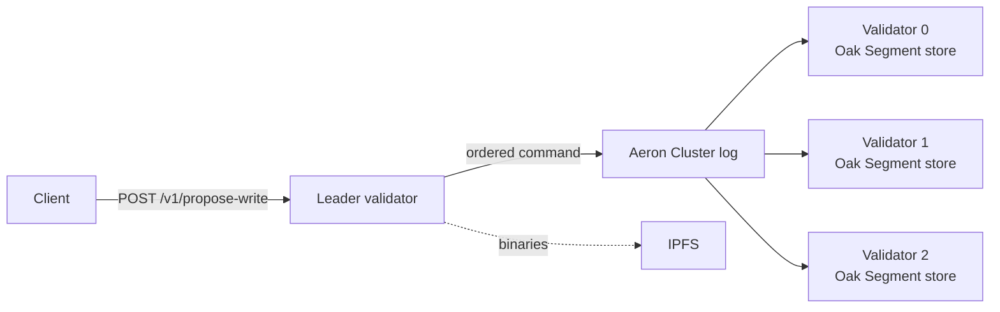

# Oak Segment Consensus

[](https://github.com/somarc/jackrabbit-oak/actions/workflows/build.yml)

The validator runtime for [Oak Chain](https://somarc.github.io/oak-chain-docs/). A
group of validators replicates one Apache Jackrabbit Oak content repository:
[Aeron Cluster](https://aeron.io/) orders every write, and each validator applies
the ordered writes to its own Oak Segment (TAR) store. Large binaries are stored
in IPFS through [`oak-blob-cloud-ipfs`](../oak-blob-cloud-ipfs/README.md).

It ships as a standalone executable JAR, built with Somarc's downstream
[Oak distribution](../README.md).

> **Status:** pre-production. A local three-validator cluster in mock payment mode
> is tested, including bounded convergence campaigns. Chain-backed payments,
> crash recovery, and production deployment are not yet validated; see
> [Maturity](#maturity).

## How it works



- **Ordering, not copying.** Validators replicate commands, not storage files. Every
  validator applies the same commands in the same order to its own store.
- **Convergence is logical.** After the same commands, validators hold the same
  nodes, property types and values. Their physical RecordIds, journal heads and
  TAR files may differ. Matching health responses or Aeron message order alone
  do not prove convergence.
- **Acceptance is not commitment.** `202 Accepted` means queued. A write is
  `COMMITTED` only after a majority of validators have applied it and flushed it
  to disk. Each accepted write is designed to end as `COMMITTED`, `FAILED` or
  `TIMED_OUT`, never silently.
- **Genesis is verified.** The first replicated command creates a reserved,
  digest-sealed genesis subtree, and writes are refused until every member has
  verified it.

Details: [operation lifecycle](docs/OPERATION-LIFECYCLE.md) and the
[genesis and write-safety contract](docs/GENESIS-AND-WRITE-SAFETY.md).

## Quick start

### Prerequisites

- JDK 17 or 21 and Maven 3.6.1+
- [Kubo](https://docs.ipfs.tech/install/command-line/) (`ipfs`): binary storage
  defaults to IPFS, and the validator does not start without a reachable IPFS API
- Node.js 20+ to build signed test transactions with
  [`oak-chain-infra`](https://github.com/somarc/oak-chain-infra)

### 1. Build

From the repository root:

```sh
mvn -B -ntp -pl oak-segment-consensus -am package -DskipTests
```

The executable JAR is `oak-segment-consensus/target/oak-segment-consensus.jar`.

### 2. Run a single validator

Start IPFS in another terminal (`ipfs init` once, then `ipfs daemon`), then:

```sh
java --add-opens=java.base/jdk.internal.misc=ALL-UNNAMED \
  -Dconsensus.enabled=true \
  -Dhttp.bind.host=127.0.0.1 \
  -Daeron.dir="$PWD/run/aeron" \
  -jar oak-segment-consensus/target/oak-segment-consensus.jar \
  --port 8090 --store "$PWD/run/validator-0"
```

With no member list, the validator forms a one-member cluster, elects itself
leader, and writes genesis within a few seconds. Logs go to `run/logs/validator.log`.

```sh
curl -s localhost:8090/health/cluster    # "status":"UP", "hasQuorum":true
curl -s localhost:8090/v1/consensus/status
```

### 3. Write and read back

Writes must be signed. The `oak-chain` CLI builds valid test transactions with
public, deterministic test keys:

```sh
git clone https://github.com/somarc/oak-chain-infra.git
(cd oak-chain-infra && npm ci)

BODY=$(node oak-chain-infra/bin/oak-chain.mjs tx write --message 'hello, Oak Chain' --format form)
ID=$(printf '%s' "$BODY" | tr '&' '\n' | sed -n 's/^proposalId=//p')

curl -s -X POST -H 'Content-Type: application/x-www-form-urlencoded' \
  --data-binary "$BODY" localhost:8090/v1/propose-write   # 202, "state":"PENDING"
curl -s localhost:8090/v1/ops/operations/$ID              # "state":"COMMITTED" within seconds
```

The `202` response includes the `wallet` address; read the content back with
`GET /v1/wallets/content?wallet=<wallet>`.

### 4. Run a three-validator cluster

[`oak-chain-infra`](https://github.com/somarc/oak-chain-infra) owns multi-validator
launch, lifecycle, fault injection and test campaigns. Clone it next to this
repository (the scripts expect `jackrabbit-oak/` and `oak-chain-infra/` to be
siblings), then:

```sh
cd oak-chain-infra && npm ci && npm link
export CLUSTER_RUNTIME_ROOT=/tmp/oak-chain
oak-chain mock up -- --fresh --build    # build, then start three validators
oak-chain mock console                  # status, start/stop, fault injection
```

The cluster uses HTTP ports 8090, 8092 and 8094, so stop a single validator first.
The validators run the JAR straight from `oak-segment-consensus/target`; stop the
cluster before rebuilding this checkout. `--fresh` wipes the runtime root it is
given, and the scripts refuse destructive actions on the default root `~/oak-chain`
unless `OAK_ALLOW_LIVE_ROOT=1` is set. See
[mock validators](https://github.com/somarc/oak-chain-infra/blob/main/modes/mock/validators/README.md)
and [troubleshooting](https://github.com/somarc/oak-chain-infra/blob/main/modes/mock/validators/TROUBLESHOOTING.md).

## Configuration

The standalone JAR has no OSGi runtime. Configure it with command-line options,
`-D` system properties and environment variables. A system property overrides
its environment variable, except for the `oak.blockchain.*` payment settings, where
the environment variable wins. Settings listed without an environment variable are
`-D` only.

| Option | Default | |
|---|---|---|
| `--port` | `8090` | HTTP port. `port + 1` is also used by the Oak standby server. |
| `--store` | `/var/oak-chain/segmentstore-composite-mount-oak-chain` | Segment store directory. Logs go to `<parent>/logs` (`-Doak.log.dir` overrides). |
| `--help` | | Print usage. |

| Setting (`-D`) | Environment | Default | |
|---|---|---|---|
| `consensus.enabled` | | `false` | Must be `true` to accept writes. When `false`, Aeron does not start and writes return `503`. |
| `aeron.cluster.nodeId` | | `0` | This validator's index in `aeron.cluster.hostnames`. |
| `aeron.cluster.hostnames` | | single member | Comma-separated host per member; the count sets the cluster size on a fresh start. |
| `aeron.cluster.basePort` | | `9000` | Aeron uses UDP ports `basePort + 100 × nodeId + 1…7`. |
| `aeron.dir` | | Aeron default | Media driver directory prefix; the driver uses `<aeron.dir>-<nodeId>-driver`. Give each local validator its own. |
| `consensus.self.url`, `consensus.peers` | | `http://127.0.0.1:<port>`, none | This validator's HTTP URL and its peers'. Every member must be configured with the same URL set; genesis records it. |
| `http.bind.host` | | all interfaces | Bind address for every HTTP connector. |
| `oak.validator.auth.token` | `OAK_VALIDATOR_AUTH_TOKEN` | unset (auth off) | See [Security](#security). |
| `tls.enabled` | | `false` | With TLS, `--port` serves HTTPS. Also `tls.keystore.path`, `tls.keystore.password`, `tls.keystore.type` (`PKCS12`), `tls.truststore.*`, `tls.client.auth` (`none`/`want`/`need`), and `http.port` for an extra plain-HTTP connector. PEM files are rejected; convert to a keystore. |
| `oak.blob.backend` | `OAK_BLOB_BACKEND` | `ipfs` | `ipfs`, `azure` or `aws`. Legacy alias: `blobstore.type` / `BLOBSTORE_TYPE`. |
| `ipfs.api.endpoint` | `IPFS_API_ENDPOINT` | `/ip4/127.0.0.1/tcp/5001` | Kubo API multiaddr. Startup fails if it is unreachable. |
| `oak.segment.backend` | `OAK_SEGMENT_BACKEND` | `local` | `local`, `azure` or `aws`. Cloud backends need further settings; see [`StorageBackendConfig`](src/main/java/org/apache/jackrabbit/oak/segment/consensus/config/StorageBackendConfig.java). |
| `oak.blockchain.mode` | `OAK_BLOCKCHAIN_MODE` | `mock` | `mock` simulates payments. `sepolia` needs `OAK_BLOCKCHAIN_RPC_URL`. `mainnet` is rejected in this version. Unknown values fall back to `mock`. |
| `oak.consensus.safety.enabled` | | `true` | `false` stops the validator from starting; genesis v2 requires the safety invariants on every member. |
| `aeron.rcv.initial.window.length`, `aeron.socket.so_rcvbuf` | | Aeron defaults | If you set `so_rcvbuf`, make it at least the window length, or Aeron refuses to start. |

A running validator reports most of its tunables, with defaults, current values
and risk notes, at `GET /v1/config/osgi/schema` and `GET /v1/config/osgi`,
including the storage backends, bind address, Aeron port base and safety gate
above; the Aeron directory is not included. `/console/configMgr` shows the same
values read-only, next to the declared OSGi properties. The validator runs without
OSGi Configuration Admin, so the OSGi declarations document the contract and do not
set values.

## Security

- **Authentication is off unless a token is set.** With `oak.validator.auth.token`
  set, clients send the token itself, without a `Bearer` prefix, as the
  `Authorization` header. Every route except `/health*` and
  `/v1/ops/snapshots/{health,runtime,storage}` then requires it, including
  `/metrics` and `/v1/index`.
- **Token auth is untested between validators.** Validators call each other over
  HTTP (for example `/v1/aeron/cluster-state` for leader discovery) without sending
  a token, so with a token set those calls are rejected.
- **Bind to loopback for local work** with `-Dhttp.bind.host=127.0.0.1`. Do not
  expose a validator without a token to an untrusted network.
- **Mock mode is not payment verification.** Signatures are format-checked only and
  payments are simulated. Production use needs a reviewed security boundary, not
  just a different `oak.blockchain.mode`.

See the repository [security policy](../SECURITY.md).

## API

| Route | |
|---|---|
| `GET /v1/index` | Live list of every route this validator serves. |
| `GET /health`, `/health/local`, `/health/cluster`, `/health/deep` | Liveness and cluster health observations. |
| `GET /v1/consensus/status`, `/v1/consensus/leader`, `/v1/aeron/cluster-state` | Role, leader and Aeron cluster state. |
| `POST /v1/propose-write`, `/v1/propose-delete` | Submit signed operations; returns `202` or a `307` redirect to the leader. |
| `GET /v1/ops/operations/{id}` | Operation state through to `COMMITTED`, `FAILED` or `TIMED_OUT`. |
| `GET /v1/wallets/content?wallet=…`, `/v1/explorer/*` | Read and browse repository content. |
| `GET /v1/config/osgi*` | Effective configuration and its sources. |
| `GET /metrics` | Prometheus metrics. |

The governed read routes are published as an
[OpenAPI contract](https://somarc.github.io/oak-chain-docs/openapi-validator-source.yaml).
The built-in dashboard (`/`), `/explorer`, `/api-browser` and `/console/configMgr`
are local diagnostic pages; integrations should use the API rather than dashboard
badges.

Health endpoints are observations, not correctness proofs. Validators also serve
their segment files (`/segments/`, `/journal.log`, `/manifest`) for read-only
mounts; replication itself happens only through the Aeron log.

## Build and test

```sh
mvn -B -ntp -pl oak-segment-consensus -am verify -DskipITs
```

This runs the module and dependency unit tests, packaging, license (RAT) and
bundle baseline checks; CI runs it on JDK 17 and 21. It does not exercise a live
cluster. A fresh build needs at least the `package` phase, because
`oak-shaded-guava` produces its relocated artifact there.

For a build whose JAR you will cite as evidence, start from a clean checkout and
stamp the source revision into the manifest:

```sh
test -z "$(git status --porcelain)"
mvn -B -ntp -pl oak-segment-consensus -am verify -DskipITs \
  -Doak.source.revision="$(git rev-parse HEAD)" -Doak.source.dirty=false
```

The manifest then records the Somarc version, the pinned Apache revision, the
source revision and dirty state; unstamped builds say `unrecorded` and `unknown`.
Keep the JAR's SHA-256 with the test record.

The module version is `2.7.0-somarc-SNAPSHOT`, on the Oak `2.7-SNAPSHOT` baseline.
It is a development build, not an Apache artifact or a published Somarc release.
The module is also packaged as an OSGi bundle, but that bundle depends on this
fork's Segment Tar exports and is not a drop-in for stock Apache Oak or AEM.

## Maturity

**Demonstrated:** unit and package gates on JDK 17 and 21; a bounded three-validator
mock-mode campaign (39 assertions) in which writes reached `COMMITTED` and the typed
repository state converged on every validator. The
[promotion record](../docs/PRODUCT-PROMOTION.md#validation-record) lists the
evidence and its limits.

**Not yet validated:** crash and restart recovery, quorum loss and partitions,
chain-backed payments and signed-intent binding, cloud storage backends, independent
IPFS replication, dynamic membership, cross-cluster deployments, cluster-wide
proposal idempotency, and garbage collection. Operation status records live only on
the validator that accepted the write.

Each kind of evidence stands on its own: unit tests, bounded multi-validator
convergence, fault and recovery runs, and chain-backed or production evidence. A
pass in one does not establish another. Live-cluster tests follow the
[consensus test charter](https://github.com/somarc/oak-chain-infra/blob/main/modes/mock/validators/tests/CONSENSUS-TEST-CHARTER.md).

## Contributing

See [CONTRIBUTING.md](../CONTRIBUTING.md). Product authority and scope are defined
in the [fork contract](../docs/FORK-MAIN-CONTRACT.md), and upstream Apache changes
arrive through the [sync runbook](../docs/FORK-UPSTREAM-SYNC-RUNBOOK.md).
`oak-auth-web3` and `oak-segment-agentic` are deferred and not part of this product.

## License

[Apache License 2.0](../LICENSE.txt). Keep [NOTICE.txt](../NOTICE.txt) when
redistributing. This is Somarc's downstream distribution, not an official Apache
release.
