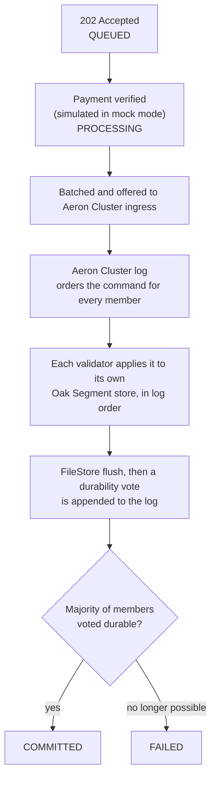
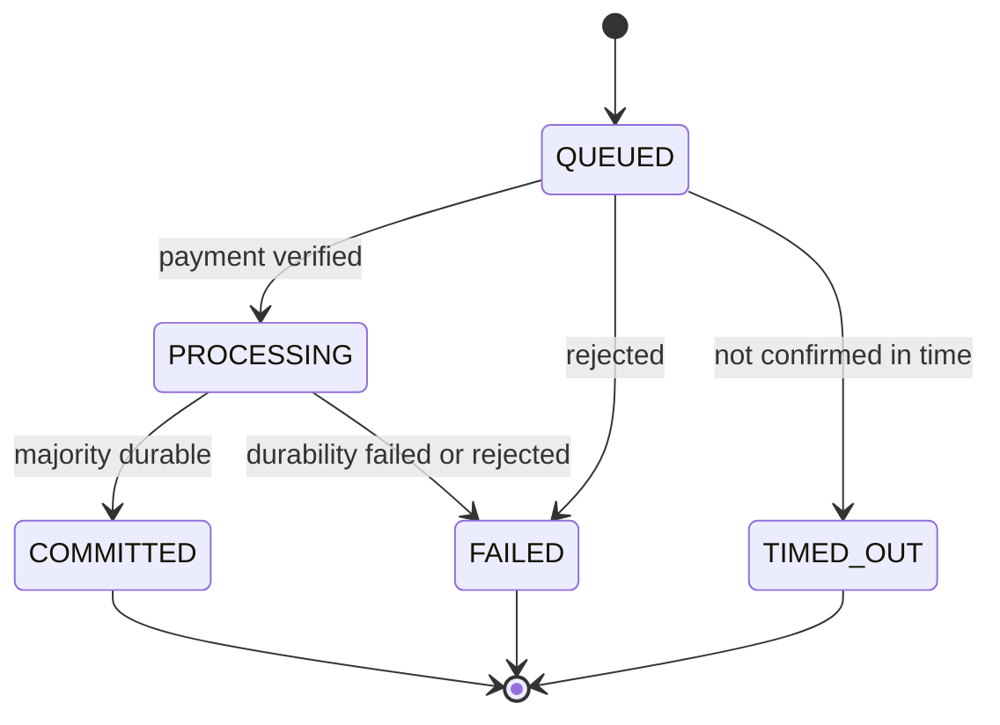

# Operation lifecycle

How a write or delete moves from an HTTP request to a committed, replicated
repository change, and how to read its status. Behavior described here is what
the current code does; [GENESIS-AND-WRITE-SAFETY.md](GENESIS-AND-WRITE-SAFETY.md)
is the normative safety contract it implements.

## Submission

Clients send `POST /v1/propose-write` or `POST /v1/propose-delete` to any validator.
The request carries a wallet address, a client-chosen 32-byte `proposalId`, an
`ethereumTxHash` and a wallet signature. The field rules are specified by the
[transaction contract](https://github.com/somarc/oak-chain-infra/blob/main/modes/mock/TRANSACTION-CONTRACT.md),
and `oak-chain tx write|delete` in `oak-chain-infra` builds conformant requests.

Before queueing, the receiving validator answers immediately when it cannot accept
the request:

| Response | Meaning |
|---|---|
| `307` with `Location`, `code=wrong_leader` | This validator is a follower. Resend to the leader. Followers never forward. |
| `503`, `code=leader_unknown`, `Retry-After: 1` | No leader is known yet. Retry. |
| `503` | The cluster is unhealthy, including before genesis is verified on every member. |
| `402` | The wallet has unpaid storage (GC) debt. |
| `400` / `401` / `403` / `422` | Malformed fields, a failed signature check outside mock mode, a reserved or unregistered wallet, or an unusable `ipfsCid`. |
| `202 Accepted` | Queued on the leader. **Not yet committed.** |

In mock mode (the default) payment is simulated and only the signature's format is
checked; outside mock mode the signature is verified at entry and again before
replication.

## From queue to commit

- Every member applies the same commands in the same log order. A member that cannot
  apply a valid command stops rather than diverge.
- A member votes durable only after a FileStore flush that covers the application.
  `COMMITTED` therefore means a **majority** (`members / 2 + 1`) of validators applied
  and flushed the change, not necessarily all of them.
- If the leader loses leadership while sending, the send is retried and then ends as
  `FAILED` or `TIMED_OUT`; it is never silently dropped.

## Reading status

Poll `GET /v1/ops/operations/{proposalId}` on **the validator that returned `202`**.
The ledger is local to that validator; others return `404`. Terminal records are
kept for 10 minutes (`oak.proposal.processed.retention.ms`).

| `state` | Terminal | Meaning |
|---|---|---|
| `QUEUED` | no | Accepted, waiting for payment verification. |
| `PROCESSING` | no | Verified, being replicated, or awaiting durability votes. |
| `COMMITTED` | yes | Applied and flushed by a majority of validators. |
| `FAILED` | yes | Rejected, or durability can no longer reach a majority. See `error`. |
| `TIMED_OUT` | yes | Not confirmed within `oak.proposal.confirmation.timeout.ms` (default 300 s). Retryable. |

The response also carries the underlying fields `sourceState` and `durabilityState`.
`GET /v1/proposals/{id}/status` returns only those raw fields:

| `sourceState` | `durabilityState` | Operation `state` |
|---|---|---|
| `PENDING` | any | `QUEUED` |
| `VERIFIED` | any | `PROCESSING` |
| `PROCESSED` | `PENDING` | `PROCESSING` |
| `PROCESSED` | `ACKED` | `COMMITTED` |
| `PROCESSED` | `FAILED` | `FAILED` |
| `REJECTED` | any | `TIMED_OUT` if the reason is a timeout, otherwise `FAILED` |

`PROCESSED` means the command was offered to the Aeron log, not that it committed.
Only the operation `state` expresses the commit outcome. The operation `type` is
currently reported as `WRITE_PROPOSAL` for deletes as well.

## Genesis

A newly elected leader that finds no genesis sends a parameter-free `CREATE_GENESIS`
as the first replicated command. Writes return `503` until every member has
verified genesis. See [GENESIS-AND-WRITE-SAFETY.md](GENESIS-AND-WRITE-SAFETY.md).

## Roles

Each validator is an Aeron Cluster member and is either `LEADER` or `FOLLOWER`.
`GET /v1/consensus/leader` and `GET /v1/consensus/status` (`isLeader`,
`currentLeader`) report the current leader. Clients do not need to discover it in
advance: follow `307` redirects, retry `leader_unknown`, and poll status on the
validator that accepted the request.

## Garbage collection

GC proposals (`POST /v1/propose-gc`) take a separate path: they go straight to the
Aeron log without the proposal queue or leader redirect and return `200`. Members
vote, and a proposal is approved when `⌊2n/3⌋ + 1` members approve. GC is not
covered by the durability contract above and is not yet production-validated.
